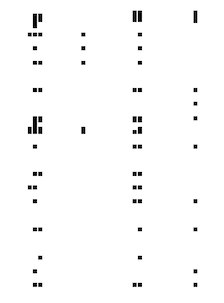

# Swamp CTF 2019 - Cartographer's Capture - Forensics

Cartographer's Capture (498 pts)

Forensics
```
We've gotten a hold of a file that contains a whole bunch of weird-looking IP addresses by having one of our robo-hounds sniff out some leaking data from a EvilCorp warehouse. We're not sure how to decipher this but we know that this particular warehouse is one of the main sources for location information.

-= Challenge by P4PA_0V3RL0RD =-
```

[ip_addresses.txt](ip_addresses.txt)

```
65.236.181.168
194.164.163.71
65.236.181.221
194.164.163.71
65.236.182.17
194.164.163.71
65.236.182.70
194.164.163.71
65.236.182.122
194.164.163.71
...
```

In this challenge we get a lot of IP addresses, it is obvious that the addresses alternate between one that starts with *65* and another that starts with *194*.

The title of the challenge suggests that these addresses correspond to coordinates on a map.

Our goal will be to transform the IP addresses into coordinates that represent us in some way the flag.

[@danitorwS](https://twitter.com/danitorwS) realized that there are only 8 different IP addresses that start with *65*, and in the same way 32 that start with *194*.

Volvemos a la idea inicial de dibujar las coordenadas, por lo que escribimos un script en python. Aunque en un primer momento, al no convertir el valor de la dirección IP a decimal, no se aprecian las palabras en la imagen resultante

We return to the initial idea of drawing the coordinates, so we write a script in python. Although at first, by not converting the value of the IP address to decimal, the words in the resulting image are not appreciated.



The flag is obtained by representing the IP addresses directly in a matrix of 32x8 pixels.

[paint-ip.py](paint-ip.py)


We flip the image horizontally and vertically and obtain the flag.


### Alternative script

If we convert each IP address to its decimal value and represent it as pixels on a map we can also obtain the flag.

[paint-decimal.py](paint-decimal.py)

```python
from PIL import Image, ImageDraw
from socket import inet_aton
import struct

def ip2long(ip):
    packed = inet_aton(ip)
    lng = struct.unpack("!L", packed)[0]
    return lng

squaresize = 18

SIZE_X = 600
SIZE_Y = 420

image = Image.new('RGB', (SIZE_X, SIZE_Y), (255, 255, 255))
draw = ImageDraw.Draw(image)


with open('ip_addresses.txt') as f:
    i = 0
    for line in f.readlines():

        ip = ip2long(line.strip())

        if i%2 == 0:
            ipy = ip - 1106031935
        else:
            ipx = ip - 3265569056

            a = SIZE_X - ipx
            b = SIZE_Y - ipy
            draw.rectangle((a, b, round(a-squaresize), round(b-squaresize)), fill=0)

        i += 1

image.save('flag.bmp')
```


Thanks to [@danitorwS](https://twitter.com/danitorwS)
