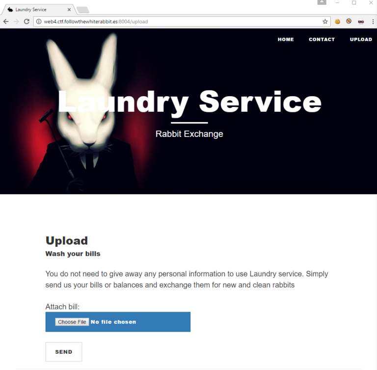
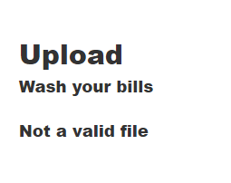
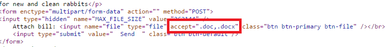
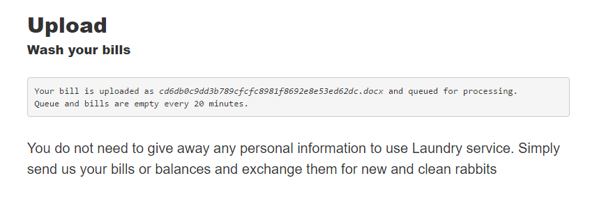
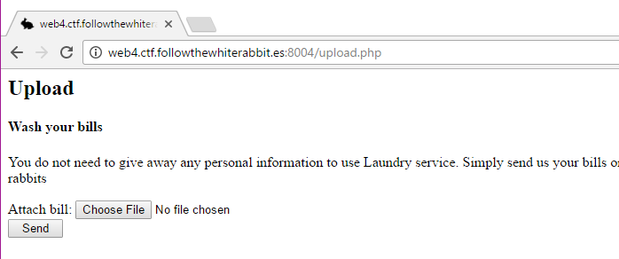
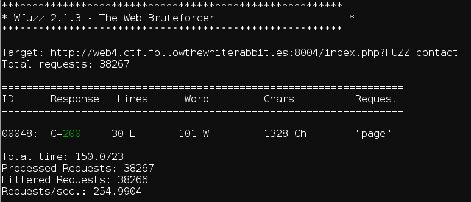
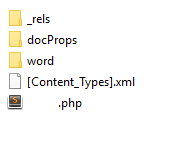
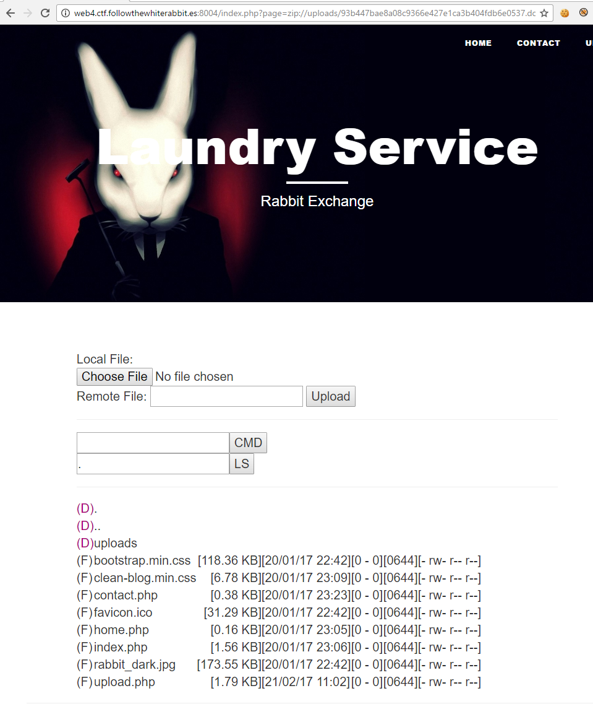
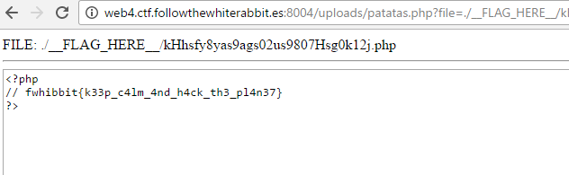

# CTF FWHIBBIT 2017 - Wash your money

En esta prueba tenemos una pagina con diferentes funcionalidades, una de ellas nos permite subir archivos *.doc* o *.docx*.

Si intentamos evadir los filtros y subir otro tipo de archivo nos aparece un mensaje con el texto *Not a valid file*.

Utilizando *wfuzz* encontramos los diferentes archivos que forman la página, y como se utiliza `index.php?page=[file]` para mostrar las paginas.

Un archivo *docx* es en realidad es un archivo *zip* con los archivos que forman el documento, aprovechamos esto para insertar una webshell php dentro del empaquetado.

Utilizando el wrapper `zip://` podemos ejecutar la webshell.

Aunque no es obligatorio, copiamos la webshell al directorio uploads para trabajar de forma mucho mas comoda.

Con esta nueva webshell podemos ver facilmente el archivo con la flag en el directorio ** __FLAG_HERE__ **

