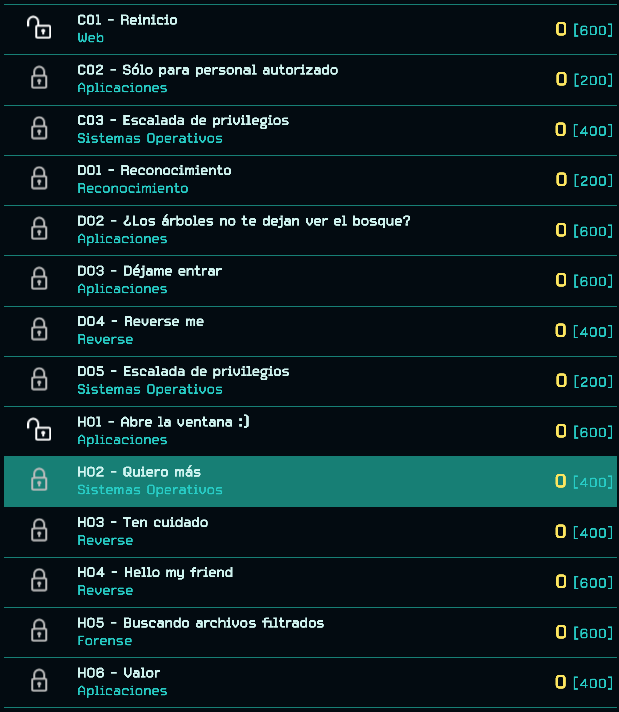
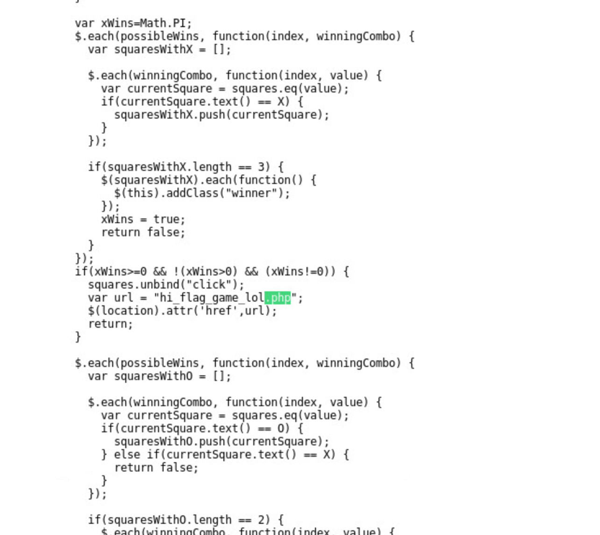
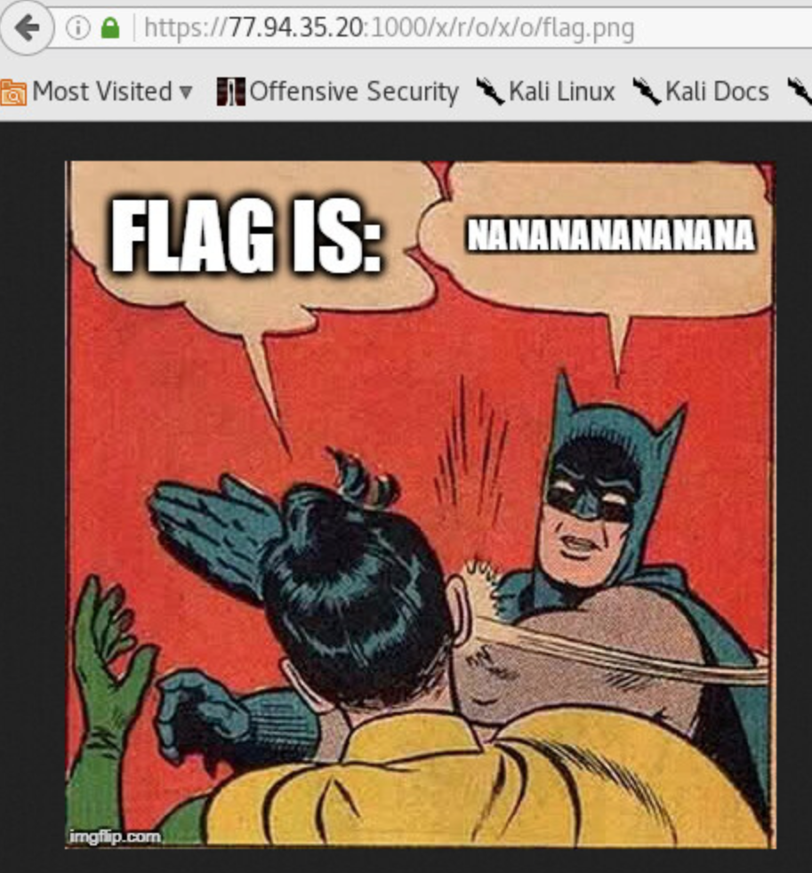
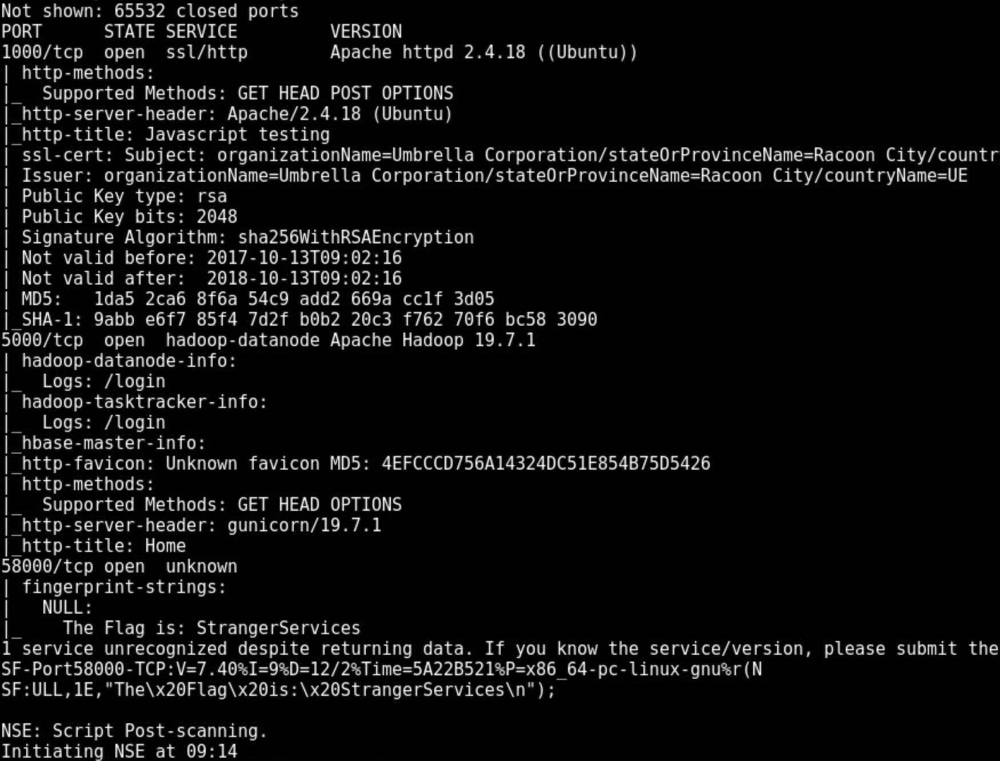
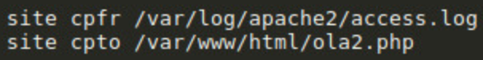

# Cybercamp Final 2017





# A01 - El Juego
Categoría: Web

La máquina A está alojando un servicio para una nueva red social: THE Login. Nos han informado que esta red social es solo una tapadera de su actividad real.

Hay un juego en el que han estado trabajando duro para obtener dinero a través de apuestas ilícitas.Según los rumores, han desarrollado una máquina que nunca pierde. ¿Podrás encontrarla y vencerla?


## Solución

En el directorio `/game/` se encuentra un juego de 3 en raya programado en JavaScript. Al ser un juego imposible de ganar, nos toca hacer trampas para conseguirlo.

En primer lugar, intenté modificar el HTML para cambiar las piezas del tablero y ganar. Sin embargo esto no funciona, debido a que el estado real del tablero se guarda en una variable del código.

Si nos fijamos en el código, vemos la URL a la que el juego nos redirige cuando ganamos, `hi_flag_game_lol.php`.



Al acceder directamente a la URL no obtenemos la flag, para ello es necesario incluir la URL del juego en la cabecera *Referer*.


Flag: `I_Know_You_Cheated!`


# A02 - ¿Me reconoces?
Categoría: Reconocimiento

¿Cuál es el nombre del servidor de correo?


# A03 - ACCEDE a THE Login
Categoría: Web

¡Necesitamos obtener más información! THE Login impide acceder a la web privada y a sus recursos.

Obtén el acceso a la web privada restringida a través de THE Login.


## Solución

En la web del panel de login observamos que aparecen de fondo bastantes palabras.

Utilizando la herramienta `CeWL` generamos un diccionario con todas las palabras que forman la web.

Realizamos una ataque de fuerza bruta con Hydra. (Lo que se supone que no esta permitido en un CTF y nunca se debe hacer)


Una vez descubrimos las credenciales, accedemos y obtenemos la flag.


Flag: `ToInfiniteAndBeyond`


# A04 - ¡Prueba Suerte!
Categoría: Web

Sabemos que una web dentro de THE Login te desafiará a probar suerte. La suerte es importante, pero debe haber una forma de entrar. No hemos tenido suerte hasta ahora. Por favor, obtén más información sobre su actividad.

## Solución

La aplicación contiene un codigo Javascript ofuscado.

Se utiliza `console.log(funcion)` para desofuscarlo y obtener la flag.


Flag: `WhyIsJavascriptEvenAThing?!`


# A05 - Información clave recopilada
Categoría: Web

Aunque no pudimos acceder a la web privada, hemos recopilado información clave a través de técnicas de ingeniería social. Si has tenido suerte, tendrás acceso a una red vulnerable. Están trabajando en ello para parchearlo. ¡Expóralo!


## Solución

A través de una inyección SQL conseguimos subir una webshell.


Flag: `WellDoneMyFriend`


# B01 - Give me a glue
Categoría: Web

La máquina B está alojando un servicio sólo para fines de prueba. "Find the hidden value" es la única información que tenemos. Esperamos que tú puedes encontrar el valor oculto.


## Solución


Si analizamos el código Javascript de la aplicación y llamamaos a la función `abcd()` obtenemos el path en el que se encuentra la flag.




Flag: `NANANANANANANA`


# B05 - Recopilación de información
Categoría: Reconocimiento

Encuentra la bandera oculta en la máquina B.

## Solución

Con un escaneo de todos los puertos utilizando `nmap` aparece un servicio en el puerto TCP 58000 con la flag en su banner.




```bash
nmap -sV -p- 77.94.35.20
```

Flag: `StrangerServices`

# X01

El servidor X tiene un servidor FTP vulnerable. Aunque este reto es trivial utilizando un modulo de metasploit, debido a que en su momento no configuré correctamente la ruta del servidor web, tuve que explotarlo manualmente.

En primer lugar realizamos una petición HTTP incluyendo una webshell php en el *User-Agent*, de forma que quede registrado en el archivo `access.log`. Hay que tener especial cuidado en este proceso, ya que si inyectamos código PHP incorrecto deberemos borrar el archivo antes de volver a realizar el proceso.

Utilizamos la vulnerabilidad del servidor FTP para copiar el log a un archivo php.



Utilizamos la shell PHP. Como se observa en la imagen, al utilizar el archivo de log como shell nos aparece su contenido.


Ejecutamos una shell reversa y leemos el archivo con la flag.


# X02

El segundo reto consiste en escalar privilegios y obtener la flag que se encuentra en `/root/flag.txt`.

Para ello subimos un archivo shadow con el password de root modificado y lo reemplazamos por el original utilizando la vulnerabilidad del servidor FTP.


Elevamos privilegios con `su` y leemos el archivo con la flag.


# X03

El tercer reto consiste en decodificar una imagen de 8x31 pixeles en blanco y negro.


# Z01 - Mr. Potato
Categoría: Reconocimiento

¿Eres Mr Potato? Si eres Potato tendrás permiso. Solo Mr Potato tiene permiso. ¿Eres Mr potato? ¿Eres Potato? Potato permitido. Pero solo Mr Potato. Potato?

### Pista 1
Es necesario hacer un doble pivotaje utilizando como segundo nodo X. La fase de reconocimiento es clave.

