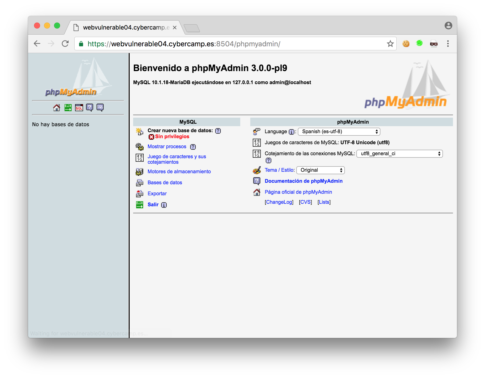

# CyberCamp Quals 2016 - Web 4 - Patataprinting

En esta prueba nos encontramos con una página estática con un enlace al Token de la prueba, si accedemos a token.secret, nos devuelve un error 403.

Ante este punto muerto, después de probar cualquier cosa absurda que se nos ocurra y no obtener resultado pasamos a nuestra herramienta favorita de botón gordo… Nikto, dirb/wfuzz, Acunetix.

Aunque normalmente los CTF suelen estar diseñados para evitar que el uso de estas herramientas funcione, en las pruebas de SQL la herramienta SQLmap funcionaba perfectamente, así que no perdíamos nada por intentarlo.

En poco tiempo el crawler encuentra una jugosa carpeta llamada ‘phpmyadmin’, ya tenemos trabajo.

Una vez accedemos nos encontramos la aplicación phpmyadmin protegida por contraseña.

Probamos las contraseñas por defecto ‘root’:’root’, ‘root’:”, ‘admin’:’admin’ sin conseguir nada. Una vez le damos a cancelar observamos el siguiente mensaje indicándonos la versión de phpMyAdmin 3.0.0-pl9, una bastante antigua y posiblemente con alguna vulnerabilidad.

Lo primero es buscar que vulnerabilidades tiene esta versión, en un principio no encontramos nada refiriéndose a ‘pl9’, pero lo dejamos pasar y buscamos vulnerabilidades simplemente para la versión 3.0.0.

Rápidamente encontramos 3 vulns con exploit publicado, recordemos que esto es un CTF, y que raramente nos van a pedir que utilicemos una vulnerabilidad sin exploit publicado.

Un rato mas tarde, no ha funcionado ninguna de las 3 vulnerabilidades, incluso en la máquina algunos archivos directamente ni existen.

El siguiente paso es descargar esta versión de phpMyAdmin y analizar su contenido, a ver si podemos localizar que archivos se encuentran disponibles y utilizar el exploit adecuado a ello.

Sorpresa, las versiones antiguas ya no están disponibles!!

En este punto, procedo a descargar TODAS las versiones de phpMyAdmin, tanto de la web oficial, como de cualquier parte de internet donde se encuentren las versiones mas antiguas.

Una vez organizadas en mi ordenador, tenemos dos tareas, generar un wordlist para el fuzzer, y guardar el MD5 de todos los archivos.

Aunque seguramente hayan formas mas eficientes o bonitas, en ese momento recurrí al comando find y md5 del terminal de OSX.

El siguiente paso es lanzar el fuzzer, en mi caso utilizo [dirsearch](https://github.com/maurosoria/dirsearch) que funciona perfectamente en OSX.

Antes de seguir, os haré un pequeño spoiler, la versión no es *3.0.0-pl9*, las autores de la prueba han jugado con nosotros :’(

Una vez conocemos que archivos están disponibles, los descargamos a nuestra maquina y calculamos la firma MD5 de aquellos que sean estáticos, descartando los que tengan extension .php

Ahora, solo tenemos que buscar coincidencias con la lista que elaboramos al principio.

`grep ${md5} md5.txt`

En este caso, después de probar diferentes archivos, damos con uno que nos reduce la busqueda a unas pocas posibles versiones.

Aunque en este momento podríamos probar exploits para estas versiones, no iba a parar estando tan cerca de la versión exacta.

La versión exacta la encontraremos analizando el archivo translators.html

Este archivo ha sido modificado cambiando el número de versión, así que su firma no nos sirve para identificarlo.

La diferencia mas evidente entre las versiones 2.6.4-pl1 y 2.6.4-pl2 es la eliminacion de las palabras so called. También hay otro detalle que nos hubiera ayudado a identificar la versión, la errata en la palabra developement

Una vez sabemos la version exacta, *2.6.4-pl1*, solo nos queda encontrar un exploit que lanzarle.

Aunque en CVEdetails no aparece ningún exploit, se puede encontrar en exploitdb un [exploit para la vulnerabilidad CVE-2005-3299](https://www.exploit-db.com/exploits/1244/).

Lanzamos el exploit….. y no funciona. Vemos que el exploit solo funciona por HTTP y puerto 80, nosotros necesitamos lanzarlo a una web HTTPS en un puerto poco común.

Mi solución rápida fue utilizar netcat `nc -l 80` y lanzarme el exploit a mi mismo, de esta forma puedo ver la petición HTTP que realiza el exploit y replicarla con la función Repeater de Burp, una vez lanzado se obteniene el archivo con el token localizado en *../../token.secret*

## Phpmyadmin

Las credenciales para acceder al phpMyAdmin eran el usuario admin con la contraseña en blanco, aunque al ser una cuenta sin privilegios no hubiera sido posible realizar consultas SQL.

