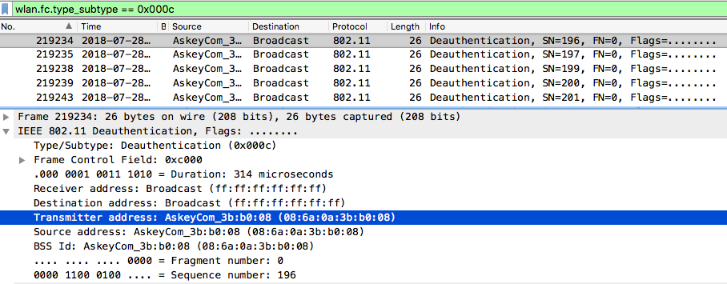

# Cybercamp Quals 2018 - 01. Toxinas aéreas (200 puntos)
### Categoría > Forense

Desde hace un tiempo la red Wifi de nuestro cliente no va bien. Se quejan de que a veces no se conectan los equipos y sospechamos que existe algún atacante malicioso en la zona. Hemos enviado a nuestro auditor junior a realizar una captura en el sitio, pero no ha podido determinar lo que pasa y nos ha enviado la captura en formato pcap. ¿Podrías echarle una mano? (Respuesta: flag{dirección MAC en formato XX:XX:XX:XX:XX:XX del host atacado} – ejemplo: flag{xx:xx:xx:xx:xx:xx})

#### [Pista 1 Objetivo 1] [30 pts]
Quizá sea mejor analizar los paquetes con alguna herramienta de línea de comandos.

#### [Pista 2 Objetivo 1] [50 pts]
Es un ataque de denegación de servicio.

#### [Pista 3 Objetivo 1] [70 pts]
Paquetes de autenticación.

## Solución

Si analizamos detalladamente la captura de tráfico encontramos bastantes paquetes de deauth.

`wlan.fc.type_subtype == 0x000c`

La dirección del host atacado es la dirección de origen spoofeada en los paquetes de deauth.

`flag{08:6a:0a:3b:b0:08}`