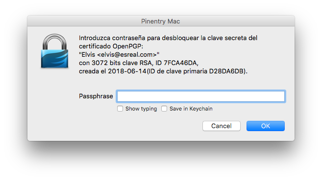

# Cybercamp Quals 2018 - 02. Vivan Las Vegas (200 puntos)
### Categoría > Criptografía


Se ha incautado el equipo personal de un presunto pedófilo, pero en dicha computadora no se ha podido obtener ninguna evidencia de la fuente de los ficheros ilegales que se descargó, sin embargo, en la carpeta de las evidencias se ha encontrado un fichero de video que parece sospechoso.


#### [Pista 1 Objetivo 2] [25 pts]
Encontrarás algo interesante en el fichero.

#### [Pista 2 Objetivo 2] [40 pts]
Los ficheros resultantes tienen relación entre ellos.

#### [Pista 3 Objetivo 2] [55 pts]
John el destripador te ayudará a completar el reto.

## Solución

Analizando el archivo de video `elvis.avi`, o encontramos a final del mismo 2 textos en base64.

[1.b64](1.b64)

[2.b64](2.b64)

Decodificamos los textos y los guardamos en formato binario.

```bash
file *.bin
1.bin:     PGP	Secret Key - 3072b created on Thu Jun 14 15:51:44 2018 - RSA (Encrypt or Sign) e=65537 hashed AES with 128-bit key Salted&Iterated S2K SHA-1
2.bin:     PGP RSA encrypted session key - keyid: A8991817 DA46CA7F RSA (Encrypt or Sign) 3072b .
```

Nos encontramos con una clave PGP protegida por contraseña y un archivo cifrado con PGP.

Para recuperar la contraseña extraemos el hash con `gpg2john`.

```bash
gpg2john 1.bin | tee 1.hash
Elvis:$gpg$*1*988*3072*8f3cbe32e7a1d077144030ba6a5b8ffc619e9c032667c65856d85907324b332c60771623e7de7ea80683171c89a6fd742fd40c08b767195647cca3b88d6291d258e995a9b4ba5aec34c24b5b29866c10d51ca2adc4a0ee15f8669a5d389b61e0314c48e1ede48e5a73efa2ea1d177f488fb41ec69242afd46b44be92c3f8cc69b99edb7d05e808998c0839adef4affe6b6a1afa26f8a408f59f31794864f52d43273c5f94f015a7c89f596b33f1d6f4b4dff42a5d21abb41212b60841060a1411dd30871b5031baddd1043a6358fb982a3917c73e44f74dd10e233e1d11eff6c5046bf10e146b5808e6e192b82daba9ef0c73b3cb72ee40fc58c13946ac4af5148874bb67037b5abac407597d6f3499895811fb44275e14e1eb71355a6c167c7c42e30f14f9ecb9b6135bceafd38c5ef2d557374fd750c9059e5ff0097bec2e33e9f89daf84a3e3215c48db46f39e771e66de7dbb980826e916d47860e0b51003378b7e1c2414a2c6bb627659be341d7f4dad20ca9111844ac74ea044f926e03905a724c170825b974540ca7decca360dedb8012142544edefd8554f5b9dbdd26f6da855f87d2b444277df2da58a760b5b4aaf7cae2b9bf1d3e18d4479c27a53cc090548ef4ed23ac1a7859f9708cdec9f00f86f1507abd95e153726ea5111dfebb561761467f40458953b7d75bde101577db364189c1a5481f1d422a6a830d9cd199cb2a86f5763ab6bfd54b3466adb6c4754a2ca58a30ffd44818669bdb1635d9a9b907eebd8e0b7b81ea7b62d3c62203babf82b1b7a67ff97f7b4228d2e8437e29d53c0d0c41f88fd7dd490bd0a0b1478eeb81cef4c50e1f532f5960c710f687048fb9cbfe6cbc90d887f2ca56c42b11637b540e5065533e10b0b95bbd4dccb7fd0f656c80f17c6adbe72cb1397b5f566243a2232c7014fd19712add1deab84e6323412d0dffcb66cdbe70fa229e2f6e8487e847789e671ff65234d63b3a0cfd6fa3acc79a718eadebb0f3d11f5dff233398717e805da419850ea070dc40d22405a990eeea644406722639896a105d834fe19aa3c3ecfa21461a3b939eb69986f20cda56342a7881308e572dfd05d44e882b259a0a2565fa8fdfcc3115727c877717dc593ebfe7605c50cd1219b47ae6d95875618ea67708122f8dcc2ae449300d86270bc6d8e6937069ec070ec8b09eb02c4cec6e73a19de58123e374e538bb9cbfb044a22be7565a321a368208b77f1f1d1c369cdecffc461dac5a37a78d39fe6c69e9bd350d6a999b0b4da084e76089c5e03dbb42369743548e6ca4031311b5365ebcaf9b458031f88b6b5240f4878c40629c79aa893ba6e7103f7b0ce653bcda4861dc24303692e134ab6358dd62e4e600717aa123c0ef462*3*254*2*7*16*21e9da9491def965a53ef71d7ea84b6f*65011712*a7ee1ca3267fa71e:::Elvis <elvis@esreal.com>::1.bin
```

Crackeamos el archivo con john the ripper. La 'dificultad' de este reto consiste en lanzar john sin ningun parametro para que utilice el nombre de la clave PGP `Elvis <elvis@esreal.com>`.

```bash
john 1.hash
Loaded 1 password hash (gpg, OpenPGP / GnuPG Secret Key [32/64])
Press 'q' or Ctrl-C to abort, almost any other key for status
elviselvis       (Elvis)
1g 0:00:00:06 DONE 1/3 (2018-11-03 23:42) 0.1647g/s 7.084p/s 7.084c/s 7.084C/s elviselvis
```

Una vez conocemos la clave `elviselvis` ya podemos importar la clave privada y descifrar el contenido del mensaje.

```bash
gpg --import 1.bin
gpg: clave D28DA6DB: clave secreta importada
gpg: clave D28DA6DB: clave pública "Elvis <elvis@esreal.com>" importada
gpg: Cantidad total procesada: 1
gpg:               importadas: 1  (RSA: 1)
gpg:      claves secretas leídas: 1
gpg:  claves secretas importadas: 1

gpg -d 2.bin
Necesita una contraseña para desbloquear la clave secreta
del usuario: "Elvis <elvis@esreal.com>"
clave RSA de 3072 bits, ID 7FCA46DA, creada el 2018-06-14(ID de clave primaria D28DA6DB)
gpg: cifrado con clave RSA de 3072 bits, ID 7FCA46DA, creada el 2018-06-14
      "Elvis <elvis@esreal.com>"
elvissiguevivo
```



Flag: `elvissiguevivo`
