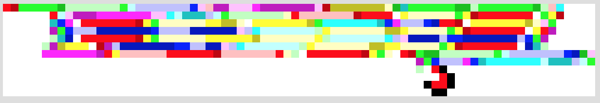
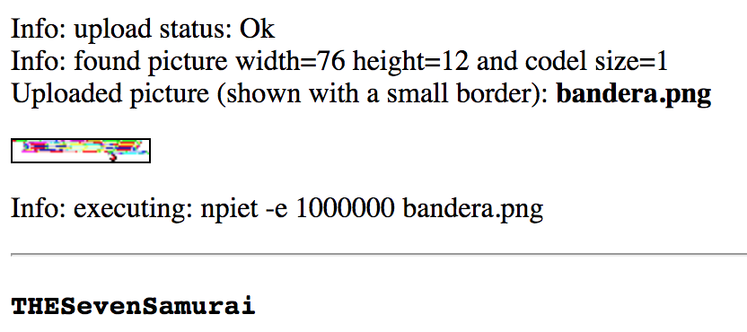

# Cybercamp Quals 2018 - 09. Monkey Island (300 puntos)
### Categoría > Criptografía


Se ha incautado un equipo perteneciente al miembro de una APT, tras un profundo análisis forense no se han podido obtener evidencias que hayan sido eliminadas o cifradas, en el contenido más significativo del delincuente se ha recuperado un video que sospechan que pueda contener algún tipo de prueba delictiva. (La flag es sensible a mayus/minus)

#### [Pista 1 Objetivo 9] [30 pts]
La contraseña para extraer el primer mensaje tiene que ver con el videojuego Monkey Island.

#### [Pista 2 Objetivo 9] [50 pts]
La contraseña para extraer el primer mensaje tiene que ver con el videojuego Monkey Island.

#### [Pista 3 Objetivo 9] [100 pts]
El segundo mensaje se ha ocultado con el lenguaje de programación PIET https://gabriellesc.github.io/piet/


## Solución

En el archivo de video se esconde un archivo ZIP.

```bash
binwalk -e MonkeyIsland.avi

DECIMAL       HEXADECIMAL     DESCRIPTION
--------------------------------------------------------------------------------
26013116      0x18CEDBC       Zip archive data, at least v2.0 to extract, compressed size: 613, uncompressed size: 811, name: bandera64.txt
26013883      0x18CF0BB       End of Zip archive
```

Una vez extraido el archivo ZIP, dentro encontrarmos un archivo TXT con texto en base64.
Decodificamos el base64 y obtenemos un nuevo archivo ZIP, esta vez con contraseña.

[bandera64.txt](bandera64.txt)

Usamos `zip2john` para extraer el hash. Para poder utilizarlo con hashcat eliminamos el principio y el final para que quede con el formato `$zip2$...$/zip2$`.

```bash
zip2john bandera.zip
bandera.zip:$zip2$*0*3*0*f2aef0aeb173b18987f5662af6be7fc2*6a0f*178*b3dedd7f79b6d7a7a7e2f05552a24ebb35378e742082bb7232ac218c2a6015a24b0702947d92e75be1f8bebfc6720224574862ea83fac076f368f482e526a176dd23053774cb6461e52cfed3a6ef27784f11cc7c4436c0cfa2eb847f8ae871f71bef8793d58e7c8f88a9e328f4d07fdb47d577e529ecd0f251c30053de11665232544168ec1558bcb0922a29c84612b891b325c842a11b62317ddf99f257f1b0f74a8cc114838f3238deff7fd79fab5576669a015a40b7cfa25eed395705e69a0f146fb8ac8b62890658e218c4d0fa49c59dd5b780212b577a64d4e7cd386580234f65e505dee88f94289679a7d6e92e2d1f05b4c724215c16ee72fc8247afd56be6bce2eafa4f53ba7466d349c98a0a114075f03b2638db7173ec6eaa5a09b73851510e591d15ae9a77cc93d0b0d6d613fca1dae205a1fc63951cb100922cec911a1b01f6a76743984df998b6397feb451a2ffb05903607e3eb8db7d30a2cb88b4785a89a84ead908b8a3e132ccb0ced1dae06578ec7756*8df6cdc4624358f9483a*$/zip2$:::::bandera.zip
```

Utilizamos `hashcat` con un diccionario y obtenemos la contraseña `grog` en menos de 15 segundos.

```bash
hashcat -m 13600 09-MonkeyIsland.txt wordlists/[CENSORED].txt
```

De dentro del ZIP obtenemos una imagen PNG con pixeles de colores.

[bandera.png](bandera.png)



Después de un rato de investigación, descubrimos que la imagen se corresponde a un programa hecho en el lenguaje PIET.

Utilizamos la web https://www.bertnase.de/npiet/npiet-execute.php para ejecutarlo y obtenemos la flag.



Flag: `THESevenSamurai`