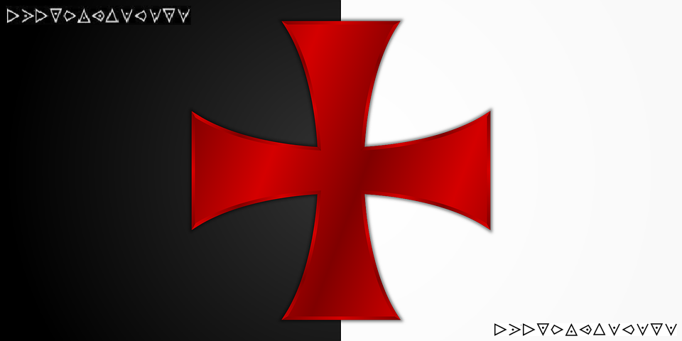

# Cybercamp Quals 2018 - 11. La orden del Temple (300 puntos)
### Categoría > Criptografía


Se incauta a un sospechoso de terrorismo su equipo, dentro de éste se encuentran ficheros que se podrían considerar de vital importancia para continuar con la investigación, pero muchos de esos ficheros están cifrados y se sabe que mediante PGP simétrico.

Gracias a la investigación del sospechoso tus compañeros te han dado las siguientes pautas que sigue el sospechoso a la hora de crear sus contraseñas:

Son de longitud de 6 a 7 caracteres.
Sólo contienen letras minúsculas
Sólo se utilizan estas letras: eghotu
No se repite ninguna de las letras de la contraseña
Algunas de ellas contienen dos números entre estos: 0134
Tu trabajo será intentar descifrar el fichero gracias a la investigación realizada sobre el sospechoso y a los datos proporcionados para determinar si el contenido es de vital importancia para la investigación en curso.

#### [Pista 1 Objetivo 11] [15 pts]
Es importante respetar las pistas para la correcta elaboración del diccionario.

#### [Pista 2 Objetivo 11] [65 pts]
Existe una herramienta específica para fuerza bruta sobre PGP.

#### [Pista 3 Objetivo 11] [105 pts]
A los templarios les gustaban mucho los mensajes ocultos con simbología.


## Solución

El reto consiste en conseguir la contraseña del archivo `medium_11.gpg`.

```bash
file medium_11.gpg
medium_11.gpg: GPG symmetrically encrypted data (AES cipher)
```

Convertimos el archivo a un archivo de hash con `gpg2john`.

```bash
gpg2john medium_11.gpg > 11-hash.txt
```

Utilizamos python para generar un diccionario, en principio había usado un script que cumplia exactamente los requisitos del reto, pero resulta que estas pistas son erroneas.

```python
import itertools

let = "eghotu"
num = "0134"

p = itertools.permutations(let+num, 6)
#p = itertools.permutations(let+num, 7)
for x in p:
    word = ''.join(x)
    print(word)
```

Lanzamos `john` con el diccionario generado y obtenemos la contraseña `eg1u03`.

Desciframos el archivo y obtenemos una imagen PNG.

```bash
gpg -d medium_11.gpg > 11.png
```

[11.png](11.png)



En la imagen aparecen simbolos del cifrado de los templarios, podemos decodificarlo con la web https://www.dcode.fr/templars-cipher

La flag es el resultado en minusculas: `eresmuygoloso`
