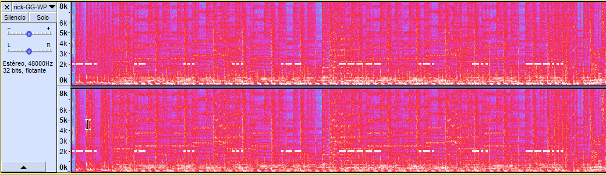

# Cybercamp Quals 2018 - 14. Rick Hacksley (500 puntos)
### Categoría > Esteganografía


Estás en una misión de infiltración en las instalaciones del enemigo. Tras una serie de hackeos en su seguridad biométrica has llegado a la sala de servidores, donde tienes la posibilidad de conectarte a la LAN local. Te das cuenta que en la red se repite mucho la transmisión de un archivo sospechoso, el cual deberás analizar para averiguar si esconde nueva tecnología militar.

#### [Pista 1 Objetivo 14] [45 pts]
#### [Pista 2 Objetivo 14] [90 pts]
#### [Pista 3 Objetivo 14] [120 pts]

## Solución

En primer lugar tenemos el archivo `hard_14.rar` que nos da un error si intentamos abrirlo.

Si examinamos el archivo, observamos como el primer byte `00` no corresponde a la cabecera RAR.

```bash
xxd hard_14.rar |head
00000000: 0061 7221 1a07 0100 5dd9 52ab 0d01 0509  .ar!....].R.....
00000010: 0008 0101 cca6 df92 8000 3314 4d94 3402  ..........3.M.4.
00000020: 030b 8893 d383 8000 04a8 a2d1 8480 00f6  ................
00000030: 8302 b7ad 9fa5 8043 010e 7269 636b 2d47  .......C..rick-G
00000040: 472d 5750 2e77 6176 0a03 13d5 8796 5b88  G-WP.wav......[.
00000050: b09f 3189 e73c 0846 6433 3344 3f55 444a  ..1..<.Fd33D?UDJ
00000060: 4537 9993 2aa6 d6f0 1de2 b3c2 6d54 f392  E7..*.......mT..
00000070: 7849 edb5 52a7 9cf3 de01 3844 e373 934d  xI..R.....8D.s.M
00000080: a9b3 731b c691 288c 6d3b 0012 514f 5e6c  ..s...(.m;..QO^l
00000090: de20 9d34 8a24 0b17 6002 5e67 1d56 ad59  . .4.$..`.^g.V.Y
```

Modificamos este byte por 'R' `0x52` y lo abrimos sin problemas.

Obtenemos los archivos de audio `rick-GG-WP.wav` y `rick-GG-WP-secret.wav`.

En el audio `rick-GG-WP.wav` se oculta un mensaje en morse dentro del espectro de frequencias.
La contraseña es la palabra en mayusculas.



```
.--. .- ... ... .-- ----- .-. -.. ---... ... ...-- -.-. ..- .-. .---- - -.-- .-. --- -.-. -.- ...
PASSW0RD:S3CUR1TYROCKS
```

Usamos `steghide` con la contraseña para extraer el contenido oculto del otro archivo de audio `rick-GG-WP-secret.wav`.

```bash
steghide extract -sf rick-GG-WP-secret.wav -p S3CUR1TYROCKS
wrote extracted data to "steanopayload17223.txt".
```

Obtenemos un texto en base64, lo convertimos a un archivo binario.

```bash
base64 -d steanopayload17223.txt > image.jpg
```

Dentro de los datos EXIF de la imagen se escuentra la flag.

```bash
strings -n 12 image.jpg
FLAG: WARHASCHANGED
```

```bash
exiftool image.jpg
...
Comment     : FLAG: WARHASCHANGED
...
```
