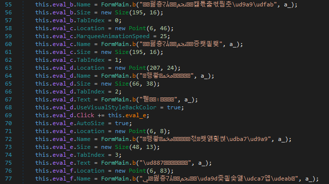
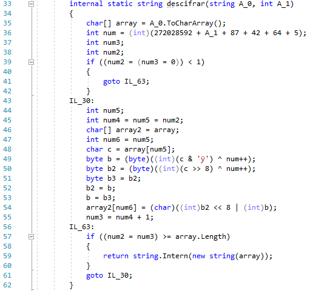
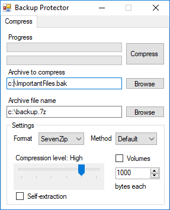
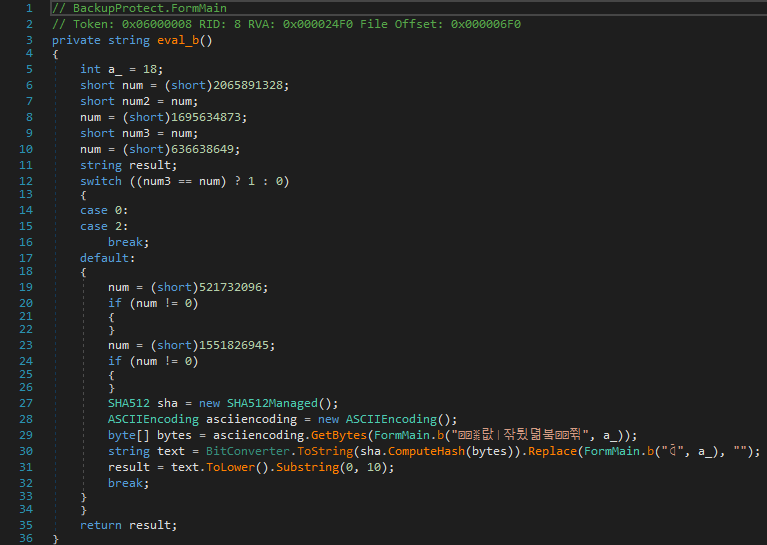
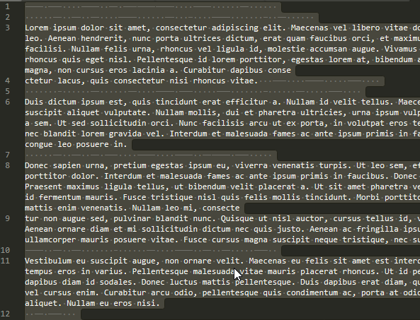

# Cybercamp Quals 2018 - 15. Hack or escape (500 puntos)
### Categoría > Forense


Se han perdido todos los datos de tu empresa, la única salida para evitar la banca rota es recuperar la copia de seguridad. Esta copia de seguridad está protegida por una contraseña, y a su vez la contraseña está protegida debido a que el administrador de sistemas es muy paranoico con la seguridad, el reto no será fácil. Se conoce que utilizan un software para proteger sus backups.

#### [Pista 1 Objetivo 15] [75 pts]
El software que utiliza tu empresa se llama Backup Protector.

#### [Pista 2 Objetivo 15] [110 pts]
Los desarrolladores suelen proteger el código .NET ofuscándolo.

#### [Pista 3 Objetivo 15] [140 pts]
Tienen costumbre de dejar espacios en blanco y de seguir a John Snow.

## Solución

El reto comienza con los archivos `memdump` y `protected`.

Como su nombre indica, el archivo `memdump` corresponde a un volcado de memoria RAM.

Por otra parte, el archivo `protected` es un 7z protegido con contraseña que contiene los archivos `backup.zip` y `password.txt`.


### Memdump

Comenzamos analizando

```bash
volatility  -f memdump imageinfo

Volatility Foundation Volatility Framework 2.6
INFO    : volatility.debug    : Determining profile based on KDBG search...
          Suggested Profile(s) : Win7SP1x86_23418, Win7SP0x86, Win7SP1x86
                     AS Layer1 : IA32PagedMemoryPae (Kernel AS)
                     AS Layer2 : FileAddressSpace (/root/Desktop/memdump)
                      PAE type : PAE
                           DTB : 0x185000L
                          KDBG : 0x8293ebe8L
          Number of Processors : 1
     Image Type (Service Pack) : 0
                KPCR for CPU 0 : 0x8293fc00L
             KUSER_SHARED_DATA : 0xffdf0000L
           Image date and time : 2018-07-06 12:05:43 UTC+0000
     Image local date and time : 2018-07-06 07:05:43 -0500
```

Usaremos el perfil `Win7SP1x86`.

```bash
volatility  -f memdump --profile=Win7SP1x86 hashdump
Volatility Foundation Volatility Framework 2.6
Invitado:501:aad3b435b51404eeaad3b435b51404ee:31d6cfe0d16ae931b73c59d7e0c089c0::: -> [empty]
teletran1:1000:aad3b435b51404eeaad3b435b51404ee:8846f7eaee8fb117ad06bdd830b7586c::: -> password
```

0x000000001e1f5ea0      5      0 R--r-d \Device\HarddiskVolume1\Users\teletran1\Desktop\BackupProtect.exeexe

```bash
volatility -f memdump --profile=Win7SP1x86 psscan
Volatility Foundation Volatility Framework 2.6
Offset(P)          Name                PID   PPID PDB        Time created                   Time exited
------------------ ---------------- ------ ------ ---------- ------------------------------ ------------------------------
0x000000001dc09d40 dllhost.exe        1816    508 0x1ee072e0 2018-07-06 11:06:53 UTC+0000
0x000000001dc47030 taskhost.exe        656    508 0x1ee07380 2018-07-06 11:06:59 UTC+0000
0x000000001dc62318 sppsvc.exe         2008    508 0x1ee073e0 2018-07-06 11:06:59 UTC+0000
0x000000001dc66030 dwm.exe            2184    856 0x1ee073c0 2018-07-06 11:07:04 UTC+0000
0x000000001dcb1030 vmtoolsd.exe       2296   2196 0x1ee07400 2018-07-06 11:07:04 UTC+0000
0x000000001dcb1518 jusched.exe        2304   2196 0x1ee07420 2018-07-06 11:07:04 UTC+0000
0x000000001dd04458 SearchIndexer.     2424    508 0x1ee07360 2018-07-06 11:07:10 UTC+0000
0x000000001dd29448 svchost.exe        2672    508 0x1ee07440 2018-07-06 11:07:12 UTC+0000
0x000000001dd36c20 wmpnetwk.exe       2532    508 0x1ee07460 2018-07-06 11:07:11 UTC+0000
0x000000001de26030 svchost.exe         700    508 0x1ee07140 2018-07-06 11:06:50 UTC+0000
0x000000001de3c030 svchost.exe        3636    508 0x1ee07300 2018-07-06 11:08:51 UTC+0000
0x000000001de57d40 explorer.exe       2196   2176 0x1ee07180 2018-07-06 11:07:04 UTC+0000
0x000000001de67030 svchost.exe         904    508 0x1ee071c0 2018-07-06 11:06:50 UTC+0000
0x000000001de6e438 audiodg.exe         324    740 0x1ee072c0 2018-07-06 12:02:58 UTC+0000
0x000000001de764e0 svchost.exe         856    508 0x1ee071a0 2018-07-06 11:06:50 UTC+0000
0x000000001de90890 svchost.exe        1020    508 0x1ee07200 2018-07-06 11:06:51 UTC+0000
0x000000001de943e0 SearchFilterHo     3520   2424 0x1ee07540 2018-07-06 12:05:43 UTC+0000
0x000000001deb9430 svchost.exe        1092    508 0x1ee07220 2018-07-06 11:06:51 UTC+0000
0x000000001def7030 spoolsv.exe        1208    508 0x1ee07240 2018-07-06 11:06:51 UTC+0000
0x000000001df73b70 svchost.exe        1624    508 0x1ee072a0 2018-07-06 11:06:52 UTC+0000
0x000000001df74030 SearchProtocol     1436   2424 0x1ee075a0 2018-07-06 12:05:43 UTC+0000
0x000000001df771b0 BackupProtect.      436   2196 0x1ee07580 2018-07-06 12:05:41 UTC+0000
0x000000001df8d780 msdtc.exe          1900    508 0x1ee07320 2018-07-06 11:06:53 UTC+0000
0x000000001e00e530 csrss.exe           412    396 0x1ee07040 2018-07-06 11:06:48 UTC+0000
0x000000001e029530 wininit.exe         404    344 0x1ee070a0 2018-07-06 11:06:48 UTC+0000
0x000000001e04a148 svchost.exe        1244    508 0x1ee07260 2018-07-06 11:06:51 UTC+0000
0x000000001e053530 winlogon.exe        460    396 0x1ee070c0 2018-07-06 11:06:48 UTC+0000
0x000000001e06ad08 vmtoolsd.exe       1396    508 0x1ee07280 2018-07-06 11:06:52 UTC+0000
0x000000001e137590 services.exe        508    404 0x1ee07080 2018-07-06 11:06:48 UTC+0000
0x000000001e170030 lsass.exe           516    404 0x1ee070e0 2018-07-06 11:06:49 UTC+0000
0x000000001e172030 lsm.exe             524    404 0x1ee07100 2018-07-06 11:06:49 UTC+0000
0x000000001e1c98e8 svchost.exe         624    508 0x1ee07120 2018-07-06 11:06:49 UTC+0000
0x000000001e501680 svchost.exe         740    508 0x1ee07160 2018-07-06 11:06:50 UTC+0000
0x000000001ee06020 smss.exe            260      4 0x1ee07020 2018-07-06 11:06:45 UTC+0000
0x000000001ee17210 dllhost.exe        2696    624 0x1ee07340 2018-07-06 12:05:44 UTC+0000
0x000000001ee1f520 csrss.exe           352    344 0x1ee07060 2018-07-06 11:06:48 UTC+0000
0x000000001eee2a58 cmd.exe            3192   2196 0x1ee07500 2018-07-06 11:07:28 UTC+0000
0x000000001eee3818 conhost.exe        3200    412 0x1ee07520 2018-07-06 11:07:28 UTC+0000
0x000000001fd11d40 PING.EXE           2372   3948 0x1ee07480
0x000000001fd2e420 dllhost.exe        2908    624 0x1ee07560 2018-07-06 12:05:41 UTC+0000   2018-07-06 12:05:46 UTC+0000
0x000000001fdf9030 mdd.exe            3036   3192 0x1ee073a0 2018-07-06 12:05:43 UTC+0000
```

Extraemos el proceso *BackupProtect*

```bash
volatility -f memdump --profile=Win7SP1x86 procdump --offset=0x000000001df771b0 -D dump
Volatility Foundation Volatility Framework 2.6
Process(V) ImageBase  Name                 Result
---------- ---------- -------------------- ------
0x85d771b0 0x00230000 BackupProtect.       OK: executable.436.exe
```

## Reversing BackupProtector.exe

```bash
file executable.436.exe
executable.436.exe: PE32 executable (GUI) Intel 80386 Mono/.Net assembly, for MS Windows
```

Analizamos la aplicación con *dnSpy*. En un primer momento observamos que la aplicación esta ofuscada con *Dotfuscator*.



Compilamos con *Visual Studio* una aplicación que nos ayude a desofuscar los textos de la aplicación, para ello copiamos la función `b(string, int)`





Si ejecutamos la aplicación vemos un boton llamado *Compress* que ejecuta la acción. Mientras desofuscamos unos de los objetivos sera encontrar este boton y que función llama al ser pulsado.

El objeto `eval_d` que se observa en la captura de pantala anterior corresponde a este botón, el string la linea 67 es 'Compress'.

Este botón llama a la función `eval_e` cuando se hace click en el.
Analizandola vemos como llama a la función *CompressFilesEncrypted*.

Si buscamos documentación de esta función, vemos como el segundo parametro es la contraseña de cifrado.

```c#
CompressFilesEncrypted(archiveFileName, Password, directoryOrFiles);
```

Por tanto el string *text2* contiene la contraseña utilizada para cifrar los archivos.

```c#
sevenZipCompressor.CompressFilesEncrypted(text, text2, new string[])
```

En la linea 80 vemos como el string text2 se le asigna el valor devuelto por la funcion `eval_b()`

```c#
string text2 = this.eval_b();
```



Replicamos esta función en *Visual Studio* para obtener la contraseña utilizada.

Esta función hace el hash sha512 del texto 'iz)85TG$$weT' y devuelve los 10 primeros caracteres.

Por tanto, la contraseña maestra de todos los archivos generados con este software es `1f4dd2261a`.


## backup.zip

En el archivo password.txt aparecen espacios y tabulaciones extrañas.



Con una rápida busqueda en internet de las palabas `space tab cipher` llegamos a la web del cifrado SNOW.

http://www.darkside.com.au/snow/description.html

```bash
snow -C password.txt out.txt && cat out.txt
password: QV651!!!1234
```

```bash
unzip backup.zip
Archive:  backup.zip
[backup.zip] flag.txt password:
  inflating: flag.txt
```

```bash
cat flag.txt
FLAG: CONGRATULATIONS_YOU_SAVED_YOUR_COMPANY
```
