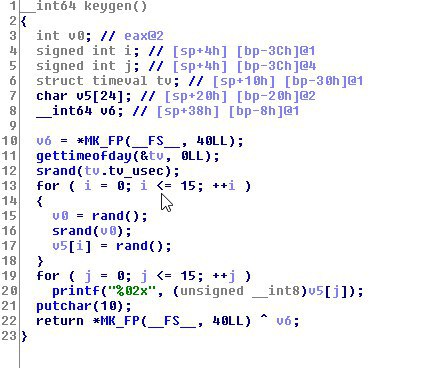

# ECSC 2018 - AES 2

Similar to AES 1, without source code provided.

The *keygen* function is different.



## Solution

- Keygen uses seed from microtime part of `gettimeofday` function.
- We modificate original crypto.c code to decode using seeds from 0 to 999999.
- For each possible solution we save the output to file.
- With unix `strings -n 20 *` and `grep` tools we search for ascii test into all of decoded files.
- The file with seed 543953 is the correct. The key for this seed is 1d06dd496c93a4063d5a6ff7d602b1ed and the md5 of file is 81a067f04ac30b3eea90d2cba6d1c06f


```bash
gcc -Wall crypto-bruteforce.c -o crypto-bruteforce -lssl -lcrypto
cat cipher | ./crypto-bruteforce

strings -n 20 out/*
WarGames is a 1983 American Cold War science fiction film written by...

grep WarGames *
out/543953_1d06dd496c93a4063d5a6ff7d602b1ed:WarGames is a 1983 American Cold War ...
```

```bash
cat cipher | ./crypto dec 1d06dd496c93a4063d5a6ff7d602b1ed
```

```
WarGames is a 1983 American Cold War science fiction film written by Lawrence Lasker and Walter F. Parkes and directed by John Badham. The film stars Matthew Broderick, Dabney Coleman, John Wood, and Ally Sheedy. The film follows David Lightman (Broderick), a young hacker who unwittingly accesses WOPR (War Operation Plan Response), a United States military supercomputer originally programmed to predict possible outcomes of nuclear war. Lightman gets WOPR to run a nuclear war simulation, believing it to be a computer game. The computer, now tied into the nuclear weapons control system and unable to tell the difference between simulation and reality, attempts to start World War III.

The film was a box office success, costing $12 million and grossing $79 million after five months in the United States and Canada. The film was nominated for three Academy Awards. A sequel, WarGames: The Dead Code, was released direct to DVD in 2008.

During a surprise drill of a nuclear attack, many United States Air Force Strategic Missile Wing controllers prove unwilling to turn the key required to launch a missile strike. Such refusals convince John McKittrick and other systems engineers at NORAD that missile launch control centers must be automated, without human intervention. Control is given to a NORAD supercomputer, WOPR (War Operation Plan Response), programmed to continuously run war simulations and learn over time.

David Lightman, a bright but unmotivated Seattle high school student and hacker, uses his computer to break into the school district's computer system and change his grades. He does the same for his friend and classmate Jennifer Mack. Later, while war dialing numbers in Sunnyvale, California to find a computer game company, he connects with a system that does not identify itself. Asking for games, he finds a list that starts with chess, checkers, backgammon, and poker, as well as titles like "Theaterwide Biotoxic and Chemical Warfare" and "Global Thermonuclear War", but cannot proceed further. Two hacker friends explain the concept of a backdoor password and suggest tracking down the Falken referenced in "Falken's Maze," the first game listed. David discovers that Stephen Falken was an early artificial intelligence researcher, and guesses correctly that his dead son's name, Joshua, is the password.

David does not know that the Sunnyvale phone number connects to WOPR at the Cheyenne Mountain Complex. He starts a game of Global Thermonuclear War, playing as the Soviet Union. The computer starts a simulation that briefly convinces the military personnel at NORAD that actual Soviet nuclear missiles are inbound. While they defuse the situation, WOPR nonetheless continues the simulation to trigger the scenario and win the game, as it does not understand the difference between reality and simulation. It continuously feeds false data such as Soviet bomber incursions and submarine deployments to NORAD, pushing them into raising the DEFCON level and toward a retaliation that will start World War III.

David learns the true nature of his actions from a news broadcast, and FBI agents arrest him and take him to NORAD. He realizes that WOPR is behind the NORAD alerts, but because he fails to convince McKittrick, he faces espionage charges. David escapes NORAD by joining a tourist group and, with Jennifer's help, travels to the Oregon island where Falken lives. David and Jennifer find that Falken has become despondent and believes that nuclear war is inevitable, that it is as futile as a game of tic-tac-toe between two experienced players. The teenagers convince Falken that he should return to NORAD to stop WOPR.

The computer stages a massive Soviet first strike with hundreds of missiles, submarines, and bombers. Believing the attack to be genuine, NORAD prepares to retaliate. Falken, David, and Jennifer convince military officials to cancel the second strike and ride out the attack. WOPR tries to launch the missiles itself, however, using a brute-force attack to obtain the launch code. Without humans in the control centers as a safeguard, the computer will trigger a mass launch. All attempts to log in and order Joshua to cancel the countdown fail, and all weapons will launch if the computer is disabled.

Falken and David direct the computer to play tic-tac-toe against itself. This results in a long string of draws, forcing the computer to learn the concept of futility and no-win scenarios. WOPR obtains the missile code, but before launching, it cycles through all the nuclear war scenarios it has devised, finding they, too, all result in stalemates. Having discovered the concept of mutual assured destruction ("WINNER: NONE"), the computer tells Falken that it has concluded that nuclear war is "a strange game" in which "the only winning move is not to play." WOPR relinquishes control of NORAD and the missiles and offers to play "a nice game of chess."
```
