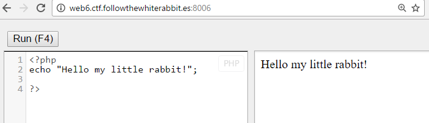
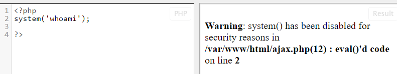
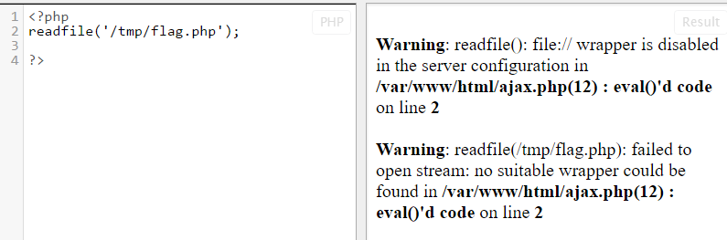
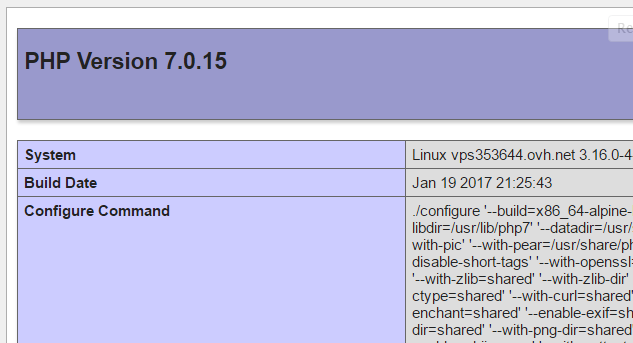
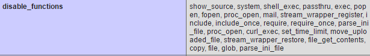
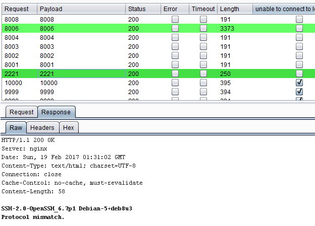
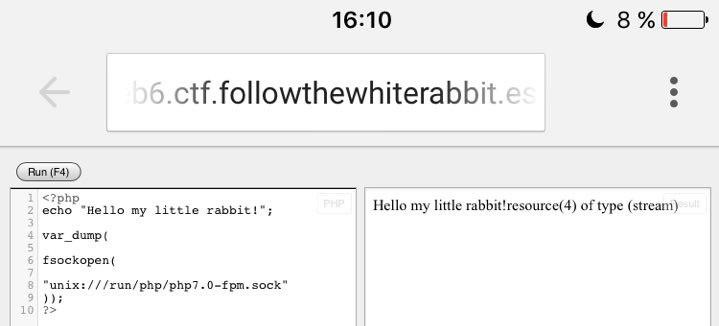
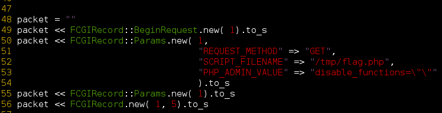
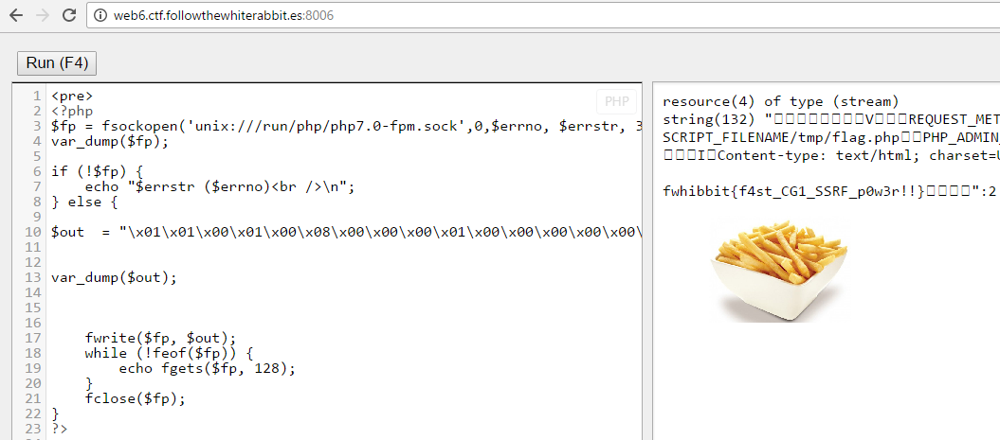

# CTF FWHIBBIT - Impossible is nothing - Indonesia

En esta prueba nos encontramos con un editor e interprete de código PHP. En la descripción nos indican que la flag se encuentra en */tmp/flag.php*

Si probamos a ejecutar un comando utilizando system nos salta una advertencia indicando que esta función esta deshabilitada.

La función *file_get_contents* y otras funciones de acceso a ficheros también están deshabilitadas, sin embargo, la función readfile no funciona al el wrapper 'file://' esta deshabilitado.

En su momento también conseguí encontrar alguna función habilitada que permitiera usar los wrappers *http* *ftp* o *php*. Aunque no fue posible realizar ninguna acción al estar deshabilitados.

La función *symlink* esta habilitada, fue posible crear un enlace simbólico del fichero con el flag, pero no leerlo.

Para obtener esta información no iba a ciegas, había utilizado en un primer momento phpinfo para ver que funciones estaban deshabilitadas, ademas de rutas, versiones y otra información jugosa.

También se me ocurrió utilizar funciones de FTP o MySQL para conectar a otro servicio y acceder al flag, pero tampoco estaban instaladas las librerías. Así que utilicé la función *fsockopen* para realizar un escaneo de puertos abiertos en la maquina con la esperanza de tener un servicio vulnerable esperándome.

Además de encontrar abierto el puerto de la prueba y de otras pruebas, había un servicio SSH en el puerto 2221. Aunque parecía interesante, asumí que no era parte de la prueba y seguí por otro camino.

Leyendo en infinidad de sitios, hablaban de la posibilidad de conectarse al cgi de php en el puerto 9000, pero en este caso no se encontraba abierto. También existía la posibilidad de conectarse a este mismo servicio a través de un socket de unix que por defecto debería encontrarse en la ruta */var/run/php-fpm.sock*. Pero no fue así.

Después de probar diferentes variaciones que aparecían en diferentes sitios como poner la versión: php5-fpm.sock, utilizar el directorio: */var/run/php/* o */run/*, etc… Después de bastantes intentos, recordé que phpinfo nos indicaba claramente que se trata de la versión 7 de php, así que buscando un poco mas encontré que la ruta por defecto para el socket se encontraba en */run/php/php7.0-fpm.sock*.

Una vez encontrado el socket, solo nos queda comunicarnos con el y pedirle amablemente que nos devuelva el archivo */tmp/flag.php*

Para ello utilicé un script en Ruby que nos devuelve la llamada en formato binario. <https://raw.githubusercontent.com/ONsec-Lab/scripts/master/fastcgipacket.rb>

Construimos el código php con la llamada binaria y obtenemos la flag.

