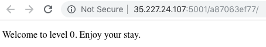

# HackerOne Hacker101 CTF


## A little something to get you started
### Web - Trivial (1/flag)

### Hints
* Flag0
	* Take a look at the source for the page
	* Does anything seem out of the ordinary?
	* The page looks really plain
	* What is that image?




```html
<!doctype html>
<html>
  <head>
    <style>
      body {
        background-image: url("background.png");
      }
    </style>
  </head>
  <body>
    <p>Welcome to level 0.  Enjoy your stay.</p>
  </body>
</html>
```
Accedemos a `background.png` y obtenemos la flag.
