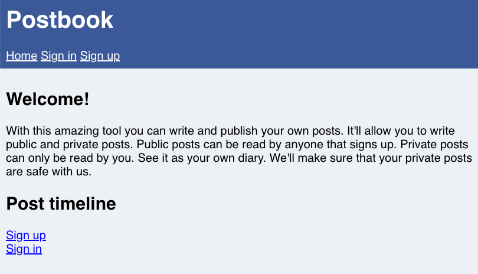

# HackerOne Hacker101 CTF

## Postbook
### Web - Easy (4/flag)

* Flag0
	* The person with username "user" has a very easy password...
* Flag1
	* Try viewing your own post and then see if you can change the ID
* Flag2
	* You should definitely use "Inspect Element" on the form when creating a new post
* Flag3
	* 189 * 5
* Flag4
	* You can edit your own posts, what about someone else's?
* Flag5
	* The cookie allows you to stay signed in. Can you figure out how they work so you can sign in to user with ID 1?
* Flag6
	* Deleting a post seems to take an ID that is not a number. Can you figure out what it is?

### Flag0 - Credenciales debiles
La primera flag se obtiene al acceder con `user:password`
	
### Flag1 - Falta de autorización
Accedemos a un post de otro usuario `/index.php?page=view.php&id=2`
	
### Flag2 - WTF!!
Creamos un post con el ID de otro usuario que se envía como un parámetro oculto del formulario.
	
### Flag3 - Free points
Visitamos el post 945 `/index.php?page=view.php&id=945`
	
### Flag4 - Falta de autorización
Modificamos el post de otro usuario `/index.php?page=edit.php&id=1`
	
### Flag5 - Cookie predecible
La cookie `c81e728d9d4c2f636f067f89cc14862c` corresponde al hash MD5 de '2', generamos el MD5 de '1' `c4ca4238a0b923820dcc509a6f75849b` y modificamos la cookie, de esta forma accedemos como el usuario admin
### Flag6 - ID predecible y falta de autorización
Borramos el post de otro usuario, de la misma forma el ID del post es el hash MD5 de un valor numerico `index.php?page=delete.php&id=c81e728d9d4c2f636f067f89cc14862c`.
