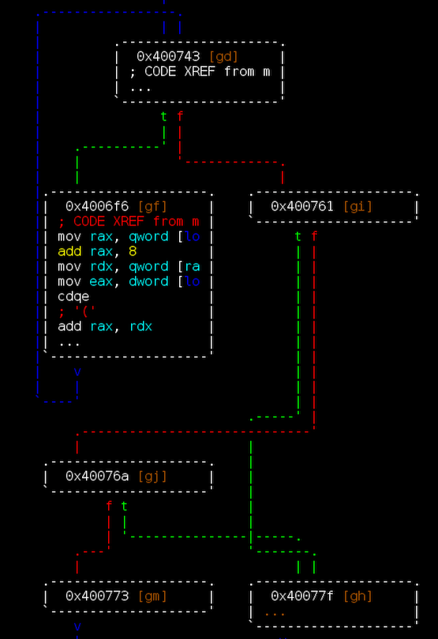
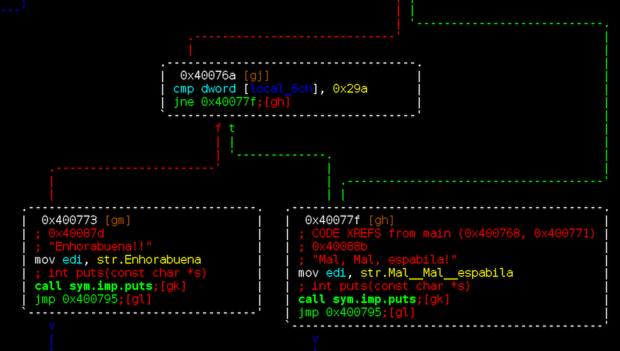
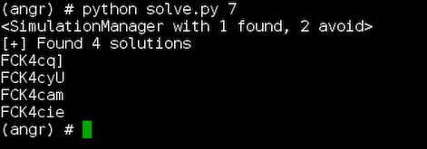

# CTF honeycon 2018 - rev4

Este reto de reversing consiste en encontrar un código válido que cumpla determinadas condiciones.

Abrimos el binario con radare.

[rev4](rev4)

```bash
r2 -AA rev4
```

Con `afl` obtenemos el listado de funciones.

```bash
[0x00400530]> afl
0x00400498    3 26           sym._init
0x004004d0    1 6            sym.imp.puts
0x004004e0    1 6            sym.imp.strlen
0x004004f0    1 6            sym.imp.__stack_chk_fail
0x00400500    1 6            sym.imp.printf
0x00400510    1 6            sym.imp.__libc_start_main
0x00400520    1 6            sub.__gmon_start_520
0x00400530    1 41           entry0
0x00400560    4 50   -> 41   sym.deregister_tm_clones
0x004005a0    4 58   -> 55   sym.register_tm_clones
0x004005e0    3 28           sym.__do_global_dtors_aux
0x00400600    4 38   -> 35   entry1.init
0x00400626   12 399          main
0x004007c0    4 101          sym.__libc_csu_init
0x00400830    1 2            sym.__libc_csu_fini
0x00400834    1 9            sym._fini
```

Desensamblamos la función main, ya sea con `pdf @ main` o `VV @ main` para verlo en modo gráfico.

```bash
[0x00400530]> VV @ main
```



La estructura de la función es bastante simple, se procesa el argumento de entrada en un bucle y al finalizar se evalua. Si el resultado es no es correcto se salta a *0x40077f*, en cambio si es correcto la función llega hasta *0x400773*.



Usamos *angr* para resolver la prueba.

[solve.py](solve.py)
```python
p = angr.Project("rev4", auto_load_libs=False)

sym_arg = claripy.BVS('sym_arg', 8*7)

argv = [p.filename]
argv.append(sym_arg)
initial_state = p.factory.entry_state(args=argv)

for byte in sym_arg.chop(8):
    initial_state.add_constraints(byte >= '0')
    initial_state.add_constraints(byte <= 'z')

sm = p.factory.simulation_manager(initial_state)
e = sm.explore(find=0x00400773, avoid=(0x0040077f, 0x0040078b))
print(e)
```



Probamos la solución en el binario.


