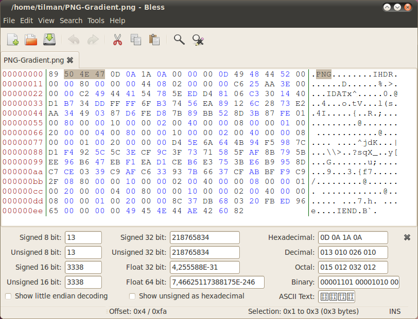
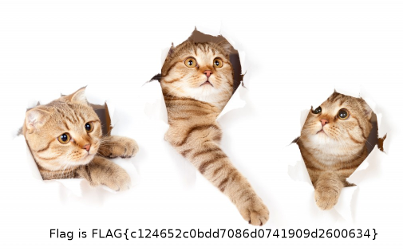

# Huawei CTF 2018 - Reto 2 - PARANORMALGLITCH
### Categoría: Forense

El reto consiste en encontrar la flag en una imagen JPG. Por comodidad usaremos `gatos.jpg` como nombre del archivo a analizar.


El archivo tiene un tamaño de `670081 bytes`.

```bash
file gatos.jpg
gatos.jpg: JPEG image data, JFIF standard 1.01, resolution (DPI), density 72x72, segment length 16, progressive, precision 8, 1920x1024, frames 3
```

Usamos algunas herramientas de busqueda de firmas como son *binwalk*, *photorec* o *foremost*.

En el caso de *foremost* obtenemos la misma imagen JPG, pero con un tamaño de `196951 bytes`. Esto nos hace sospechar que hay otro archivo o datos importantes después de la imagen JPG.

Extraemos los datos a partir del offset 196951

```bash
dd if=gatos.jpg of=part2 bs=1 skip=196951
```

Analizamos este nuevo archivo `part2`. Rápidamente observamos la existencia de los strings *IHDR* y *IDAT*, por lo que posiblemente nos encontramos con una imagen PNG.

```
xxd part2 |head
00000000: 0d0a 1a0a 0000 000d 4948 4452 0000 0400  ........IHDR....
00000010: 0000 0288 0806 0000 00ee 2e88 0c00 0000  ................
00000020: 0662 4b47 4400 ff00 ff00 ffa0 bda7 9300  .bKGD...........
00000030: 0020 0049 4441 5478 daec dde9 93a4 5776  . .IDATx......Wv
00000040: dff7 efbd f759 72ab acbd 7a43 3730 0007  .....Yr...zC70..
00000050: 98c1 7048 0ec5 4594 4c29 4221 4b61 5bf2  ..pH..E.L)B!Ka[.
00000060: a208 ff3d e2df e1b0 432f 1cb2 23ec b06c  ...=....C/..#..l
00000070: 5914 456d 2629 919c 2139 43ce 7008 6200  Y.Em&)..!9C.p.b.
00000080: 34d0 68f4 5a5d 5d6b aecf 72ef f58b 2733  4.h.Z]]k..r...'3
00000090: 2bbb d0d5 682c 33e8 46ff 3e98 8cca caaa  +...h,3.F.>.....
```

Comparamos este inicio del archivo con otro archivo PNG o con el ejemplo que aparece en Wikipedia.



Vemos como nos faltan los 4 primeros bytes de la cabecera PNG (por este motivo los programas de recuperación de datos no identifican el archivo PNG).
Los añadimos con *xxd* y *cat*.

```bash
echo 89504e47 | xxd -ps -r > pngheader
cat pngheader part2 > image.png
```

Esta imagen no esta 100% correcta y no se abre con todos los softwares, aun así es posible visualizarla con *GIMP* y obtener la flag.

