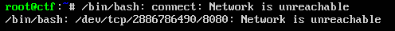
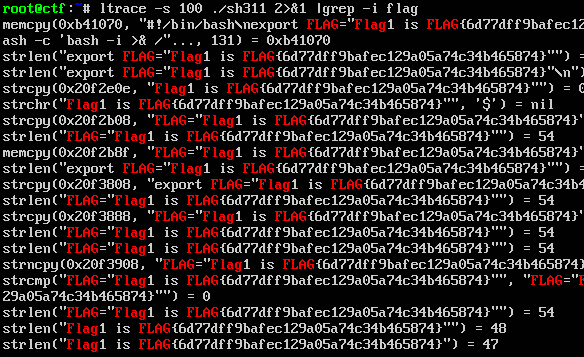

# Huawei CTF 2018 - Reto 3 - BACKD00RS_01
### Categoría: Forense

Estos retos se basan en analizar una Maquina Virtual infectada que utiliza el sistema operativo Ubuntu 16.04.

Una vez accedemos con el usuario `ctf`, utilizamos el comando `su` para acceder como administradores de la maquina y analizarla mas exhaustivamente.

En un primer momento obtenemos un mensaje de error, que nos indica que hay algo troyanizado.



Al final del archivo `.bashrc` tenemos un ejecutable, con un intento de ocultación después de muchos saltos de linea.

```
/bin/sh311.x
```

Analizamos este binario y con `ltrace` observamos como genera el string de la flag.

