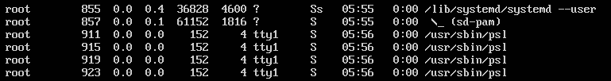
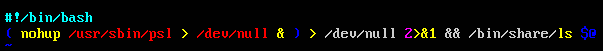
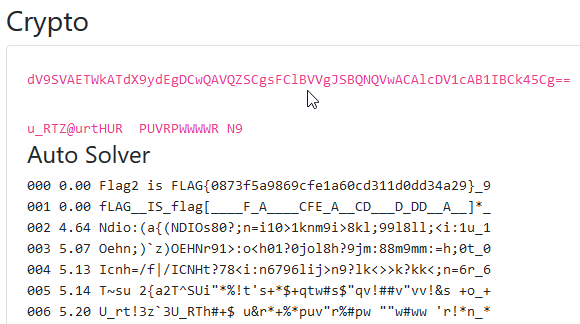

# Huawei CTF 2018 - Reto 4 - BACKD00RS_02
### Categoría: Forense

El segundo backdoor se encuentra al utilizar `ps` para ver los procesos en ejecución.



El binario infectado es `/bin/ls`



Analizamos el binario ```/usr/sbin/psl``` y con `strings` obtenemos un texto en base64.

```
Watch this: dV9SVAETWkATdX9ydEgDCwQAVQZSCgsFClBVVgJSBQNQVwACAlcDV1cAB1IBCk45Cg==
```

Con *Auto Solver* de las PatataUtils *desciframos* el contenido del base64 y obtenemos la flag.

De la forma complicada, el texto hay que descifrarlo/decodificarlo con XOR *0x33*.


