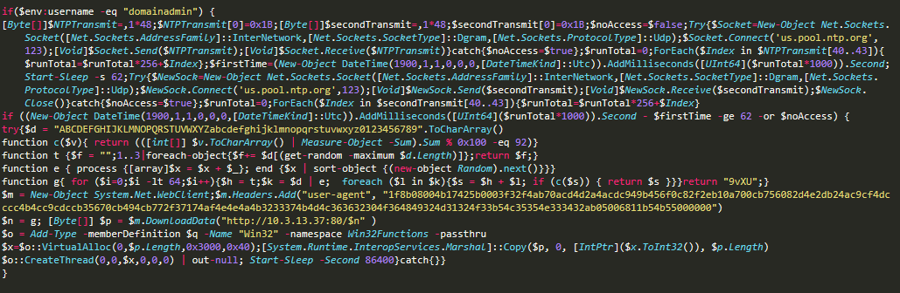

# Huawei CTF 2018 - Reto 5 - CYBERCRIME101
### Categoría: Forense

En este reto nos piden analizar el malware `do_not_remove.bat` para encontrar la flag.

En un primer analisis descubrimos que se trata de un script de powershell que ejecuta algo que esta codificado en Base64.

```powershell
Invoke-Expression $(New-Object IO.StreamReader (
	$(New-Object IO.Compression.DeflateStream (
		$(New-Object IO.MemoryStream (,
			$([Convert]::FromBase64String("...")))),
	[IO.Compression.CompressionMode]::Decompress)),
[Text.Encoding]::ASCII)).ReadToEnd();
```

Decodificamos el texto en base64 y obtenemos algo binario, si nos fijamos en el código vemos como el siguiente paso es user la función `CompressionDeflateStream`.

```bash
base64 -d b64.txt > bin
printf "\x1f\x8b\x08\x00\x00\x00\x00\x00\x00\x00" |cat - bin |gzip -dc > code
```



Los mas sospechoso de este código es la la cadena hexadecimal que se envía en el User-Agent. Tras unas cuanto intentos de decodificarla, se llega a la conclusión de que se trata de otro gzip al comenzar con los bytes `1f 8b 08 00`.

```bash
echo 1f8b08004b17425b0003f32f4ab70acd4d2a4acdc949b456f0c82f2eb10a700cb756082d4e2db24ac9cf4dcccc4b4cc9cdccb35670cb494cb772f37174af4e4e4a4b3233374b4d4c363632304f364849324d31324f33b54c35354e333432ab05006811b54b55000000 |xxd -ps -r |gzip -dc
Org:Umbrella; Host:PAW; User:domainadmin; Flag:FLAG{cbfb676eac3207c0db5d27f59e53f126}
```