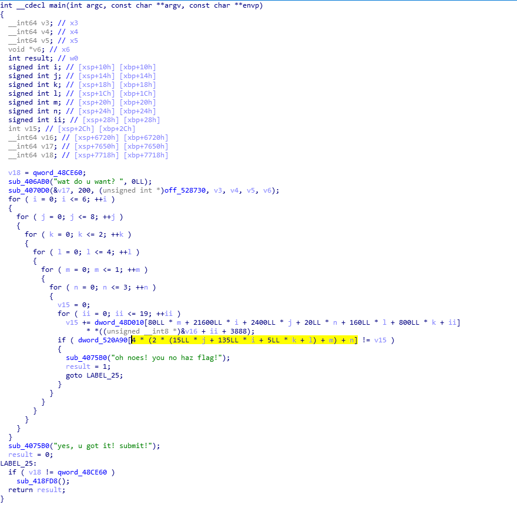
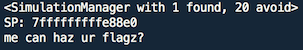
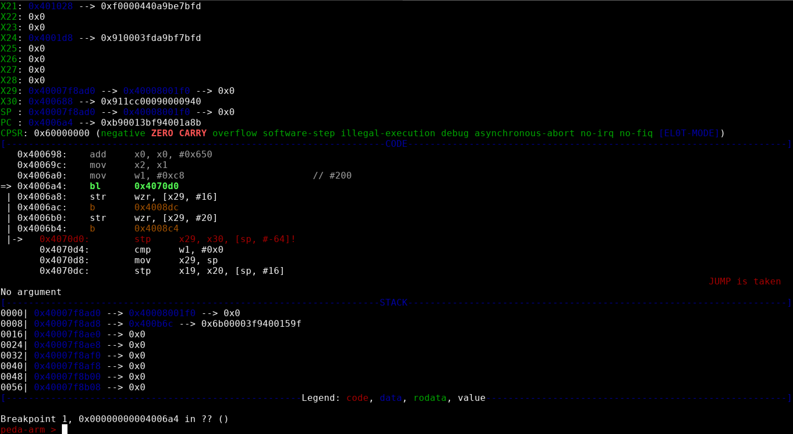
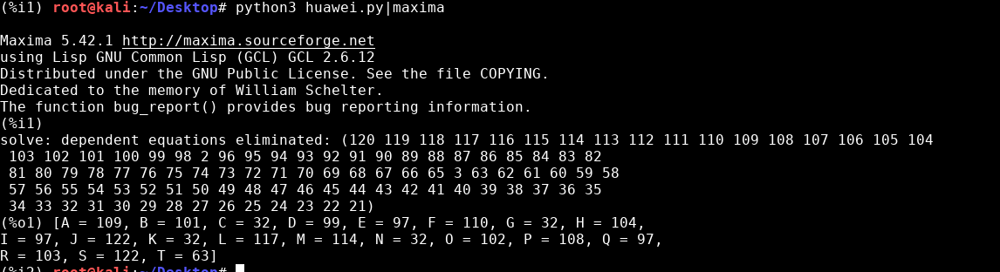
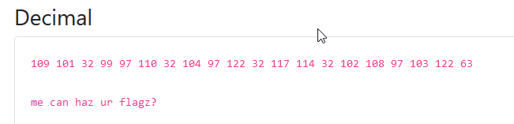

# Huawei CTF 2018 - Reto 6 - ARMOURED KITTEN
### Categoría: Reversing

El reto consiste en reversear un binario en ARM64 para conseguir la flag.

[re1](re1)

```bash
file re1
re1: ELF 64-bit LSB executable, ARM aarch64, version 1 (SYSV), statically linked, for GNU/Linux 3.7.0, BuildID[sha1]=48e70b04d5fdfcaccb8442dda6fec030f0f6b822, stripped
```

La primera dificultad es no poder ejecutar nativamente este binario en nuestra maquina x64.
Por lo que instalamos `qemu` para ejecutarlo y debugearlo.

Cuando ejecutamos el binario, espera a que introduzcamos un texto y comprueba si es correcto.

```bash
qemu-aarch64 ./re1
wat do u want? patatas
oh noes! you no haz flag!
```

Analizando el binario con un desensamblador (r2, gdb, IDA) vemos que el texto que se obtiene al introducir la solución correcta es `yes, u got it! submit!`.

Con IDA X-Rays decompilamos el código para entender claramente el funcionamiento del binario.



Vemos una serie de bucles en los que se comprueba que los caracteres que hemos introducido cumplan una serie de ecuaciones lineales. Este reto es muy similar a *baby-re* del CTF de clasificación de DEFCON 2016.

Este reto se puede resolver rápidamente con la herramienta *angr*, o de forma mas laboriosa extrayendo las ecuaciones y resolviéndolas con software matemático.

### Angr

Generamos un script de *angr* indicando la direcciones a encontrar y direcciones a evitar.

Como solo es necesario encontrar una solución que cumpla las 20 primeras ecuaciones, diseñamos el script con este proposito. Otra solución sería eliminar algunos bucles del binario original, reduciendo el número total de ecuaciones que se comprueban.

Otra parte importante del script es *hookear* las funciones *printf* y *scanf* para que no realicen nada.

Por ultimo, una vez encontramos la solución, tenemos que mostrar el estado de la memoria en `SP + 30288`.

[solve.py](solve.py)




### Debugging y extracción de ecuaciones

Para debuggear el programa utilizamos:

`qemu-aarch64 -g 3000 ./re1`

`gdb-multiarch` Con el plugin de p3da para ARM `peda-arm`

Después de arrancar GDB introducimos `target remote localhost:3000`



En este proceso obtenemos de que direcciones de memoria se sacan los valores para completar las ecuaciones, el primero es `0x48d010` de donde se extraen los coeficientes para cada letra de la flag. Y el segundo es `0x520A90`, del que se extraen los valores que debe cumplir la ecuación.

Estos valores no están en una única dirección de memoria, sino que para cada iteración del bucle se obtiene de una dirección de memoria distinta.

Con el comando `iS` de radare2 obtenemos en que offset del archivo se localizan estas secciones:
```
> iS
[Sections]
00 0x00000000      0 0x00000000      0 ----
01 0x00000190     32 0x00400190     32 -r-- .note.ABI_tag
...
23 0x0007d000 641688 0x0048d000 641688 -rw- .data
24 0x00119a98      0 0x00529a98   5952 -rw- .bss
25 0x00119a98      0 0x0052b1d8     48 -rw- libc_freeres_ptrs
...
```

Tenemos por tanto los offsets `0x7D010` y `0x110A90`.

Cortamos el binario con `dd` y extraemos esas secciones:

```bash
dd if=re1 of=bin1 bs=1 skip=512016
dd if=re1 of=bin2 bs=1 skip=1116816
```

Dado que para 20 incognitas solo necesitamos 20 ecuaciones en el mejor de los casos, no es necesario extraer las miles de ecuaciones que evalúa el programa, en este caso extraemos las 120 primeras.

```python
import struct

bin1 = open('bin1','rb')
data1 = bin1.read()

bin2 = open('bin2','rb')
data2 = bin2.read()

var = 'ABCDEFGHIJKLMNOPQRST'
var_maxima = 'A,B,C,D,E,F,G,H,I,J,K,L,M,N,O,P,Q,R,S,T'
final_equation = ''
for k in range(0,3):
    for l in range(0,5):
        for m in range(0,2):
            for n in range(0,4):
                equation = ''
                xx = 0
                for ii in range(0,20):
                    i = ii + 20*n + 80*m + 160*l + 800*k
                    x = struct.unpack('<L', data1[4*i:4*i+4])[0]
                    if x!=0:
                        equation += '(%s*%s)' % (var[ii], x)
                        if(ii<19):
                            equation += "+"

                j = n + 4*m + 8*l + 40*k
                y = struct.unpack('<L', data2[4*j:4*j+4])[0]

                final_equation += '%s=%d,' % (equation,y)

final_equation = final_equation[:-1]
print('linsolve([%s],[%s]);' % (final_equation,var_maxima))
```

Ejecutamos el script y obtenemos las ecuaciones, se las pasamos a *wxmaxima* para resolverlas.

```bash
python re1.py | maxima

Maxima 5.42.1 http://maxima.sourceforge.net
using Lisp GNU Common Lisp (GCL) GCL 2.6.12
Distributed under the GNU Public License. See the file COPYING.
Dedicated to the memory of William Schelter.
The function bug_report() provides bug reporting information.
(%i1)
solve: dependent equations eliminated: (24 23 22 21)
(%o1) [A = 109, B = 101, C = 32, D = 99, E = 97, F = 110, G = 32, H = 104,
I = 97, J = 122, K = 32, L = 117, M = 114, N = 32, O = 102, P = 108, Q = 97,
R = 103, S = 122, T = 63]
```



Obtenemos la flag en formato decimal, lo convertimos a ascii.



`me can haz ur flagz?`
