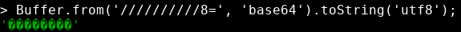
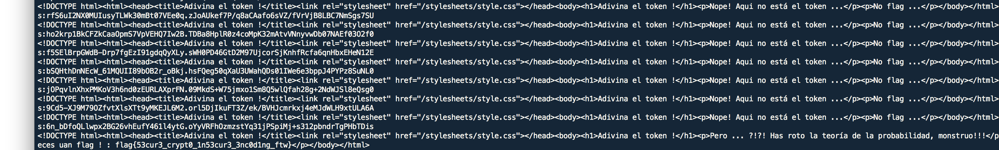
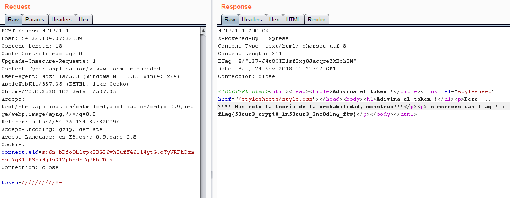

# Huawei CTF 2018 - Reto 7 - CRYPTOKENITA
### Categoría: Criptografia

En esto reto nos proporcionan el código fuente de *nodeJS* de la aplicación. El objetivo es encontrar un token correcto para obtener el flag.

[source.js](huawei-crypto.js)

En resumen, se genera un token de 8 bytes que tenemos que acertar y enviar codificado en base64.

A continuación se muestran las partes más importantes/criticas de la aplicación.

```js

function tokenGen() {
    return crypto.randomBytes(8).toString();
}

app.post('/guess', function (req, res, next) {
    var token = req.body.token;
    // No hack
    if(!_.isString(token) || !_.isBuffer(Buffer.from(token, 'base64')) || !_.isString(Buffer.from(token, 'base64').toString('utf8'))) {
        res.render('hacker', {title: title});
        return;
    }

    token = Buffer.from(token, 'base64').toString('utf8');
    if(req.session && req.session.token && req.session.token === token) {
        res.render('flag', {title: title, flag: config.flag});
        return;
    }

    res.render('no_flag', {title: title});
});
```

Si analizamos detalladamente el código observaremos que en la función *toString* utiliza *UTF8*. Esta codificación es multibyte y se utilizan 2 bytes para representar los caracteres 0x80 a 0xff, por lo que utilizar literalmente 0x80 a 0xff nos devuelve un error de codificación.



Sabiendo esto solo tenemos que probar múltiples veces con este valor no valido `0xffffffff` hasta conseguir la flag.

```python
import urllib.parse
import requests

user_agent = 'Mozilla/5.0'

for i in range(10000):
    headers = { 'User-Agent' : user_agent, 'Connection': 'keep-alive'}
    url = 'http://54.36.134.37:32009'
    r = requests.get(url, headers=headers)
    data = r.text
    print(urllib.parse.unquote(r.cookies['connect.sid']))

    url2 = 'http://54.36.134.37:32009/guess'
    headers = { 'User-Agent' : user_agent, 'Connection': 'keep-alive','Content-Type':'application/x-www-form-urlencoded'}
    headers['Cookie'] = 'connect.sid=' + r.cookies['connect.sid']
    r2 = requests.post(url2, data='token=//////////8', headers=headers)
    data2 = r2.text
    print(data2)

    if  'No flag' not in data2:
        break
```




