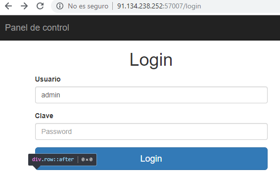
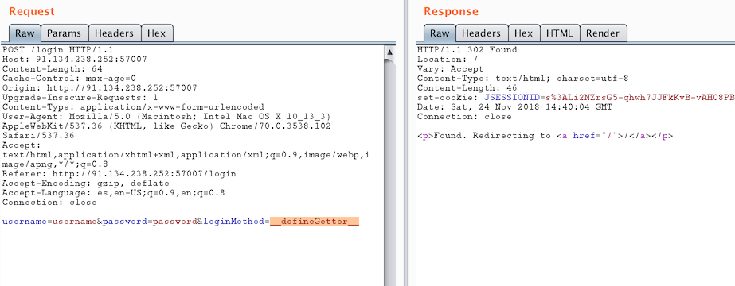
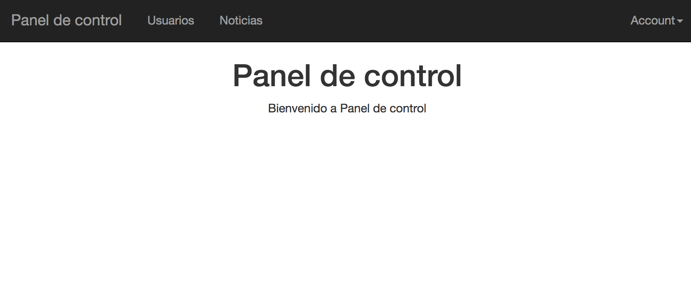
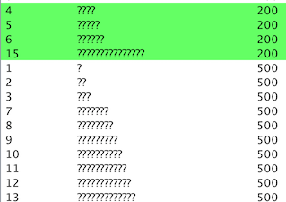
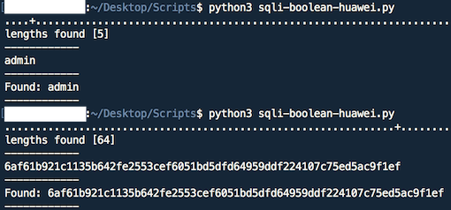
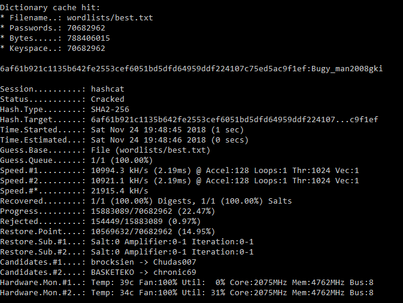
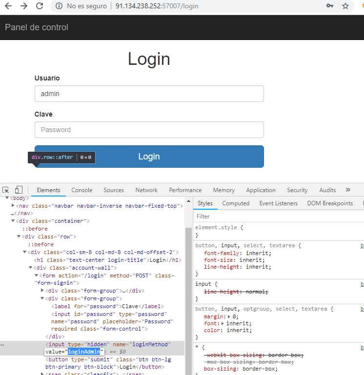
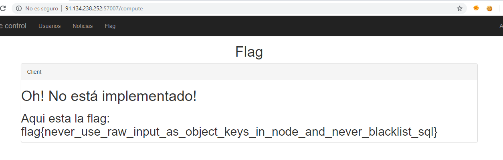

# Huawei CTF 2018 - Reto 8 - LOGIN DENOID
### Categoría: Web

Este reto tiene 2 partes. En un primer lugar tendremos que enfrentarnos a una página de login y conseguir autenticarnos de cualquier forma. Una vez dentro del panel de usuario, habrá que explotar una inyección SQL para extraer las credenciales de administrador y utilizarlas para conseguir la flag.



## Login Bypass

El login tiene 3 parámetros:
* username
* password
* loginMethod

Tras no encontrar ninguna inyección en *username* o *password*, probamos a modificar *loginMethod*.

Si lo modificamos por otra palabra obtenemos el siguiente error que nos indica que ese método/función no existe.

```user[loginMethod] is not a function```


Haciendo fuzzing con algunos diccionarios obtenemos un comportamiento distinto con la palabra *constructor*.

```Class constructor User cannot be invoked without 'new'```

Finalmente, con `__defineGetter__` conseguimos hacer el bypass del login.




## Inyección SQL

Una vez accedemos al panel de usuario, tenemos accesible una opción para visualizar noticias.



`/news/item?id=1`

Con una inyección comilla simple descubrimos que se devuelve el error `Database error`, por lo que muy probablemente exista una inyección SQL.

El primer paso es formar una inyección booleana, tras probar algunos caracteres o palabras de SQL nos damos cuenta de que esta aplicación tiene reglas para bloquear ataques, devolviendo el error `Blacklisted`.


#### Caracteres bloqueados
```
[Espacio] > ` * # = --  || &&
```

#### Palabras bloqueadas
```
LIKE BETWEEN CONCAT LENGTH LOWER SUBSTR SUBSTRING COUNT ASC ABS TRIM VERSION UNION ALL
NULL ISNULL LEFT CHAR GETDATE ROUND UNION COALESCE REGEXP PRINTF UPPER LOWER
```

### Caracteres y palabras permitidas
```
' ( ) < - + (%2b) AND OR SELECT FROM WHERE SIGN MID GLOB
```

Uno de estos caracteres bloqueados es el espacio, por lo que deberemos construir las consultas SQL sin hacer uso de ellos y en su lugar utilizando paréntesis donde sea posible.

```
/news/item?id=2'and'1  (BOOLEAN TRUE, devuelve la noticia 2)
/news/item?id=2'and'0  (BOOLEAN FALSE, devuelve 'Noticia no encontrada')
```

Basándonos en esta inyección booleana debemos construir una consulta mas compleja para obtener información de la base de datos, en primer lugar que tipo de base de datos se esta utilizando.

Uno de los factores mas determinantes es el error que se obtiene al intentar utilizar la función MID (alias de SUBSTRING), lo que nos indica que el motor de base de datos utilizado no lo soporta.

Tras una larga investigación se determina que la base de datos puede ser SQLite. Además de la posibilidad de utilizar la función *GLOB*.

La función *GLOB* se puede utilizar junto con los comodines '*' o '?', en este caso el asterisco no esta permitido, por lo que utilizamos el carácter de interrogación '?'.

Este carácter comodín equivale a un solo carácter, por lo que para descubrir el tamaño de los campos debemos hacer fuerza bruta con diferentes longitudes.




La inyección toma la siguiente forma, sustituyendo *TABLA*, *COLUMNA*, y el numero de '?'.
```
'and(SELECT(1)from(TABLA)WHERE(glob('????',COLUMNA)))and'1
```

Una vez conocemos el tamaño del campo a extraer, hacemos fuerza bruta carácter a carácter, dado que algunos caracteres o palabras estan prohibidos, utilizamos el comodin en el caso de no encontrar una coincidencia.


Extraer nombre de tablas: TABLA='sqlite_master' COLUMNA='tbl_name'
* news
* users
* admins
* sqlite_sequence

Columnas de la tabla admins:
```
'and(SELECT(1)from(sqlite_master)WHERE(glob('admins',tbl_name)and(glob('????',sql))))and'1
CREAT??TABLE?admins?ID?INTEGE??PRIMARY?KEY?AUTOINCREMENT??u53rn4m333?TEX??NO??NUL??UNIQUE??p455w0rddd?TEX??NO??NUL??
```
* u53rn4m333
* p455w0rddd

Extraemos finalmente el usuario y contraseña de la tabla *admins*



Por el tamaño del password suponemos que se trata de un hash SHA256, utilizamos hashcat para crackearlo.



Una vez tenemos usuario y contraseña de administrador hacemos login modificando el *loginMethod* por *loginAdmin*.





