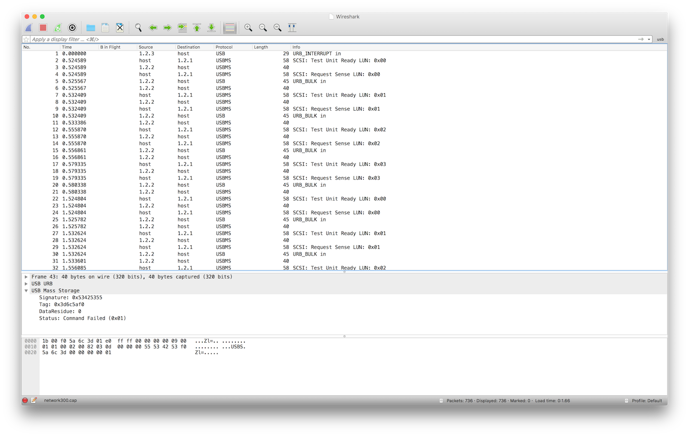
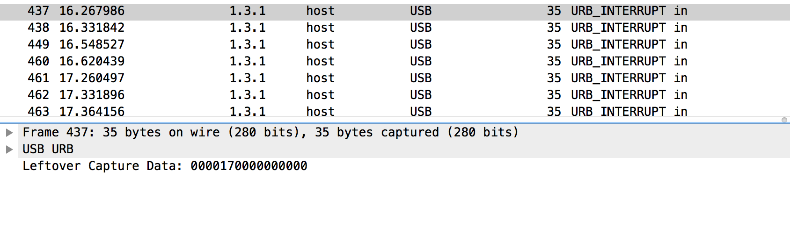

# Kernel 2015 - Networking

En esta prueba nos dan un archivo .cap que contiene una comunicación USB entre el PC y varios dispositivos.

Una de las cabeceras del archivo nos indica “USB packets with USBPcap header”



En un vistazo rápido al archivo podemos observar la dirección de los diferentes dispositivos conectados y analizando algunos paquetes hacernos una idea preliminar de lo que son cada uno

host – El pc del usuario
1.1.x – Hub USB
1.2.x – USB Mass Storage
1.3.x – Keyboard Tracer Gamma Ivory
Nos centraremos en los datos enviados por el teclado (1.3.1), para ello usaremos el filtro de wireshark usb.device_address==3



En esta captura podemos observar como el teclado envia el caracter 0x17

Usando una tabla para traducir los scancodes a la tecla correspondiente <http://www.mindrunway.ru/IgorPlHex/USBKeyScan.pdf>

Traducimos 0x17 a la tecla ‘t’

Siguiendo el mismo proceso podríamos sacar todas las teclas pulsadas, aunque para complicar las cosas nos aparece la siguiente secuencia en la que se pulsan 2 teclas simultáneamente

```
00:00:18:00:00:00:00:00
00:00:18:11:00:00:00:00
00:00:11:00:00:00:00:00
00:00:00:00:00:00:00:00
```

En este caso tenemos la pulsación de la tecla ‘u’ (0x18) seguida la tecla ‘n’ (0x11) simultáneamente antes de soltar la ‘u’. Sin mucha dificultad sabemos que la secuencia pulsada ha sido ‘un’.

```
00:00:17:00:00:00:00:00	T
00:00:20:00:00:00:00:00	3
00:00:0c:00:00:00:00:00	I
00:00:0c:11:00:00:00:00 N
00:00:11:00:00:00:00:00
00:00:19:00:00:00:00:00 V
00:00:0c:00:00:00:00:00 I
00:00:17:00:00:00:00:00 T
00:00:27:00:00:00:00:00	0
00:00:21:00:00:00:00:00 4
00:00:18:00:00:00:00:00 U
00:00:18:11:00:00:00:00 N
00:00:11:00:00:00:00:00
00:00:21:00:00:00:00:00 4
00:00:10:00:00:00:00:00 M
00:00:1e:00:00:00:00:00 1
00:00:0f:00:00:00:00:00 L
00:00:11:00:00:00:00:00 N
00:00:18:00:00:00:00:00 U
00:00:20:00:00:00:00:00 3
00:00:19:00:00:00:00:00 V
00:00:20:00:00:00:00:00 3

T3INVIT04UN4M1LNU3V3
```

El texto es **t3invit04un4m1lnu3v3**