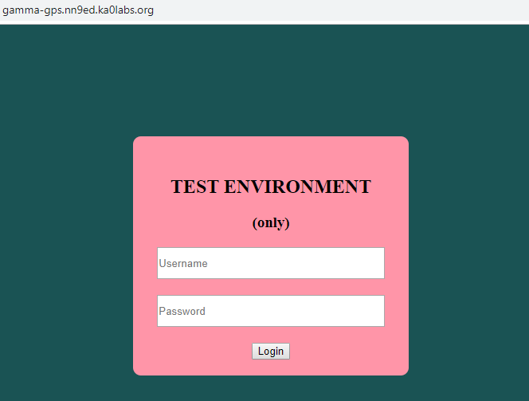
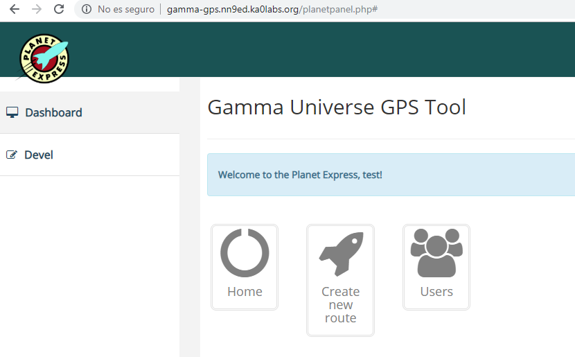
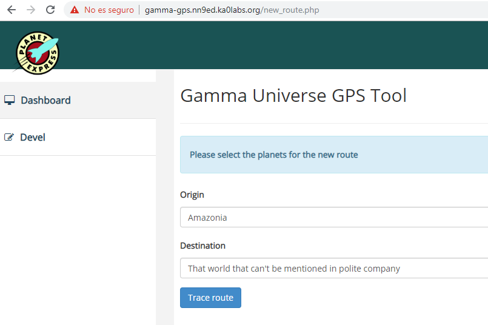
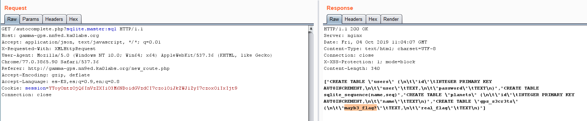
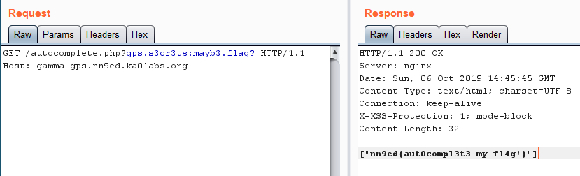

## Gamma-GPS - Web - 337 Points

```
We are testing our new system. The Planet Express Ship will be able to trace the best route between 2 planets in a few seconds, but we are trying to make it secure first! It seems unbreakable, isn't it?

http://gamma-gps.nn9ed.ka0labs.org/

```

### Login
La web nos presenta un login de un entorno de Testing. Utilizamos credenciales comunes, consiguiendo acceder con `test:test`.




### Aplicación Planet Express
Una vez accedemos podemos navegar por varias paginas de la aplicación.



### Devel Debug

En el panel de Devel nos indica que solo se puede acceder en *modo debug*. Si analizamos la cookie de sesión, vemos que se trata de un serializado en base64.

`a:2:{s:4:"user";s:4:"test";s:5:"debug";s:1:"0"}`

Modificamos el valor de debug a '1' y volvemos a codificarlo en base64.

```php
<?php

include("config.php");

if(strpos(urldecode($_SERVER['QUERY_STRING']), '_') !== FALSE  ||  strpos(urldecode($_SERVER['QUERY_STRING']), '`') !== FALSE){
    // avoid querying sqlite_master ;)
    die("[+] Hacking attempt!!!!!11!\n");
}


foreach($_GET as $sql_column => $search_term)
{
    list($table, $column) = explode(':', $sql_column, 2);

    $stm = $dbh->prepare('SELECT `'. $column .'` FROM `'. $table .'` WHERE `'. $column .'` LIKE ? || "%"');
    $stm->bindValue(1, $search_term);
    $stm->execute();
    $res =$stm->fetchAll(PDO::FETCH_COLUMN);

    die(json_encode($res));
}


?>
```


### Bug en Autocompletado

En el formulario para introducir los planetas de origen y destino existe una función de autocompletado, la cual utiliza el código que hemos obtenido previamente.




### Bypass
Una de las limitaciones en el código es no poder utilizar el caracter `_`.

Al estar contenido en el nombre de una variable, PHP convierte algunos caracteres reservados a `_`. Podemos usar espacios, puntos, o la llave `[` una única vez.

<https://www.php.net/manual/en/language.variables.external.php#language.variables.external.dot-in-names>

### DUMP!

`sqlite.master:sql  -> SELECT sql FROM sqlite_master`




`FLAG`


