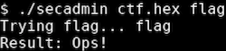
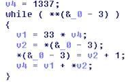

# CTF secadmin 2017 - reversing con angr

Para la prueba de reversing del CTF Secadmin 2017 decidí utilizar angr, aunque más adelante veremos que no es la forma ni mas optima ni mas rápida de resolverlo.

La prueba consiste en un binario x64 para linux. Si ejecutamos el binario obtenemos el siguiente mensaje indicándonos la forma de ejecutarlo


Además del binario a analizar, nos proporcionan el archivo ctf.hex que a simple vista solo distinguimos los dos strings “Enhorabuena!” y “Ops!”


Ahora, si probamos a ejecutar el binario con los parámetros correctos, obtenemos el mensaje de flag incorrecta “Ops!”.



En el caso de introducir un flag con una letra mayúscula o un símbolo obtenemos el error Illegal chars. The flag must contain only lowercase letters [a-z].

Si analizamos estaticamente el binario con radare2 rápidamente observamos el uso de las funciones hash y VmLoop.

La función hash, como su nombre indica, realiza el hash del flag introducido anteriormente. Con IDA podemos decompilar esta función, que consiste en un bucle que recorre todos los caracteres del flag, multiplicando por 33 el valor anterior del hash en cada vuelta y sumando el carácter actual.



Por otro lado, la función VmLoop consiste en una CPU virtual con su propio juego de instrucciones que ejecuta las instrucciones contenidas en el archivo ctf.hex. Para utilizar angr no es necesario conocer esto, sino que el objetivo es encontrar en que punto del programa se muestra el texto “Enhorabuena!”.

Analizando con GDB vemos como se muestra el mensaje “Ops!” en la dirección 0x400b64.


Otro detalle a tener en cuenta es el valor 0x3C, ya que si nos fijamos en el archivo ctf.hex, es la posición en la que se encuentra el texto “Ops!”. Por lo tanto, deberemos llegar a este mismo punto de ejecución con el valor 0x2D correspondiente al texto “Enhorabuena!”

Con todos estos datos, utilizamos angr para resolver la prueba. En esta ocasión no tenemos el caso habitual de llegar a una dirección de programa especifica, sino que además deberemos comprobar que cierto registro contiene el valor 0x2D. Otra de las complicaciones es la forma en la que trabaja angr, ya que no evalúa todas las direcciones de programa, sino solo aquellas en las que se bifurca el programa o se realiza un salto. Para descubrir rápidamente que direcciones se evalúan en la función check del script de angr, se utilizó la instrucción print(state) que se encuentra comentada en la linea 29.

La dirección evaluada es 0x400b49, en la cual el valor de 0x3C o 0x2D se encuentra en la dirección del stack RBP - 10


Otro problema que me costo bastante tiempo de solucionar fue debido a que angr por defecto no interactua con el sistema de archivos, por lo que el script no funcionó hasta que no se añadió la opción `concrete_fs=True`.

<secadmin-angr.py>


Probamos la solución y vemos como es válida, aunque debido a las colisiones del algoritmo de hash, no es la solución correcta.


Este problema se puede abordar de varias formas, la que se ha seguido consiste en dividir el proceso en dos partes, primero obteniendo el hash valido, y después obteniendo todos los valores posibles que devuelven ese hash para quedarnos con el flag correcto.

Si analizáramos el código de la maquina virtual veríamos casi inmediatamente en que parte del archivo ctf.hex se encuentra el hash válido. En cambio, vamos a realizar esta parte con angr. Para ello modificamos el binario utilizando radare2 para que no realice el hash, por lo que modificamos la función hash de la siguiente forma.


En cuanto al script de angr, tan solo hay que realizar un par de cambios para que realice la búsqueda en 4 bytes y el resultado se muestre en formato hexadecimal.


Una vez conocemos el hash, realizamos fuerza bruta con un script de python.

Un detalle adicional que nos da la prueba, es la longitud del flag correcto, 9 caracteres.

Realizar una fuerza bruta sobre 9 caracteres llevaría bastante tiempo, pero debido a que el hash se realiza con una operación matemática bastante simple, es posible reducir el problema, por ejemplo en una fuerza bruta de 6+3.

Cuando digo bastante simple me refiero a la siguiente ecuación lineal. Esto en cualquier otro tipo de hash de los usados habitualmente no sería posible.

- Flag: ABCDEFGHJ
- Un caracter en minusculas se encuentra entre 0x61 (97) y 0x7A (122)

0: 1337
1: 1337·33 + A
2: (1337·33 + A)·33 + B = 33·1337 + 33·A + B
3: ((33^2)·1337 + 33·A + B)·33 + C = (33^3)·1337 + (33^2)·A + 33·B + C
4: (33^4)·1337 + (33^3)·A + (33^2)·B + (33)·C + D
...
9: (33^9)·1337 + (33^8)·A + (33^7)·B + (33^6)·C + (33^5)·D + (33^4)·E + (33^3)·F + (33^2)·G + (33)·H + J

Tomando la parte de los 3 ultimos caracteres (33^2)·G + (33)·H + J calculamos la distancia entre el hash de XXXXXXaaa y XXXXXXzzz, que es de 28075.

1123 *  97 = 108931
1123 * 122 = 137006
           --------
              28075

De esta forma se realiza una fuerza bruta variando únicamente los 6 primeros caracteres, y en el caso de que el valor resultante sea lo suficientemente cercano al que buscamos, se realiza la fuerza bruta de los últimos 3 caracteres.

```
from itertools import product
import string

def hash(password):
  x = 1337
  for c in password:
    x = 33*x + ord(c)
  return x%pow(2,32)


search = 0x45c84173

for key in product(string.lowercase, repeat=6):
  diff = search - hash(key + ('a','a','a'))
  if diff >= 0 and diff <= 28076:
    for key3 in product(string.lowercase, repeat=3):
      if hash(key + key3) == search:
        print("%s" % (''.join(key+key3)))
        break
```

En aproximadamente 5 minutos, obtenemos 1290 posibles soluciones de 9 caracteres. De las que solo unas cuantas parecen ser palabras con sentido. Siendo la solución correcta fuckvcpus.

Si optimizamos el script para que resuelva la ecuación carácter a carácter, se reduce el tiempo de ejecución a 1 segundo.
